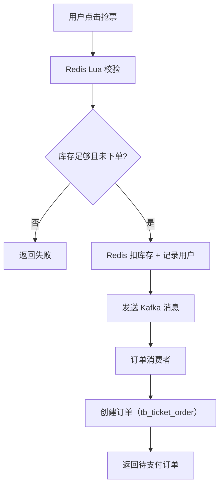

# ticket-rush-ai Agent Guide

## Project Goal

Build `ticket-rush` as a concert ticket rush platform. Implement the core high-concurrency ticketing business first, then add AI function calling and RAG as bonus capabilities.

The first complete milestone is:

```text
User login -> event browsing -> ticket SKU selection -> Redis Lua rush request
-> async order creation -> order query/payment/cancel
```

AI must not directly deduct stock. AI only understands user intent, queries business information, and calls backend tools that enter the same ticket rush flow as normal users.

## Current Technical Direction

- Backend: Spring Boot 4.x, Java 17
- Persistence: MySQL + MyBatis-Plus 3.5.x
- Cache and rush control: Redis + Lua
- Async order creation: Kafka
- Auth: JWT (jjwt 0.13.x, HMAC-SHA256)
- AI: LangChain4j function calling, optional Chroma/RAG knowledge base

The current `pom.xml` already includes Kafka dependencies. Use Kafka for async order creation — do not introduce RabbitMQ or any other MQ.

## Implementation Progress

| Step | Module | Status |
|------|--------|--------|
| 1 | User login and JWT | ✅ Done |
| 2 | Event list and event detail | ✅ Done |
| 3 | Ticket SKU query | ✅ Done |
| 4 | Redis stock initialization | ✅ Done |
| 5 | Lua rush eligibility validation | ✅ Done |
| 6 | Async order creation with Kafka | ✅ Done |
| 7 | Order query, simulated payment, and cancel | 🔲 Pending |
| 8 | AI function calling | 🔲 Pending |
| 9 | RAG knowledge base | 🔲 Pending |

## Package Structure

```text
dev.dahuangggg.ticketrush
├── config/              -- Spring configuration (@Configuration classes)
├── controller/          -- REST controllers, HTTP layer only
├── dto/                 -- Request/response DTOs (Java records)
│   ├── auth/
│   ├── common/
│   ├── event/
│   └── user/
├── entity/              -- MyBatis-Plus entities (@TableName)
├── exception/           -- Custom exceptions + GlobalExceptionHandler
├── handler/             -- MetaObjectHandler (auto-fill audit fields)
├── infrastructure/      -- Infrastructure concerns, not business logic
│   ├── cache/           -- Caffeine + Redis cache managers, LogicalExpireValue
│   └── mq/              -- Kafka producers, consumers, and message records
├── mapper/              -- MyBatis-Plus mappers
├── security/            -- JWT service, interceptor, UserContext
└── service/             -- Service interfaces + impl/ sub-package
```

## Coding Conventions

- **Dependency injection**: Constructor injection only. Never use `@Autowired` on fields.
- **Primary keys**: `@TableId(type = IdType.ASSIGN_ID)` (Snowflake ID) on all entities. No auto-increment.
- **Soft delete**: All tables include a `deleted TINYINT(1) DEFAULT 0` column. Annotate with `@TableLogic`. MyBatis-Plus filters deleted rows automatically.
- **Audit fields**: All tables include `create_time` and `update_time`. Use `@TableField(fill = FieldFill.INSERT)` and `@TableField(fill = FieldFill.INSERT_UPDATE)` — `MybatisPlusMetaObjectHandler` fills them automatically. Do not set them manually.
- **Money**: All amount fields are in cents (integer). Never use float or double for money.
- **Time**: Use `LocalDateTime` in Java and `DATETIME` in MySQL.
- **Status values**: Define status constants or enums in the entity or a dedicated constants class. No magic numbers in service code.
- **DTOs**: Use Java `record` for all request and response DTOs. No Lombok on DTOs.
- **Entities**: Use Lombok `@Data @Builder @NoArgsConstructor @AllArgsConstructor` on entity classes.
- **Error responses**: All error responses use `ErrorResponse(String code, String message)`. All exceptions are handled by `GlobalExceptionHandler`. Never return error details from controllers directly.
- **Exception types**: Business exceptions extend `RuntimeException` and are handled centrally. Do not catch-and-swallow exceptions in service code.

## Testing Conventions

- Use `@SpringBootTest` + `MockMvc` for controller integration tests.
- Replace real dependencies with Fake implementations via `@TestConfiguration` + `@Primary`. Do not use `@MockBean` or Mockito.
- Fake classes implement the service interface directly (e.g., `FakeSmsCodeStore implements SmsCodeStore`).
- Test classes live under `src/test/.../controller/` or the relevant module sub-package.
- Focused tests required for: Lua result handling, duplicate order prevention, stock rollback, and order consumer idempotency.

## Database Migration

Build SQL is maintained manually. All DDL goes in `src/main/resources/db/` (one file per table, e.g. `V1__create_tb_user.sql`). Execute scripts manually when setting up a new environment. Do not use Flyway or Liquibase unless explicitly requested.

## Redis Key Reference

```text
-- Auth module
auth:sms-code:{phone}             -- SMS verification code, TTL = sms-code-ttl (default 5m)
auth:sms-cooldown:{phone}         -- Send rate limit guard, TTL = 60s

-- Event module
event:detail:{eventId}            -- Normal event detail (Cache-Aside), TTL = 30±5min
event:detail:hot:{eventId}        -- Hot event detail (logical expiry, no real TTL)
event:null:{eventId}              -- Null marker for non-existent events, TTL = 2min
event:lock:{eventId}              -- Mutex lock for normal event cache rebuild, TTL = 10s
event:list:{city}:{date}          -- Event list cache (city+date key), TTL = 10±3min
event:access:count:{eventId}      -- Access count for dynamic hot detection, TTL = 1min
event:bloom                       -- Redisson bloom filter for event ID existence check

-- Ticket rush module
ticket:stock:{skuId}              -- Remaining stock for a ticket SKU
ticket:order:user:{skuId}         -- Set of userIds that already rushed this SKU
```

## Core Modules

### 1. User Module ✅ Done

Responsibilities:

- SMS verification code login (register + login unified).
- Generate JWT after successful login.
- Resolve current user from token for protected APIs via `JwtAuthenticationInterceptor`.
- Query user profile.

Main flow:

```text
request SMS code -> Redis stores code (5m TTL, 60s cooldown per phone)
-> submit phone + code -> validate code -> delete code -> find or create user
-> issue JWT -> frontend sends Bearer token -> interceptor resolves user into UserContext
```

Table:

```sql
tb_user
- id             BIGINT          -- Snowflake ID
- phone          VARCHAR(20)     -- unique, uk_user_phone
- nick_name      VARCHAR(50)
- icon           VARCHAR(255)
- deleted        TINYINT(1)      -- soft delete, 0=normal 1=deleted
- create_time    DATETIME
- update_time    DATETIME
```

APIs:

```text
POST /api/auth/sms-code   -- Send SMS code; same phone limited to once per 60s → 429 if exceeded
POST /api/auth/login      -- Phone + code login → { accessToken, tokenType, expiresIn }
GET  /api/users/me        -- Requires Bearer token → UserProfileResponse
```

Error codes:

```text
SMS_COOLDOWN      429   -- SMS send rate exceeded
INVALID_SMS_CODE  400   -- Code wrong or expired
UNAUTHORIZED      401   -- Missing/invalid/expired JWT
BAD_REQUEST       400   -- Validation failure
INTERNAL_ERROR    500   -- Unexpected server error
```

### 2. Event Module ✅ Done

Responsibilities:

- Show concert/event list.
- Show event detail.
- Filter by city, keyword, and date.

Main flow:

```text
home page queries event list
-> filter by city / keyword / date
-> click event -> enter detail page
```

Cache strategy:

```text
Event detail:
  is_hot=1 → logical expiry (hot key, no real TTL, async rebuild via REBUILD_EXECUTOR)
  is_hot=0 → Cache-Aside + mutex lock (setIfAbsent, 3 retries, double-check after lock)
  Non-existent ID → Bloom Filter (Redisson) + null value cache (TTL 2min)
  Cache invalidation → sync DEL → Kafka fallback on failure (event.cache.invalidate topic)

Event list:
  city+date as cache key, TTL 10±3min; keyword bypasses cache (too many combinations)

Dynamic hot detection:
  Access counter per eventId (1min window); ≥1000 → log WARN + trigger warmUp
```

Table:

```sql
tb_event
- id             BIGINT
- title          VARCHAR(200)    -- 周杰伦2026世界巡回演唱会
- artist         VARCHAR(100)    -- 周杰伦
- city           VARCHAR(50)     -- 上海
- venue          VARCHAR(200)    -- 梅赛德斯奔驰文化中心
- event_time     DATETIME        -- 开演时间
- cover_url      VARCHAR(500)
- description    TEXT
- is_hot         TINYINT(1)      -- 1=热点活动（逻辑过期缓存）0=普通活动
- status         TINYINT(1)      -- 0未上架 1售卖中 2已结束
- deleted        TINYINT(1)
- create_time    DATETIME
- update_time    DATETIME
```

APIs:

```text
GET /api/events?city=&keyword=&date=    -- No auth required
GET /api/events/{eventId}               -- No auth required; 404 if not found
```

Error codes:

```text
EVENT_NOT_FOUND   404   -- Event does not exist or is soft-deleted
```

### 3. Ticket SKU Module ✅ Done

Responsibilities:

- One event has multiple ticket SKUs, such as 380, 580, 880, 1280 (in cents: 38000, 58000...).
- Event detail should include or allow querying all SKUs.
- Display price, remaining stock, sale window, and per-user purchase limit.

Table:

```sql
tb_ticket_sku
- id             BIGINT
- event_id       BIGINT
- name           VARCHAR(100)    -- 看台票 / 内场票 / VIP票
- price          INT             -- 单位分，e.g. 58000 = 580元
- stock          INT             -- 数据库库存
- sale_start_time DATETIME
- sale_end_time   DATETIME
- limit_per_user  INT            -- 每人限购数量，一人一单可设为1
- status         TINYINT(1)      -- 0未开售 1售卖中 2售罄
- deleted        TINYINT(1)
- create_time    DATETIME
- update_time    DATETIME
```

APIs:

```text
GET /api/events/{eventId}/skus    -- No auth required; returns [] if event has no SKUs
GET /api/ticket-skus/{skuId}      -- No auth required; 404 if not found
```

Notes:

- `price` is `BIGINT` in the actual schema (not `INT`), mapped to `Long` in Java.
- `stock` returns the real-time Redis counter `ticket:stock:{skuId}` when initialized (Module 4); falls back to MySQL account stock before initialization.
- `status=2 sold out` is written back asynchronously by the Kafka consumer in Module 5; there is a brief window of inconsistency.
- Both endpoints are whitelisted in `WebMvcConfig`: `/api/ticket-skus/**` is explicitly excluded; `/api/events/{id}/skus` is covered by the existing `/api/events/**` exclusion.

Error codes:

```text
TICKET_SKU_NOT_FOUND   404   -- SKU does not exist or is soft-deleted
```

### 4. Redis Stock Initialization ✅ Done

Responsibilities:

- Initialize `ticket:stock:{skuId}` in Redis from MySQL account stock before sale starts.
- Idempotent: calling `initStock` a second time does not overwrite the live counter.
- After initialization, `GET /api/ticket-skus/{skuId}` and `GET /api/events/{id}/skus` return the Redis real-time stock (falls back to MySQL stock when key absent).

API:

```text
POST /api/admin/skus/{skuId}/init-stock    -- No auth required (admin path whitelisted for now)
```

Response:

```json
{ "initialized": true }   -- 新建计数器
{ "initialized": false }  -- 计数器已存在，未覆盖
```

Notes:

- Redis key: `ticket:stock:{skuId}` (plain integer string, compatible with `DECR` in Module 5 Lua script).
- `StockInitServiceImpl` depends on `TicketSkuMapper` directly (not `TicketSkuService`) to avoid circular dependency.
- `Boolean.TRUE.equals(set)` is used for null-safe check on `setIfAbsent` return value (can return null in cluster pipeline).
- `/api/admin/**` is JWT-whitelisted for now; admin-role restriction to be added in a future module.

Error codes:

```text
TICKET_SKU_NOT_FOUND   404   -- SKU does not exist or is soft-deleted
```

---

### 5. Ticket Rush Module ✅ Done

This is the core module. Uses Redis + Lua to implement atomic stock pre-deduction and one-user-one-order validation.

Main flow:

```text
user clicks rush ticket
-> Lua checks stock
-> Lua checks whether user already rushed this SKU
-> Redis deducts stock
-> Redis records userId
-> send message to Kafka
-> immediately return "queued/request submitted"
```

Lua logic:

```lua
-- KEYS[1] = ticket:stock:{skuId}
-- KEYS[2] = ticket:order:user:{skuId}
-- ARGV[1] = userId

local stock = tonumber(redis.call('GET', KEYS[1]) or '0')
if stock <= 0 then
    return 1
end

if redis.call('SISMEMBER', KEYS[2], ARGV[1]) == 1 then
    return 2
end

redis.call('DECR', KEYS[1])
redis.call('SADD', KEYS[2], ARGV[1])
return 0
```

Return codes:

```text
0 success, queued
1 stock not enough
2 duplicate order
```

API:

```text
POST /api/ticket-rush/requests    -- Requires Bearer token
```

Request body:

```json
{
  "eventId": 1,
  "skuId": 10,
  "quantity": 1
}
```

Notes:

- Lua script loaded via `DefaultRedisScript<Long>` from `classpath:lua/ticket_rush.lua`; Spring Data Redis auto-caches SHA after first `EVAL` (subsequent calls use `EVALSHA`).
- `Long.valueOf(1L).equals(result)` used for null-safe Lua result comparison (result can be null in cluster pipeline scenarios).
- `ticket:order:user:{skuId}` Set has **no TTL** — Module 7 cancel/timeout rollback must call `SREM` to remove userId, otherwise user can never re-rush the same SKU after cancellation.
- Kafka topic: `ticket.rush.requests`; partition key: `userId-skuId` (same user+SKU always hits the same partition for ordered processing).
- `TicketRushMessage` carries `messageId` (UUID) for order consumer idempotency in Module 6.
- `quantity` is validated `@Min(1) @Max(1)` in `TicketRushRequest`; current flow only supports one ticket per rush.
- `userId` is read from `UserContext` (set by JWT interceptor) — never trusted from the request body.

Error codes:

```text
SOLD_OUT          400   -- stock <= 0 or stock key not initialized
DUPLICATE_ORDER   400   -- userId already in ticket:order:user:{skuId}
UNAUTHORIZED      401   -- missing or invalid JWT
```

### 6. Order Module ✅ Done

Responsibilities:

- Consume rush messages from Kafka asynchronously.
- Check idempotency before database writes.
- Create pending payment order.
- Query order status.

Consumer flow:

```text
Kafka consumer receives rush message
-> INSERT tb_ticket_order_msg (message_id unique index, idempotency gate)
   -> DuplicateKeyException → skip (already processed)
-> SELECT tb_ticket_sku for price
-> INSERT tb_ticket_order (status=0 待支付, orderNo=UUID)
-> UPDATE tb_ticket_order_msg status=1 (success)
```

Note: **MySQL stock (`tb_ticket_sku.stock`) is NOT decremented.** Redis `ticket:stock:{skuId}` is the authoritative real-time counter. MySQL stock remains the initial configured capacity used to seed Redis; actual sold quantity is derived from `tb_ticket_order` count.

Tables:

```sql
tb_ticket_order
- id             BIGINT
- order_no       VARCHAR(64)     -- UUID (32 hex chars), unique
- user_id        BIGINT
- event_id       BIGINT
- sku_id         BIGINT
- quantity       INT
- total_amount   BIGINT          -- 单位分
- status         TINYINT(1)      -- 0待支付 1已支付 2已取消 3已超时
- pay_time       DATETIME
- cancel_time    DATETIME
- deleted        TINYINT(1)
- create_time    DATETIME
- update_time    DATETIME

unique key uk_order_no(order_no)
unique key uk_user_sku(user_id, sku_id)  -- final idempotency guard

tb_ticket_order_msg
- id             BIGINT
- message_id     VARCHAR(128)    -- TicketRushMessage.messageId (UUID), unique
- user_id        BIGINT
- event_id       BIGINT
- sku_id         BIGINT
- quantity       INT
- status         TINYINT(1)      -- 0待处理 1成功 2失败
- error_message  VARCHAR(1024)
- deleted        TINYINT(1)
- create_time    DATETIME
- update_time    DATETIME
```

APIs:

```text
GET /api/orders/{orderId}         -- Requires Bearer token; only returns own orders
GET /api/orders/by-no/{orderNo}   -- Requires Bearer token; only returns own orders
GET /api/orders/me                -- Requires Bearer token; returns all orders desc by create_time
```

Notes:

- `TicketRushConsumer` is a thin `@KafkaListener` wrapper; all business logic is in `OrderServiceImpl`.
- Idempotency has two layers: ① `tb_ticket_order_msg.message_id` unique index (primary gate); ② `uk_user_sku(user_id, sku_id)` on `tb_ticket_order` (final backstop, should never fire given upstream Lua guarantee).
- Null guard: if `ticketSkuMapper.selectById(skuId)` returns null, message is marked `status=2` (failed) and skipped — avoids NPE and infinite Kafka retry.
- Known limitation: if `uk_user_sku` fires (Lua script bug), the whole transaction rolls back including the `tb_ticket_order_msg` INSERT, causing an infinite Kafka retry loop. Production fix: use `REQUIRES_NEW` propagation for the msg INSERT so it commits independently.
- `JsonProcessingException` from Kafka is caught and logged (not rethrown) — message is skipped. All other exceptions propagate to trigger Kafka retry.
- `userId` ownership is enforced at service layer: `getById` and `getByOrderNo` throw `OrderNotFoundException` if order belongs to a different user.

Error codes:

```text
ORDER_NOT_FOUND   404   -- order does not exist or belongs to another user
UNAUTHORIZED      401   -- missing or invalid JWT
```

### 7. Payment and Cancel Module 🔲 Pending

Start with simulated payment. Do not integrate a real payment provider in the first version.

Main flow:

```text
order created -> pending payment
user pays -> status becomes paid
payment timeout -> cancel order and roll back stock
user cancels -> cancel order and roll back stock
```

Cancel or timeout rollback must do all three atomically:

```text
1. MySQL stock + 1
2. Redis stock + 1
3. Remove userId from Redis user rush set (ticket:order:user:{skuId})
```

APIs:

```text
POST /api/orders/{orderId}/pay
POST /api/orders/{orderId}/cancel
```

## AI Ticket Assistant 🔲 Pending

AI only calls tools. It must never bypass Redis Lua or directly update stock/order tables.

Example user request:

```text
帮我抢周杰伦上海站580元票
```

Expected AI flow:

```text
1. call search_events(keyword, city, date)
2. call query_ticket_skus(eventId)
3. confirm or infer target SKU when information is complete
4. call create_ticket_order_request(eventId, skuId, quantity)
5. backend enters Redis + Lua rush flow
```

Tool functions:

```text
search_events(keyword, city, date)
get_event_detail(eventId)
query_ticket_skus(eventId)
create_ticket_order_request(eventId, skuId, quantity)
get_order_status(orderId)
```

RAG knowledge base can include:

```text
购票规则、实名制规则、退票规则、入场须知、场馆交通、限购说明、排队规则
```

Optional tables:

```sql
tb_ai_chat_session
- id, user_id, title, deleted, create_time, update_time

tb_ticket_rule_doc
- id, title, category, content, embedding_doc_id, deleted, create_time, update_time
```

## Recommended Table List

Implement these first:

```text
tb_user           ✅ Done
tb_event          ✅ Done
tb_ticket_sku     ✅ Done
tb_ticket_order   ✅ Done
```

Add these only when the core flow needs them:

```text
tb_ticket_order_msg    ✅ Done (Kafka message idempotency/failure tracking)
tb_ai_chat_session     -- AI chat session history
tb_ticket_rule_doc     -- RAG document metadata
```

## Core Rush Flow



## Implementation Rules for Agents

- Keep the first version simple. Finish modules 1-7 before expanding AI/RAG.
- The rush request endpoint must return quickly after Redis Lua succeeds and the Kafka message is sent.
- Database order creation must be idempotent. Use `uk_user_sku(user_id, sku_id)` as the final guard.
- Do not trust Redis alone for final persistence. The order consumer must still verify database state.
- Do not let AI tools mutate inventory directly. AI must call `create_ticket_order_request`.
- Use cents for all money fields.
- Use clear status enums/constants instead of scattering magic numbers through services.
- All tables must have a `deleted` soft-delete column. Never hard-delete rows.
- Always use constructor injection. Never use `@Autowired` on fields.
- New exceptions must extend `RuntimeException` and be registered in `GlobalExceptionHandler`.
