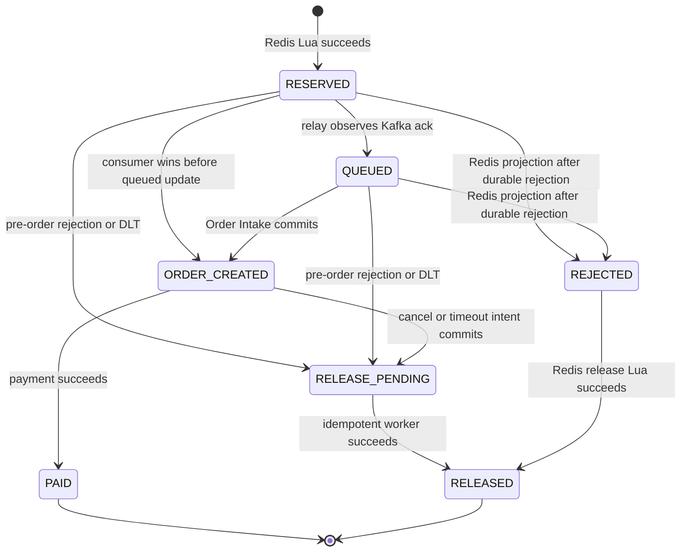

# Domain context

This file defines the shared language for ticket-rush. Code, tests, diagrams, and ADRs should use these terms consistently.

## Core terms

### Event

A concert or performance that users can browse. An Event owns one or more Ticket SKUs and has a venue and performance time.

### Ticket SKU

A sellable ticket class for an Event, such as a price tier. It defines configured inventory, price in cents, sale window, status, and the per-user limit.

### Configured Inventory

The total quantity assigned to a Ticket SKU before sale. It is a configuration fact, not the live remaining count.

### Available Inventory

The quantity that may still be reserved. Redis serves this value on the hot path. It must be derivable from the Inventory Ledger after recovery.

### Rush Request

An authenticated user's intent to reserve one unit of a Ticket SKU. A Rush Request carries an idempotency identity and is not yet an order.

A repeated request with the same identity refers to the same logical request, even when HTTP, relay, or Kafka retries it.

### Reservation

The fact that one unit of a Ticket SKU has moved from available to held for a user. It starts in Redis and becomes durable in the MySQL Ledger before Kafka publication.

A Reservation has a stable reservation ID and a lifecycle. It is created at the Redis Lua linearization point. It is not equivalent to a Kafka acknowledgement or an order row.

### Reservation Journal

The recoverable record written atomically with a Reservation. It contains enough information for a relay to publish the Reservation after a crash.

The journal closes the process-death gap between Redis reservation and Kafka publication.

### Relay

The worker that reads unpublished Reservation Journal entries and publishes them to Kafka. Delivery is at least once. It uses the reservation ID as the deterministic message identity.

The relay does not create orders and does not decide inventory policy.

### Order Intake

The Module that consumes a Reservation event and creates a pending order exactly once from the application's point of view.

Order Intake commits message idempotency and the order in one MySQL transaction. A duplicate event returns the already known outcome; a failed transaction remains retryable.

### Order

The durable commercial record created from a Reservation. Its lifecycle is:

- PENDING: inventory is held while payment is pending.
- PAID: inventory is consumed.
- CANCELED: the user canceled before payment.
- TIMEOUT: the payment window expired.

PENDING and PAID are both active for the one-user-one-SKU uniqueness rule. CANCELED and TIMEOUT are terminal and release their Reservation.

### Release Intent

A durable MySQL record saying that a Reservation must be released in Redis.

The order transition to CANCELED or TIMEOUT and its Release Intent are committed in the same transaction. A worker may apply the intent repeatedly, but Redis inventory changes at most once.

### Inventory Ledger

The combined durable evidence used to explain every configured unit:

- available in Redis;
- held by a Reservation that has not reached a terminal order state;
- consumed by an active order;
- released by a completed Release Intent.

The ledger is a logical model. Its physical representation may include the Reservation Journal, orders, and Release Intents.

### Reconciliation

The process that compares Redis state with the Inventory Ledger and reports drift. The current Module can inspect and derive a safe missing-stock value, and Stock Initialization uses that value for a missing stock key. Rebuilding buyer/Reservation state plus a general pause/audit/resume workflow remains Target architecture.

Reconciliation is not a substitute for correct transactional design. It is the final defense against unknown failures and operational mistakes.

### Idempotency Key

A client-generated stable identity for one logical Rush Request. The current Redis mapping is scoped
by `(authenticated user ID, Ticket SKU ID, SHA-256(trimmed key))`; the raw key is not globally unique
and is not a digest of the complete request payload. Retrying within that scope with the same key must
return the same Reservation identity and current outcome.

### Linearization Point

The single instant at which a concurrent operation is considered to have taken effect.

For Reservation, this is the Redis Lua execution that validates eligibility, decrements Available Inventory, and writes the journal atomically.

### Compensation

A durable, retryable action that restores an invariant after a multi-system workflow cannot complete. Compensation must itself be idempotent.

### Read-only AI Assistant

An assistant whose registered tools can only query events, Ticket SKUs, and the authenticated user's orders. It cannot create Rush Requests, Reservations, orders, payments, cancellations, reminders, or inventory mutations.

## Lifecycle



The diagram overlays the durable MySQL lifecycle and its Redis projection; both use names from
`ReservationStatus`, but they do not always hold the same intermediate value. A permanent pre-order
rejection commits MySQL `RELEASE_PENDING` plus a Release Intent first, then best-effort marks the
Redis projection `REJECTED`; the status API prefers the durable Ledger and therefore normally exposes
`RELEASE_PENDING`. The Release Worker requires durable `RELEASE_PENDING` and may move the Redis
projection from any allowed releasable state, including `REJECTED`, to `RELEASED`. A producer timeout
is an inferred publication outcome, not a stored `UNKNOWN` state: the Stream entry remains and the
relay republishes the same ID.

## Ownership

| Fact | Authoritative owner | Read model or cache |
|---|---|---|
| Event metadata | MySQL | Caffeine and Redis event caches |
| Ticket SKU price and sale configuration | MySQL | Redis eligibility snapshot for the hot path |
| Available Inventory | Redis Reservation Module | API-facing SKU view |
| Reservation publication state | Redis Journal before durable handoff; MySQL Reservation Ledger afterward | relay worker and logs; dedicated backlog gauges remain Target architecture |
| Order lifecycle | MySQL Order Module | user order query |
| Required inventory release | MySQL Release Intent | worker queue view |
| AI conversation memory | Redis | none |

“Authoritative” does not mean “the only copy.” It identifies which Module is allowed to decide or reconstruct the fact.

## Invariants

### Inventory conservation

For each Ticket SKU:

```text
configured inventory
  = available inventory
  + held reservations
  + active order quantity
```

A Reservation that has become an active order must not be counted twice; the ledger defines the handoff point explicitly.

### One active order per user and SKU

For a user and Ticket SKU, at most one order may be PENDING or PAID. CANCELED and TIMEOUT orders do not block a later Rush Request.

### Accepted means recoverable

Once HTTP accepts a Rush Request, the Reservation and Stream entry exist atomically in Redis. An application-process crash cannot erase them, and after Relay records the MySQL Ledger an old RESERVED row can republish a lost Stream entry. Redis AOF `everysec` is not zero-loss storage: a Redis host failure before fsync, or total Redis loss before MySQL persistence, remains an explicit disaster-recovery gap.

### Release at most once

Replaying one Release Intent changes Available Inventory at most once.

### AI cannot mutate business state

No model output, prompt, tool argument, or future RAG document can reach a business mutation through the AI tool registry. RAG is not implemented in the current runtime.

## Module language

- A Module has an Interface and an Implementation.
- A Seam is where an Interface lives and where an Adapter may vary behavior.
- Depth is leverage behind a small Interface.
- The Redis, Kafka, MySQL, and AI tool integrations are Adapters.
- Consistency rules should have Locality: they belong in Reservation, Order Intake, and Release Intent Modules instead of being repeated by controllers, listeners, and schedulers.
