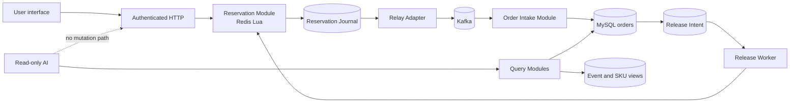

# ticket-rush

[中文说明](README.zh-CN.md)

ticket-rush is a teaching project for high-concurrency concert ticket sales. It uses Spring Boot, MySQL, Redis Lua, and Kafka to make the difficult parts of a flash-sale system visible: linearization, idempotency, asynchronous order intake, compensation, recovery, and observability.

The goal is not to present a production-ready ticketing platform or an impressive QPS number. The goal is to make every important invariant explicit and testable.

## Safety boundary

The AI assistant is read-only.

- It may search events, inspect ticket SKUs, and query the signed-in user's orders.
- It has no rush-ticket, create-order, pay, cancel, inventory, or reminder mutation tool.
- A request such as “buy this ticket for me” must be redirected to the normal user interface.
- Any user-initiated mutation must use an explicit authenticated HTTP endpoint outside AI; Kafka consumers and schedulers may continue that deterministic workflow internally.

There is intentionally no AI ticket-rush tool.

Reminder creation is a normal authenticated `POST /api/reminders` business operation, not an AI
tool. This describes the backend boundary; it does not claim that the current frontend exposes a
reminder UI.

See [AI read-only boundary](docs/ai/read-only-boundary.md) and [ADR-0003](docs/adr/0003-ai-read-only.md).

## What this repository teaches

- Why a MySQL-only stock decrement is easy to reason about but hard to scale.
- Why Redis Lua gives one atomic reservation point but does not solve cross-system consistency.
- Why “Redis succeeded, then send Kafka” contains a crash window.
- How a Reservation Journal and relay make an accepted Rush Request recoverable.
- How idempotent Order Intake turns Kafka's at-least-once delivery into one durable order.
- Why an order terminal transition and its Release Intent belong in one MySQL transaction.
- How to prove inventory conservation with an Inventory Ledger and reconciliation.
- How to test ack loss, duplicate delivery, process death, Redis restart, and delayed compensation.

The domain vocabulary is defined in [CONTEXT.md](CONTEXT.md).

## Architecture

The worktree implements the main hardened structure and one Flyway-owned schema. Fast tests, a
real MySQL/Redis integration lane, and one local full-async experiment verify the paths named below;
real-service fault injection is still required before making production-style reliability claims.
See [implementation status](docs/architecture/current-vs-target.md) and the
[2026-07-22 verification report](docs/zh-CN/verification-report.md) for the exact evidence boundary.



The normal success path is:

1. The client submits a Rush Request with an idempotency identity.
2. Redis Lua validates eligibility, reserves inventory, and records a recoverable Redis Stream journal entry atomically.
3. A relay publishes the Reservation to Kafka using a deterministic reservation ID.
4. Order Intake creates the order and records message idempotency in one MySQL transaction.
5. Payment keeps the reservation consumed. Cancel or timeout writes a Release Intent with the order transition.
6. A worker applies the release idempotently in Redis and marks the intent complete.

## Implementation and verification

| Area | Implemented structure | Remaining proof |
|---|---|---|
| Rush | Lua Reservation, stable ID, idempotency mapping, Redis Stream journal, Cluster hash tags; a 100,000-request Redis stock-and-dedup primitive run and a 1,000-request complete Reservation run passed their conservation gates | Redis restart, lifecycle-GC, and Cluster/failover tests |
| Kafka handoff | scheduled relay republishes the same reservation ID; old MySQL RESERVED rows recover a lost Redis journal after ledger persistence; one 1,000-request local full-async run ended with zero lag | ack-loss, broker/relay restart, backlog-under-failure, and multi-instance tests |
| Order intake | inbox, order, and ledger update share one MySQL transaction; real MySQL duplicate delivery and rollback/retry cases passed | process death after message claim and before commit |
| Cancel/timeout | order transition and durable Release Intent share one transaction; real MySQL/Redis transaction, duplicate-release, and retry-exhaustion tests passed | worker-death-after-Redis replay and live failed-intent re-drive |
| Inventory recovery | retryable `NEW -> OPENING -> OPENED`; stock-key recovery shares a per-SKU mutex with release and requires buyer evidence plus settled intents | operator pause/audit controls, full buyer/reservation rebuild, and full-Redis-loss recovery exercise |
| AI and security | query-only tool registry, bounded inputs, atomic OTP consume, fixed-TTL hashed refresh tokens | live-model adversarial tests and deployment hardening |
| Operations | explicit Kafka topics, readiness, Prometheus metrics, and correctness-gated benchmark harness; local Prometheus snapshots and all three benchmark scenarios were captured | broker failure, repeated-run variance, and capacity exercises |
| Schema | immutable Flyway V1 through V4 history plus a separate relative-time development seed; Docker DDL removed; blank-database migration passed | guarded V3-to-V4 legacy-upgrade and interrupted-DDL recovery exercises |

The table is deliberately honest: implementation classes, migrations, and fast tests are not substitutes for real-service failure-path tests.

On 2026-07-22, the recorded gate passed 106 fast tests and 27 real-service integration tests. The
same worktree also passed `bash bench/run.sh all`; those single-machine results are evidence for
that snapshot, not production capacity claims.

## Technology

| Concern | Choice |
|---|---|
| Runtime | Java 17, Spring Boot 4 |
| Persistence | MySQL, MyBatis-Plus |
| Reservation hot path | Redis, Lua |
| Asynchronous intake | Kafka |
| Authentication | JWT access token plus Redis-backed refresh token |
| Local and distributed cache | Caffeine and Redis |
| AI | LangChain4j with an explicit read-only tool allowlist |
| Schema evolution | Flyway as the single schema owner |
| Frontend | Vue 3 and Vite |

## Run locally

Start infrastructure without starting the application container:

```bash
docker compose up -d mysql redis kafka
```

Set the required configuration, then start the backend:

```bash
export JWT_SECRET="$(openssl rand -base64 48)"
export OPENAI_API_KEY=your_key_if_ai_is_enabled
./mvnw spring-boot:run -Dspring-boot.run.profiles=dev
```

Start the frontend in a second terminal:

```bash
cd frontend
npm ci
npm run dev
```

Backend defaults to http://127.0.0.1:8081 and the Vite frontend defaults to http://127.0.0.1:5173.

Flyway applies the ordered V1 through V4 schema history and the development profile then applies a separate relative-time seed. V4 rejects unresolved legacy rollback tasks, legacy pending orders, and duplicate active orders for one user/SKU before changing durable tables. V3-to-V4 is a stop-the-world protocol upgrade, not a rolling migration. A database created by the old Docker SQL has no automatic adoption path; read [running locally](docs/getting-started/running.md) before reusing it, and do not delete a volume unless it is explicitly disposable.

## Test

The default lane is fast and excludes tests tagged `integration`:

```bash
./mvnw test
```

The real-service lane expects MySQL, Redis, and Kafka:

```bash
docker compose up -d mysql redis kafka
./mvnw -Pintegration verify
```

Point this lane at a dedicated empty database, not a shared development database; the
[run guide](docs/getting-started/running.md#test) includes explicit create and cleanup commands.

A passing happy-path suite is not sufficient for this project. The consistency suite must also inject failures between side effects and acknowledgements. See [testing and benchmarking](docs/testing/testing-and-benchmarking.md).

## Documentation

| Start here | Purpose |
|---|---|
| [Documentation map](docs/README.md) | Reading paths for learners, reviewers, and operators |
| [Chinese teaching documentation](docs/zh-CN/README.md) | Current architecture, source walkthroughs, local operation, and measured evidence |
| [Domain context](CONTEXT.md) | Shared vocabulary and invariants |
| [Architecture overview](docs/architecture/overview.md) | Modules, seams, data ownership, and system flow |
| [Core rush flow](docs/architecture/rush-flow.md) | Reservation to order to release |
| [Consistency case study](docs/architecture/consistency.md) | Reservation, Order Intake, and Release Intent in depth |
| [Technology comparison](docs/comparisons/data-paths.md) | MySQL versus Redis Lua versus Kafka and relay |
| [Failure playbook](docs/failures/failure-playbook.md) | Crash windows, recovery, and expected benefits |
| [Testing](docs/testing/testing-and-benchmarking.md) | Correctness tests, fault injection, and load tests |
| [Observability](docs/operations/observability.md) | Correlation, metrics, invariants, and alerts |
| [Security](docs/security/security.md) | Auth, abuse controls, secrets, and trust boundaries |
| [AI boundary](docs/ai/read-only-boundary.md) | Tool allowlist and prompt-injection defense |
| [Learning roadmap](docs/learning/roadmap.md) | A staged curriculum |
| [Run guide](docs/getting-started/running.md) | Local startup and troubleshooting |
| [Decision records](docs/adr/README.md) | Architectural decisions and their consequences |

## Scope

This repository deliberately keeps payments simulated and does not cover real payment-provider settlement, legal identity verification, seat maps, refunds, tax, or multi-region disaster recovery. RAG is also a future teaching extension: the current runtime has no vector store, retrieval dependency, retrieval path, or RAG tool. The legacy `tb_ticket_rule_doc` table remains only because released schema history is immutable; no current runtime component can reach it. These are useful extensions only after the core inventory invariants are proven.

## Contribution standard

Read [AGENTS.md](AGENTS.md) before changing the project. A change is not complete merely because it compiles: state which checks ran, preserve the AI read-only boundary, and add a failure-path test whenever a consistency invariant changes.
