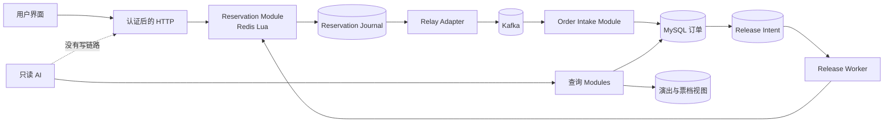

# ticket-rush

[English](README.md)

[完整中文教学文档](docs/zh-CN/README.md) 集中说明当前架构、逐模块源码、运行测试、压测方法和本轮实测结果。

ticket-rush 是一个面向教学的高并发演唱会抢票项目。它用 Spring Boot、MySQL、Redis Lua 和 Kafka，把秒杀系统最难讲清楚的部分显式化：线性化点、幂等、异步创单、补偿、故障恢复和可观测性。

项目目标不是包装成“生产可用平台”，也不是展示一个脱离环境的漂亮 QPS 数字，而是让每一条重要不变量都能被解释、验证和故障注入。

## 安全边界

AI 助手是只读的。

- AI 可以搜索演出、查询票档、查询当前登录用户自己的订单。
- AI 不存在抢票、创建订单、支付、取消、库存修改或提醒写入工具。
- 用户说“帮我抢这张票”时，AI 只能引导用户进入普通抢票页面。
- 任何用户主动发起的写操作都必须走 AI 之外、经过认证的 HTTP 入口；Kafka consumer 与 scheduler 只负责继续执行这条确定性工作流。

本项目刻意不存在 AI 抢票 tool。

创建提醒属于普通的已认证业务操作，入口是 `POST /api/reminders`，不是 AI tool。这里描述的
只是后端边界，并不声称当前前端已经提供提醒 UI。

详细设计见 [AI 只读边界](docs/ai/read-only-boundary.md) 和 [ADR-0003](docs/adr/0003-ai-read-only.md)。

## 你能学到什么

- 为什么只用 MySQL 扣库存容易推理，却很难承受开票峰值。
- 为什么 Redis Lua 能提供原子预占，却不能自动解决跨系统一致性。
- 为什么“Redis 成功后再发 Kafka”一定存在进程崩溃窗口。
- Reservation Journal 与 relay 如何让已接受的 Rush Request 可恢复。
- Order Intake 如何在 Kafka 至少一次投递下只创建一张订单。
- 为什么订单终态和 Release Intent 必须在同一个 MySQL 事务中提交。
- 如何借助 Inventory Ledger 和对账证明库存守恒。
- 如何测试 ack 丢失、重复投递、进程退出、Redis 重启和延迟补偿。

统一领域词汇定义在 [CONTEXT.md](CONTEXT.md)。

## 架构

当前工作树已经实现主要加固结构，并由一套 Flyway schema 统一建库。快速测试、真实
MySQL/Redis 集成测试和一次本机 full-async 实验验证了下表所列路径；在真实依赖上完成故障
注入之前，仍不能声称具备生产级可靠性。准确边界记录在
[实现状态](docs/architecture/current-vs-target.md) 和 [2026-07-22 验证报告](docs/zh-CN/verification-report.md)。



正常成功路径是：

1. 客户端携带幂等身份提交 Rush Request。
2. Redis Lua 在一次原子操作中完成资格校验、库存预占和可恢复的 Redis Stream Journal 写入。
3. relay 使用稳定的 reservation ID 将 Reservation 发布到 Kafka。
4. Order Intake 在一个 MySQL 事务中完成消息幂等和订单创建。
5. 支付后库存保持消耗；取消或超时会随订单状态转换一并写入 Release Intent。
6. worker 幂等释放 Redis 库存，并把 intent 标成完成。

## 实现与验证

| 领域 | 已实现结构 | 仍需证明 |
|---|---|---|
| 抢票 | Lua Reservation、稳定 ID、幂等映射、Redis Stream journal、Cluster hash tag；本轮 10 万次 Redis stock+dedup 原语压测和 1,000 次完整 Reservation 链路均通过库存守恒门禁 | Redis 重启、生命周期 GC 和 Cluster 测试 |
| Kafka 交接 | relay 使用相同 reservation ID 重发；Ledger 持久化后 Redis Journal 丢失可由老 RESERVED 记录恢复；本轮 1,000 请求 full-async 实验最终 lag=0 | ack 丢失、broker/relay 重启、故障积压和多实例测试 |
| 创单 | inbox、订单与 ledger 在一个 MySQL 事务更新；真实 MySQL 重复投递及回滚后重试用例通过 | 消息 claim 后、订单提交前的进程强杀测试 |
| 取消/超时 | 订单终态与 Release Intent 同事务；真实 MySQL/Redis 事务、重复释放和重试耗尽用例通过 | Redis 释放后、Intent 完成前的 worker 强杀与真实失败 intent re-drive |
| 库存恢复 | 可重试的 `NEW -> OPENING -> OPENED`；缺失 stock key 的恢复与释放共用 SKU 锁，并要求 buyer 证据和已结 Release Intent | 管理员暂停/审计控制、完整 buyer/Reservation 重建与全量 Redis 丢失恢复演练 |
| AI 与安全 | 只读 tool registry、输入约束、原子 OTP 消费、固定 TTL 的哈希 refresh token | 真实模型对抗测试与部署加固 |
| 运维 | 显式 Kafka topic、readiness、Prometheus 指标和带正确性门禁的压测；本轮完成一次三场景本机实验 | broker 故障、重复实验方差与容量演练 |
| Schema | 不可变的 Flyway V1 到 V4 历史、独立的相对时间开发 seed；已删除 Docker DDL；本轮空库迁移通过 | V3 到 V4 guard 正反例与 DDL 中途失败恢复演练 |

这张表有意保持诚实：实现类、migration 和快速测试不能替代真实依赖上的故障路径测试。

2026-07-22 记录的最终 gate 通过了 106 个快速测试和 27 个真实服务集成测试；同一工作树的
`bash bench/run.sh all` 也通过。它们是本机单次快照证据，不是生产容量承诺。

## 技术栈

| 关注点 | 选择 |
|---|---|
| 运行时 | Java 17、Spring Boot 4 |
| 持久化 | MySQL、MyBatis-Plus |
| 秒杀热路径 | Redis、Lua |
| 异步创单 | Kafka |
| 认证 | JWT access token 与 Redis refresh token |
| 多级缓存 | Caffeine、Redis |
| AI | LangChain4j 和显式只读工具 allowlist |
| Schema 演进 | Flyway 是唯一 schema owner |
| 前端 | Vue 3、Vite |

## 本地运行

只启动基础设施，不启动 Compose 中的应用容器：

```bash
docker compose up -d mysql redis kafka
```

配置必要环境变量并启动后端：

```bash
export JWT_SECRET="$(openssl rand -base64 48)"
export OPENAI_API_KEY=仅在启用AI时填写
./mvnw spring-boot:run -Dspring-boot.run.profiles=dev
```

在另一个终端启动前端：

```bash
cd frontend
npm ci
npm run dev
```

后端默认地址是 http://127.0.0.1:8081，Vite 前端默认地址是 http://127.0.0.1:5173。

Flyway 会按顺序执行 V1 到 V4，开发 profile 随后执行一份采用相对时间的 seed。V4 会在修改持久表前拒绝未完成的旧 rollback task、仍待支付的旧订单，以及同一用户/票档同时存在两笔活动订单的数据。V3 到 V4 是停服式协议升级，不支持滚动迁移。旧 Docker SQL 创建的数据库没有自动接管路径；复用前请先阅读 [运行指南](docs/getting-started/running.md)，除非确认数据可丢弃，否则不要删除 volume。

## 测试

默认测试通道是快速测试，会排除标记为 `integration` 的用例：

```bash
./mvnw test
```

真实依赖通道需要 MySQL、Redis 和 Kafka：

```bash
docker compose up -d mysql redis kafka
./mvnw -Pintegration verify
```

该通道应指向独立空数据库，而不是共享开发库；[运行指南](docs/getting-started/running.md#test)
给出了明确的创建与清理命令。

对这个项目来说，happy path 通过还不够。只要修改一致性不变量，就必须覆盖副作用与确认之间的故障窗口。具体方法见 [测试与压测](docs/testing/testing-and-benchmarking.md)。

最近一次实际执行的命令、失败修复过程、测试数量与未覆盖边界见
[本轮验证报告](docs/zh-CN/verification-report.md)。

## 文档地图

| 从这里开始 | 内容 |
|---|---|
| [文档索引](docs/README.md) | 面向学习、评审和运维的阅读路线 |
| [中文教学文档](docs/zh-CN/README.md) | 当前架构、逐模块源码、运行测试、压测与本轮实测报告 |
| [领域上下文](CONTEXT.md) | 统一词汇和库存不变量 |
| [架构总览](docs/architecture/overview.md) | Modules、Seams、数据归属与系统流程 |
| [核心秒杀流程](docs/architecture/rush-flow.md) | Reservation 到订单再到释放 |
| [一致性案例](docs/architecture/consistency.md) | 深入拆解 Reservation、Order Intake、Release Intent |
| [技术对比](docs/comparisons/data-paths.md) | MySQL、Redis Lua、Kafka 与 relay |
| [故障手册](docs/failures/failure-playbook.md) | 崩溃窗口、恢复方式与收益 |
| [测试与压测](docs/testing/testing-and-benchmarking.md) | 正确性、故障注入、负载实验 |
| [可观测性](docs/operations/observability.md) | 关联 ID、指标、不变量和告警 |
| [安全](docs/security/security.md) | 认证、防刷、密钥和信任边界 |
| [AI 边界](docs/ai/read-only-boundary.md) | 工具 allowlist 和提示词注入防护 |
| [学习路线](docs/learning/roadmap.md) | 分阶段课程 |
| [运行指南](docs/getting-started/running.md) | 本地启动与排障 |
| [ADR](docs/adr/README.md) | 关键架构取舍与后果 |

## 项目范围

当前支付是模拟支付。项目不覆盖真实支付清结算、法定实名核验、选座图、退税、真实退款和多地域容灾。RAG 也只是未来教学扩展：当前运行时没有向量库、检索依赖、检索链路或 RAG tool。旧的 `tb_ticket_rule_doc` 表仅因已发布 schema 历史不可变而保留，当前运行时没有任何组件能访问它。这些都可以作为后续练习，但前提是核心库存不变量已经能够被证明。

## 贡献标准

修改前阅读 [AGENTS.md](AGENTS.md)。代码能编译不代表任务完成：必须说明实际运行了哪些验证；不得扩大 AI 写权限；任何一致性规则变化都要补充相应故障路径测试。
