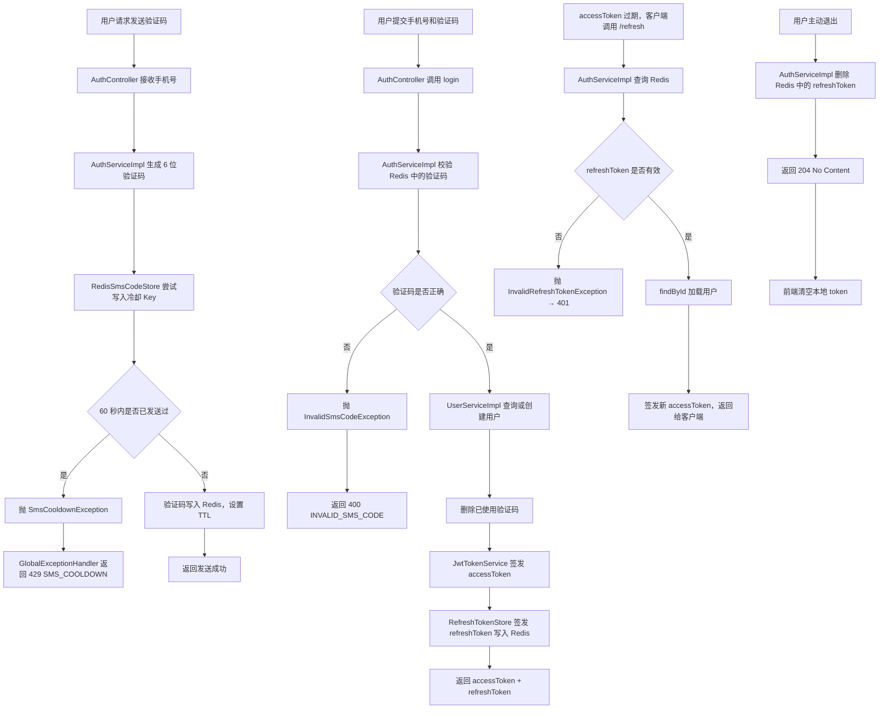
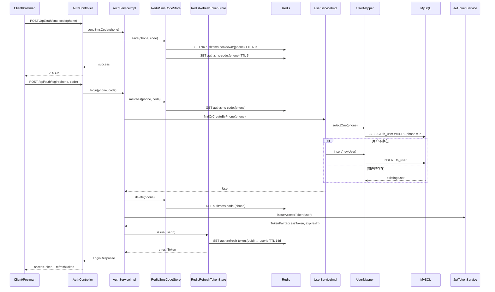
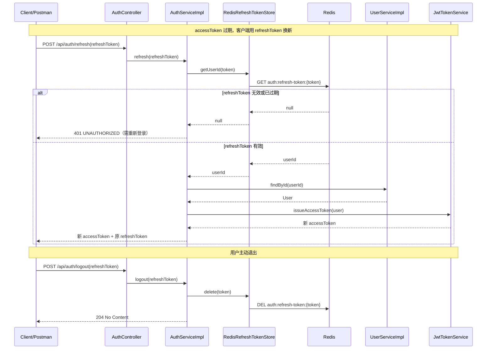
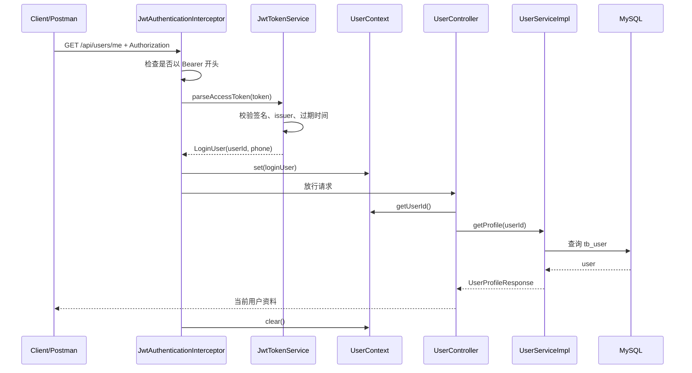

# 模块一：用户登录与 JWT 鉴权

## 模块目标

模块一完成的是票务抢购系统的用户身份入口，负责把"手机号验证码登录"转换成后续业务都可以识别的登录态。

本模块不使用服务端 Session 保存会话，而是登录成功后签发两个 token：

- **accessToken**（JWT，2 小时）：用于接口鉴权，前端在后续请求中携带 `Authorization: Bearer <accessToken>`，后端通过拦截器解析并把当前用户信息写入 `UserContext`。
- **refreshToken**（随机 UUID，14 天，存 Redis）：用于在 accessToken 过期后换取新的 accessToken，让活跃用户不必频繁重新登录。主动退出时服务端删除 Redis 中的 refreshToken，使其立即失效。

## 完成范围

| 能力 | 状态 | 说明 |
|------|------|------|
| 发送短信验证码 | 已完成 | 当前是模拟短信发送，验证码写入 Redis，不接真实短信供应商 |
| 验证码登录 | 已完成 | 手机号未注册时自动创建用户，已注册时直接登录 |
| accessToken 签发 | 已完成 | JWT，HMAC-SHA256 签名，有效期 2 小时，包含 userId 和 phone |
| refreshToken 签发 | 已完成 | UUID，存 Redis，有效期 14 天，用于换新 accessToken |
| 无感续期 | 已完成 | `POST /api/auth/refresh` 用 refreshToken 换新 accessToken |
| 主动退出登录 | 已完成 | `POST /api/auth/logout` 删除 Redis 中的 refreshToken |
| 当前用户查询 | 已完成 | `GET /api/users/me` 通过 JWT 获取当前用户资料 |
| 统一异常响应 | 已完成 | 业务异常统一转成 `ErrorResponse(code, message)` |
| 审计字段自动填充 | 已完成 | `create_time`、`update_time` 由 MyBatis-Plus 自动写入 |

## MVC 分层结构

```text
dev.dahuangggg.ticketrush
├── controller/      -- HTTP 入口，只接收请求、调用 Service、返回 DTO
├── dto/             -- 请求和响应对象，Controller 对外暴露的数据结构
├── entity/          -- 数据库实体，映射 tb_user 表
├── mapper/          -- MyBatis-Plus Mapper，负责数据库访问
├── service/         -- 业务接口
│   └── impl/        -- 业务实现，负责登录、注册、验证码、token 等业务规则
├── security/        -- JWT 签发、JWT 拦截器、当前用户上下文
├── config/          -- WebMvc、Redisson、MyBatis-Plus 自动填充配置
└── exception/       -- 自定义异常和全局异常处理器
```

## 核心接口

| 接口 | 方法 | 是否需要登录 | 作用 |
|------|------|--------------|------|
| `/api/auth/sms-code` | `POST` | 否 | 发送短信验证码，同一手机号 60 秒内只能发送一次 |
| `/api/auth/login` | `POST` | 否 | 手机号 + 验证码登录，返回 accessToken + refreshToken |
| `/api/auth/refresh` | `POST` | 否（用 refreshToken 鉴权） | 换取新的 accessToken，accessToken 过期时调用 |
| `/api/auth/logout` | `POST` | 否（用 refreshToken 鉴权） | 主动退出，立即删除 refreshToken |
| `/api/users/me` | `GET` | 是 | 根据 JWT 查询当前用户资料 |

## 请求示例

**发送验证码：**

```http
POST http://127.0.0.1:8081/api/auth/sms-code
Content-Type: application/json

{
  "phone": "13191229039"
}
```

**登录：**

```http
POST http://127.0.0.1:8081/api/auth/login
Content-Type: application/json

{
  "phone": "13191229039",
  "code": "123456"
}
```

响应：

```json
{
  "accessToken": "eyJhbGciOiJIUzI1NiJ9...",
  "tokenType": "Bearer",
  "expiresIn": 7200,
  "refreshToken": "550e8400-e29b-41d4-a716-446655440000"
}
```

**accessToken 过期后换新（无感续期）：**

```http
POST http://127.0.0.1:8081/api/auth/refresh
Content-Type: application/json

{
  "refreshToken": "550e8400-e29b-41d4-a716-446655440000"
}
```

响应结构与登录一致，refreshToken 字段返回原值（不轮换）。

**主动退出登录：**

```http
POST http://127.0.0.1:8081/api/auth/logout
Content-Type: application/json

{
  "refreshToken": "550e8400-e29b-41d4-a716-446655440000"
}
```

响应：`204 No Content`

**查询当前用户：**

```http
GET http://127.0.0.1:8081/api/users/me
Authorization: Bearer <accessToken>
```

## 数据模型

### MySQL：tb_user

```sql
tb_user
- id             BIGINT       -- MyBatis-Plus 雪花 ID
- phone          VARCHAR(20)  -- 手机号，唯一索引 uk_user_phone
- nick_name      VARCHAR(50)  -- 昵称，新用户默认生成
- icon           VARCHAR(255) -- 头像
- deleted        TINYINT(1)   -- 逻辑删除，0 正常，1 删除
- create_time    DATETIME     -- 创建时间，插入时自动填充
- update_time    DATETIME     -- 更新时间，插入和更新时自动填充
```

### Redis Key

```text
auth:sms-code:{phone}           -- 短信验证码，默认 5 分钟过期
auth:sms-cooldown:{phone}       -- 发送冷却标记，60 秒过期
auth:refresh-token:{token}      -- refreshToken → userId，默认 14 天过期
```

## 登录态生命周期

```text
登录
 └─ 签发 accessToken（JWT，2h）+ refreshToken（UUID，14d，存 Redis）

正常请求
 └─ 携带 accessToken，拦截器校验

accessToken 过期（2h 后）
 └─ POST /api/auth/refresh { refreshToken }
 └─ 服务端校验 refreshToken 是否在 Redis 中
     ├─ 有效 → 签发新 accessToken，用户无感知
     └─ 无效（已过期 / 已注销）→ 401 → 跳登录页

主动退出
 └─ POST /api/auth/logout { refreshToken }
 └─ Redis 删除 refreshToken，立即失效
 └─ 前端同步清空本地 accessToken + refreshToken
 └─ 旧 accessToken 最多在自然过期前（≤2h）仍有效（可接受的窗口期）

14 天不活跃
 └─ refreshToken 自然过期，Redis key 消失
 └─ 下次 /refresh → 401 → 要求重新登录
```

## 业务主流程



## 登录时序图



## 无感续期 & 退出时序图



## 受保护接口鉴权流程



## 关键代码说明

### Controller 层

`AuthController` 负责四个认证入口：发送验证码、登录、续期、退出。它不直接操作 Redis、不直接操作数据库，也不自己拼 JWT，而是把业务交给 `AuthService`。

`UserController` 负责用户相关 HTTP 接口。`/api/users/me` 不从请求参数中接收 userId，而是从 `UserContext` 读取当前登录用户，这样可以避免用户伪造别人的 userId 查询资料。

### Service 层

`AuthServiceImpl` 是认证业务的核心：

- 发送验证码时生成 6 位随机码；
- 调用 `SmsCodeStore.save()` 保存验证码；
- 日志中只记录手机号，不记录验证码明文；
- 登录时先校验验证码，通过后查询或创建用户，删除验证码，最后签发 accessToken + refreshToken；
- 续期时先从 Redis 查询 refreshToken 对应的 userId，再从数据库加载完整用户信息，重新签发 accessToken；
- 退出时直接删除 Redis 中的 refreshToken。

`UserServiceImpl` 是用户业务的核心：

- `findOrCreateByPhone()` 先根据手机号查询用户；查不到时创建默认用户；如果并发注册同一手机号导致唯一索引冲突，捕获 `DuplicateKeyException` 后重新查询；
- `getProfile()` 根据当前登录 userId 查询用户资料，用户不存在时返回未授权异常；
- `findById()` 根据 userId 返回用户实体，供续期流程使用（refreshToken 只存了 userId，签发 accessToken 需要完整 User）。

`RedisSmsCodeStore` 负责验证码在 Redis 中的存储规则：

- `auth:sms-code:{phone}` 保存验证码；
- `auth:sms-cooldown:{phone}` 保存 60 秒冷却标记；
- 使用 Redis `setIfAbsent` 实现"同一手机号 60 秒只允许发送一次"；
- 超过频率限制时抛出 `SmsCooldownException`，最终返回 429。

`RedisRefreshTokenStore` 负责 refreshToken 的生命周期：

- `issue(userId)` 生成 UUID 存入 Redis，值为 userId 字符串，TTL 默认 14 天；
- 选用 UUID（不透明随机字符串）而非 JWT：存在 Redis 中可以随时主动删除，实现真正的注销；JWT 无状态，服务端无法主动撤销；
- `getUserId(token)` 查询 Redis，不存在返回 null；
- `delete(token)` 退出时调用，使 token 立即失效。

### Security 层

`JwtTokenService` 负责 JWT 的签发和解析：

- 启动时通过 `@PostConstruct` 初始化一次 `SecretKey`，避免每次请求都重建；
- 登录成功时把 userId 写入 subject 和 claim，同时把 phone 写入 claim；
- 解析 token 时校验签名、issuer 和过期时间；
- token 无效或过期时抛出 `UnauthorizedException`。

`JwtAuthenticationInterceptor` 负责保护 `/api/**` 下需要登录的接口：

- 请求进入 Controller 前检查 `Authorization` 头；
- 只接受 `Bearer <accessToken>` 格式；
- token 解析成功后写入 `UserContext`；
- 请求结束后清理 `UserContext`，避免线程复用导致用户信息串号。

`UserContext` 是基于 `ThreadLocal` 的当前用户上下文。它只在一次 HTTP 请求内部有效，不是 Session，也不会跨请求保存登录状态。

### Config 层

`WebMvcConfig` 注册 JWT 拦截器：

- 拦截 `/api/**`；
- 放行 `/api/auth/sms-code`、`/api/auth/login`：尚未持有 token；
- 放行 `/api/auth/refresh`：accessToken 可能已过期，用 refreshToken 自行鉴权；
- 放行 `/api/auth/logout`：保证 accessToken 过期时也能正常退出。

`MybatisPlusMetaObjectHandler` 负责自动填充审计字段：

- 插入数据时填充 `createTime` 和 `updateTime`；
- 更新数据时刷新 `updateTime`；
- 实体字段通过 `@TableField(fill = FieldFill.INSERT)` 和 `@TableField(fill = FieldFill.INSERT_UPDATE)` 标记。

## 客户端对接约定

`/api/auth/refresh` 接口已在服务端实现，但**何时调用它的逻辑不在本项目里**，属于客户端（App / Web 前端）的职责，需要在 HTTP 拦截器层统一处理。

### 推荐实现方式：被动刷新 + 防并发

```
任意接口返回 401
  └─ HTTP 拦截器判断是否持有 refreshToken
      ├─ 没有 → 跳转登录页
      └─ 有 → 调用 POST /api/auth/refresh
              ├─ 成功 → 更新本地 accessToken → 重放原请求
              └─ 失败（refreshToken 也过期）→ 清空本地 token → 跳转登录页
```

防并发处理：多个请求同时 401 时，只触发一次 `/refresh`，其他请求等待换新完成后统一重放。

```
// 伪代码
let isRefreshing = false
let waitQueue = []

onResponse 401:
  if isRefreshing:
    return enqueue(waitQueue, retryOriginalRequest)
  
  isRefreshing = true
  refresh()
    .then(newToken):
      flushQueue(waitQueue, newToken)
      retry(originalRequest, newToken)
    .catch():
      rejectQueue(waitQueue)
      redirectToLogin()
    .finally():
      isRefreshing = false
```

### 各端对应实现位置

| 客户端 | 实现位置 |
|--------|----------|
| Web（Axios） | `axios.interceptors.response` |
| iOS（Alamofire） | `RequestInterceptor.retry` |
| Android（OkHttp） | `Authenticator` |
| React Native | `axios.interceptors.response` 或 `fetch` 封装层 |

### 本服务端的配合

- accessToken 过期时统一返回 `401 UNAUTHORIZED`，客户端以此为触发信号
- `/api/auth/refresh` 不在 JWT 拦截器保护范围内，accessToken 过期时仍可正常访问
- `/api/auth/logout` 同样不在保护范围内，accessToken 过期时也可正常退出
- 每次 `/refresh` 成功后服务端会重置 refreshToken 的 TTL（滑动过期），客户端无需关心

## 本轮质量修复记录

| 问题 | 修复方式 | 影响 |
|------|----------|------|
| 并发注册同一手机号可能 500 | 捕获 `DuplicateKeyException` 后重新查询用户 | 同一手机号并发登录时返回同一个用户 |
| 验证码明文进入日志 | 移除日志中的 `code={}` | 避免敏感验证码泄露 |
| 发送验证码无频率限制 | Redis `setIfAbsent` 加 60 秒冷却 Key | 超频返回 429 |
| MyBatis 类型别名包错误 | `type-aliases-package` 改为 `dev.dahuangggg.ticketrush.entity` | 避免配置指向不存在包 |
| JWT 每次操作重建 SecretKey | `@PostConstruct` 初始化并缓存 | 减少重复计算 |
| 缺少兜底异常处理 | 增加 `Exception.class` handler | 未知异常统一返回 500 |
| 全局字段注入 | 改为构造器注入 | 依赖关系更清晰，更利于测试 |
| 未使用 hutool-all | 从 `pom.xml` 移除 | 减少无效依赖 |
| 活跃用户 2 小时后强制掉线 | 引入 refreshToken + `/refresh` 接口 | 活跃用户可无感续期，最多 14 天不活跃才需重新登录 |
| 退出登录无法立即失效 | refreshToken 存 Redis，退出时 DEL 立即撤销 | 主动退出后无法再用 refreshToken 换新 token |

## 错误码

| HTTP 状态 | code | 触发场景 |
|-----------|------|----------|
| 400 | `BAD_REQUEST` | 请求参数校验失败 |
| 400 | `INVALID_SMS_CODE` | 验证码错误或已过期 |
| 401 | `UNAUTHORIZED` | 未登录、token 无效、token 过期、refreshToken 无效 |
| 429 | `SMS_COOLDOWN` | 同一手机号 60 秒内重复发送验证码 |
| 500 | `INTERNAL_ERROR` | 未预期的服务端异常 |

## 验证方式

### 1. 运行单元和集成测试

```bash
./mvnw test
```

### 2. Postman 验证主流程

1. 调用 `POST /api/auth/sms-code` 发送验证码。
2. 从 Redis 或日志中获取验证码。
3. 调用 `POST /api/auth/login` 获取 `accessToken` 和 `refreshToken`。
4. 调用 `GET /api/users/me`，在 Authorization 头携带 `Bearer <accessToken>`，应返回当前用户资料。

### 3. Postman 验证续期

1. 完成登录，保存 `refreshToken`。
2. 调用 `POST /api/auth/refresh { "refreshToken": "..." }`，应返回新的 `accessToken`。
3. 用新 accessToken 调用 `GET /api/users/me`，应正常返回。

### 4. Postman 验证退出

1. 调用 `POST /api/auth/logout { "refreshToken": "..." }`，应返回 204。
2. 再次调用 `POST /api/auth/refresh` 使用同一个 refreshToken，应返回 401。

### 5. Redis 验证

```bash
# 查看短信验证码
docker exec redis redis-cli -p 6379 GET auth:sms-code:13191229039
docker exec redis redis-cli -p 6379 TTL auth:sms-code:13191229039

# 查看发送冷却
docker exec redis redis-cli -p 6379 TTL auth:sms-cooldown:13191229039

# 查看 refreshToken（将 {token} 替换为登录返回的实际 token）
docker exec redis redis-cli -p 6379 GET "auth:refresh-token:{token}"
docker exec redis redis-cli -p 6379 TTL "auth:refresh-token:{token}"
```

如果本地 Redis 容器映射的是 `16379:6379`，应用配置使用的是宿主机端口 `16379`，容器内部 `redis-cli` 仍然访问容器内端口 `6379`。

## 当前边界

- 当前短信发送是模拟实现，只把验证码写入 Redis，没有接短信供应商。
- 退出登录不立即吊销 accessToken，旧 accessToken 在自然过期前（最多 2 小时）仍有效。如需立即失效，需要引入 accessToken 黑名单（Redis SET），每次请求多一次查询。对于抢票平台当前窗口期可接受。
- refreshToken 不做 token rotation：每次 `/refresh` 返回同一个 refreshToken，token 字符串不变，只重置 TTL。如需更高安全性，可在每次 `/refresh` 时签发新 UUID 并删除旧 token。
- **`/api/auth/refresh` 的调用时机由客户端决定，本服务不实现。** 推荐在客户端 HTTP 拦截器里统一处理 401，详见上方「客户端对接约定」。
- 当前没有用户资料更新接口。
- 当前用户模块只服务后续抢票主流程，后续模块会继续复用 `UserContext.getUserId()` 获取当前用户。
