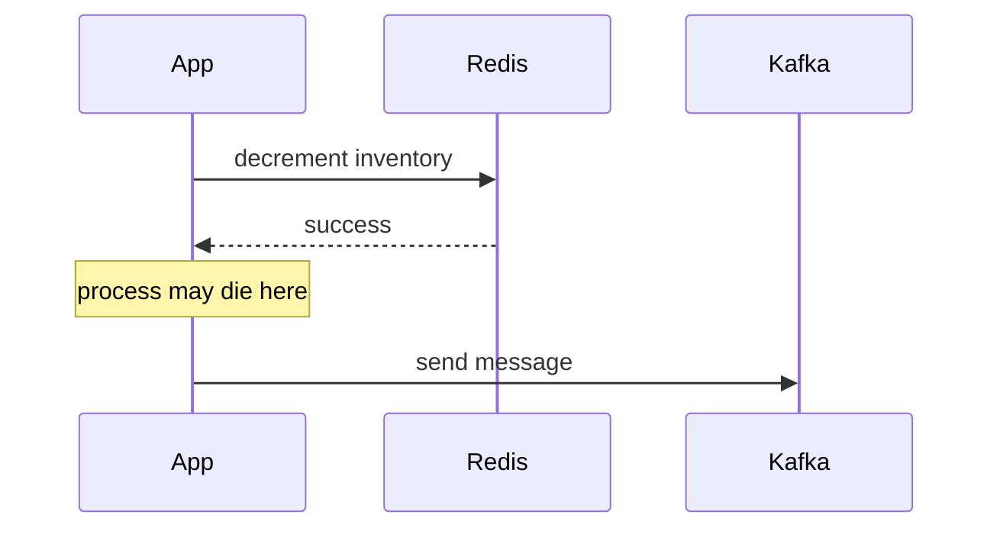
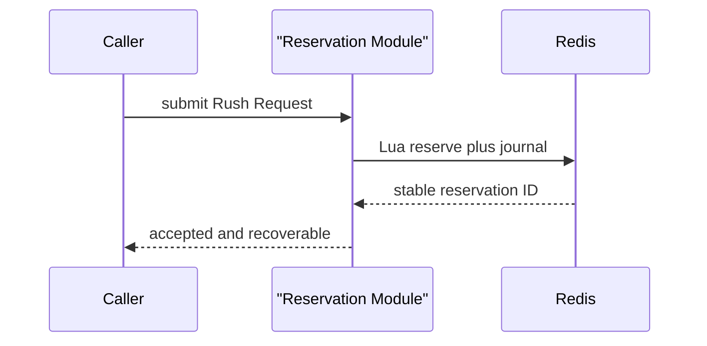
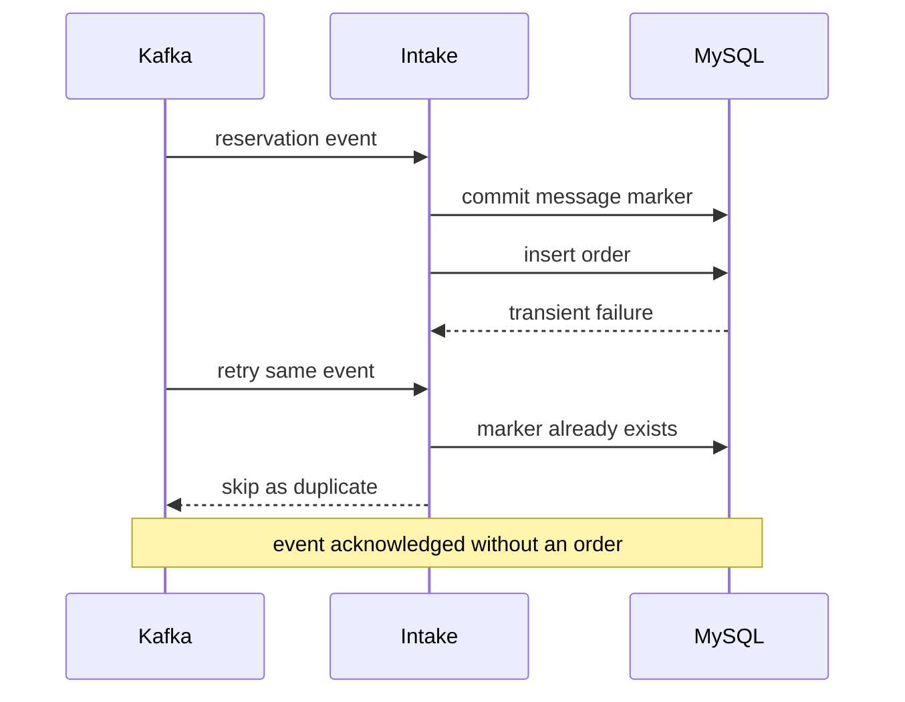
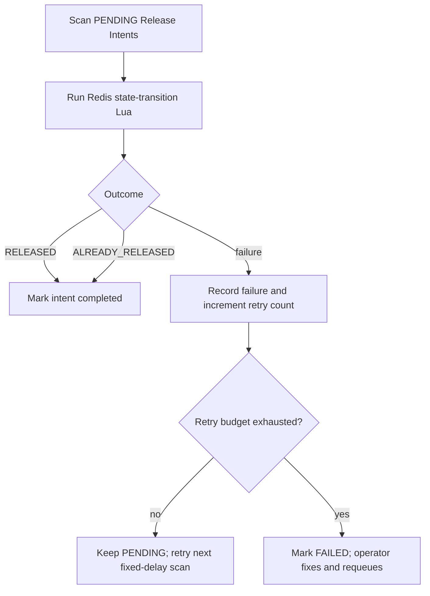
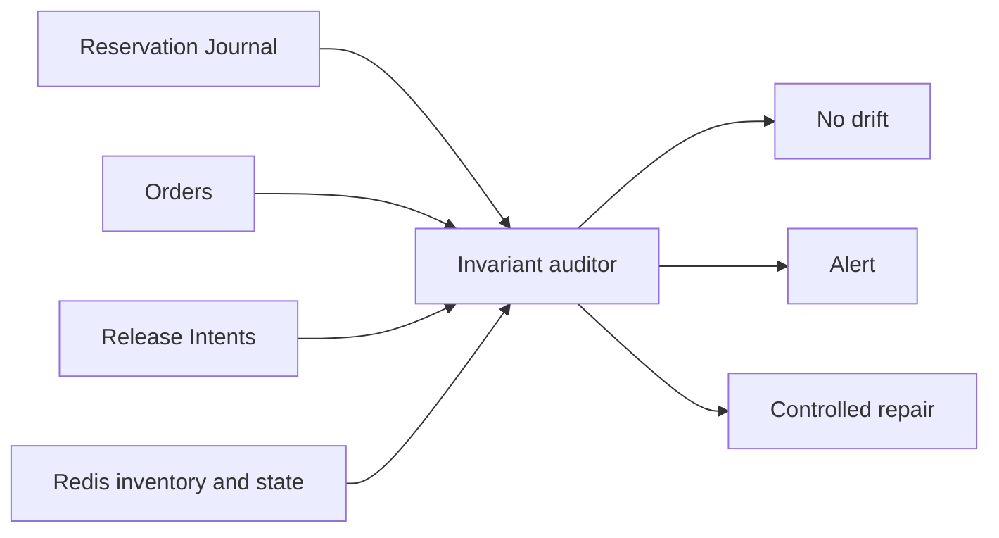

# Consistency case study

This chapter follows one ticket unit across three deep Modules:

1. Reservation owns the inventory hold.
2. Order Intake owns durable order creation.
3. Release Intent owns eventual inventory return.

The design is a saga with explicit durable facts, not a distributed transaction disguised as try/catch.

## Start with the invariant

For one Ticket SKU:

```text
configured inventory
  = available
  + reserved but not yet represented by an active order
  + active order quantity
```

The exact handoff between the last two terms must be defined in the Inventory Ledger so the same unit is not counted twice.

Every accepted Rush Request must also satisfy:

```text
one authenticated user + one SKU + one normalized idempotency key
  -> one reservation ID -> at most one active order
```

Every cancellation or timeout must satisfy:

```text
one release intent -> inventory incremented at most once
```

## Case 1: Reservation and journal

### The shallow design



The caller must understand Redis success, Kafka acknowledgement ambiguity, rollback timing, process death, and duplicate publication. The Interface is almost as complex as the Implementation.

### The deepened Module

Reservation hides those details behind one promise: accepted means reserved and journaled.



The relay is internal workflow after the Interface promise. This creates Leverage for HTTP, retries, tests, and future clients, while keeping Locality for consistency rules.

### Ack timeout rule

Producer timeout is UNKNOWN, not FAILED.

- Definite serialization failure before send may be failed.
- Definite broker rejection may be failed.
- Missing acknowledgement after send may still mean the record was appended.

The relay retries with the same reservation ID. Order Intake absorbs duplicates. It must not release inventory merely because an acknowledgement was not observed.

## Case 2: Order Intake

### The early-marker failure

Committing a message marker before the order creates this sequence:



The marker did not provide idempotency; it converted a retryable failure into data loss.

### Atomic intake transaction

The current implementation uses this transaction boundary:

```text
BEGIN
  insert PENDING message identity when absent
  authenticate message against the Reservation Ledger
  insert or recover the pending order
  CAS the Reservation Ledger to ORDER_CREATED
  mark inbox SUCCESS with the order ID
COMMIT
```

If any step fails, the marker rolls back and Kafka can retry. If COMMIT succeeded but Kafka redelivers
because the offset acknowledgement was lost, the unique message identity returns the existing
outcome. A permanent business rejection instead commits a matching FAILED inbox row and Release
Intent in the same transaction; payload-integrity and infrastructure failures do not become
committed skip markers.

For advanced teaching, a resumable state machine is also valid, but it must distinguish:

- PROCESSING with a lease;
- SUCCESS with an order ID;
- FAILED_RETRYABLE;
- FAILED_PERMANENT with compensation status.

“Row exists” alone is not a state machine.

## Case 3: Release Intent

### Why inline rollback fails

Changing MySQL order status and then calling Redis creates two opposite crash windows:

| Order | Redis | Result |
|---|---|---|
| DB commits, process dies before Redis | not released | inventory leak |
| Redis releases, DB commit fails | released | active order without held inventory |
| Redis executes, response is lost, retry executes | released twice | inventory inflation |

### Transactional intent

The order Module writes intent, not the external Redis effect:

```text
BEGIN
  UPDATE order
    SET status = terminal
    WHERE id = ? AND status = PENDING
  INSERT release_intent(reservation_id, status = PENDING)
COMMIT
```

Only the CAS winner inserts the intent. A worker later applies it.



The Redis implementation stores enough Reservation state to distinguish a releasable state from
RELEASED. The worker also requires the durable Ledger state to be RELEASE_PENDING. Inventory is
incremented only when the Redis state transition succeeds.

The current worker uses a batch scan plus an optional process-wide distributed lock. Per-row claim
leases and time-based backoff are Target architecture, not current behavior.

## Active-order uniqueness

Pending and paid are the same active class:

```text
active_flag = 1 when status is PENDING or PAID
active_flag = NULL when status is CANCELED or TIMEOUT
UNIQUE(user_id, sku_id, active_flag)
```

Mapping active_flag to the raw status is incorrect because it allows one pending row and one paid row for the same user and SKU.

Redis duplicate state provides the fast rejection; the MySQL unique constraint is the durable final guard. Both must encode the same business rule.

## TTL is business policy

A buyer Set TTL is not merely cache hygiene. If it expires while paid orders remain active, duplicate protection disappears.

The current implementation does not assign an automatic TTL to accepted buyer state, Reservation
hashes, idempotency mappings, or the relay journal. `cleanupAt` is an earliest-GC marker, not deletion
permission: a downstream outage can outlive any fixed grace period. A future lifecycle-aware GC may
remove an entry only after durable ledger evidence proves it terminal and no replay or release still
depends on it.

Do not refresh one whole SKU Set with an arbitrary one-hour TTL on every purchase, and do not expire
unpublished journal entries merely because the sale window ended.

## Reconciliation

Reconciliation answers:

- Which accepted Reservations were never published?
- Which published Reservations have no order after the expected delay?
- Which terminal orders have incomplete Release Intents?
- Does Available Inventory equal the ledger-derived value?
- Does any user have more than one active order for a SKU?



Repair must be deterministic and recorded. Blindly resetting Redis from configured stock can resell inventory that already has active orders.

## Benefits of the implemented design

- **Depth:** callers learn one Reservation promise instead of Redis, Kafka, and rollback choreography.
- **Leverage:** the same idempotency identity works for HTTP retry, relay retry, Kafka retry, and status query.
- **Locality:** inventory release rules live in one Module rather than request, scheduler, and retry code.
- **Testability:** each durable state creates a fault-injection checkpoint.
- **Operability:** every accepted request and every required release has a queryable record.

## Verification map

The normal path has local real-service and full-async evidence. The crash/concurrency cases below
remain the minimum proof map; the current status of each is tracked in
[implementation status](current-vs-target.md).

| Invariant | Minimum test |
|---|---|
| Accepted means recoverable | terminate after Lua, then relay after restart |
| One order per Reservation | deliver the same Kafka record concurrently |
| Failure remains retryable | fail order insert after inbox insert, then redeliver |
| Release at most once | execute one intent twice and concurrently |
| Active uniqueness | paid plus new pending insert must fail |
| Inventory conservation | compare ledger before and after every injected failure |

See [failure playbook](../failures/failure-playbook.md) and [testing](../testing/testing-and-benchmarking.md).
