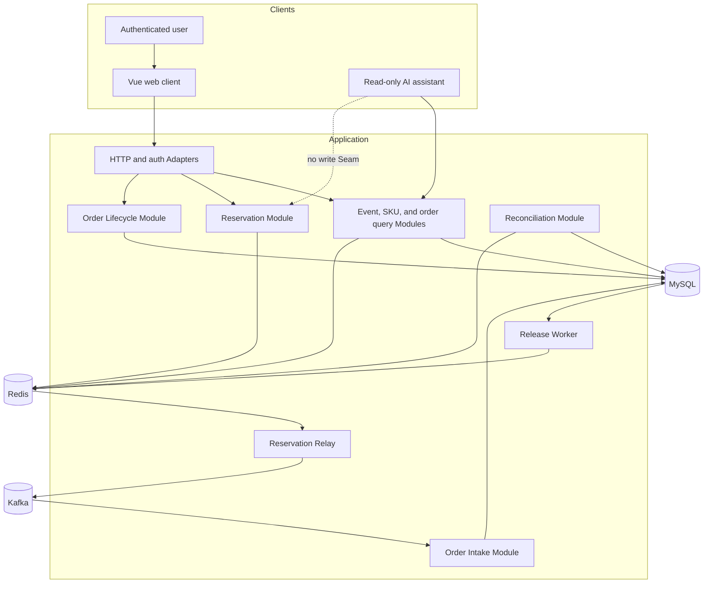
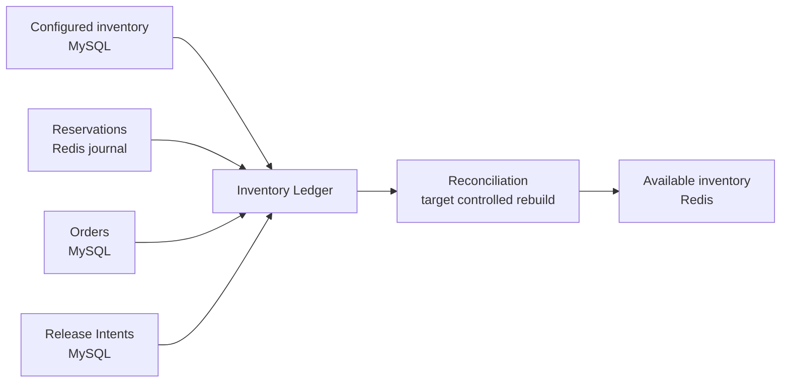
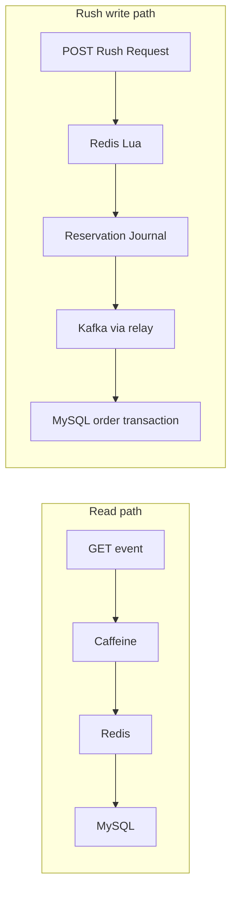

# Architecture overview

## Teaching objective

ticket-rush is organized around a small set of deep domain Modules. Each Module owns an invariant and hides infrastructure-specific Implementation behind a narrow Interface.

The important question is not “which controller calls which service?” It is “which Module is allowed to decide this fact, and how can it recover after a crash?”

## System context

## Module map

| Module | Interface responsibility | Hidden Implementation |
|---|---|---|
| Authentication | Establish current user and role | JWT parsing, refresh-token Redis keys |
| Event Query | Return public event views | MySQL, Caffeine, Redis cache, Bloom filter |
| Ticket SKU Query | Return price, window, and available view | MySQL metadata plus Redis availability |
| Reservation | Accept or reject one idempotent Rush Request | Lua, cluster keys, journal, duplicate policy |
| Relay | Eventually publish each accepted Reservation | Journal scan, Kafka producer, retry and ack handling |
| Order Intake | Turn one Reservation into one pending order | Kafka Adapter, MySQL transaction, unique constraints |
| Order Lifecycle | Pay, cancel, or expire an order | CAS transitions and Release Intent creation |
| Inventory Release | Apply one Release Intent at most once | Lua state transition and retry worker |
| Reconciliation | Inspect and explain inventory drift | Ledger queries and safe missing-stock initialization; full state repair is Target architecture |
| Read-only AI | Answer with authenticated business facts | LangChain4j and query-only tool allowlist |

Depth comes from keeping callers unaware of key formats, retry timing, message acknowledgement ambiguity, and transaction choreography. Those facts belong inside the Module that owns the invariant.

## Sources of truth

- MySQL owns durable order lifecycle and Release Intent.
- Redis owns the hot-path Available Inventory and Reservation linearization point.
- Kafka transports Reservation events; it is not the inventory source of truth.
- The Reservation Journal explains accepted requests before an order exists.
- The Inventory Ledger combines these facts for reconciliation.
- The durable `stock_initialized` state machine distinguishes retryable first-opening preparation
  from disaster recovery. Stock-key recovery and Redis release share a per-SKU mutex; missing buyer
  evidence or an unsettled Release Intent fails closed instead of resetting Configured Inventory.

## Read path and write path

The project intentionally treats browsing and rushing differently.

The read path optimizes latency and tolerates bounded staleness. The write path protects inventory invariants and requires durable recovery.

The Caffeine detail value carries an explicit `normal` or `hot` type. Without that small type tag,
a normal event cached in L1 would be returned by the hot-cache probe on its next request. The caller
would then report `isHot=true`, so the dynamic hotspot detector would stop counting the very traffic
that should promote the event. The type tag preserves both the fast local hit and the routing truth.

## Trust boundaries

- Public event and SKU reads require no identity.
- Rush, order, payment, cancellation, and reminder HTTP operations require JWT identity.
- Admin stock initialization requires the admin role.
- User identity comes from the authenticated context, never from a request or AI tool argument.
- AI tools are query-only and do not share a Seam with mutation Modules.
- Kafka messages are internal input, but Order Intake still validates their domain invariants.

## Implementation status

The current worktree contains the Reservation journal, relay, transactional Order Intake, Release
Intent worker, read-only AI registry, reconciliation inspection Module, and matching immutable
Flyway V1-through-V4 history. The 2026-07-22 local gate passed 106 fast tests, 27 real-MySQL/Redis
integration tests on an empty Flyway-managed database, and all three benchmark scenarios. Redis
Cluster/failover, acknowledgement-loss, and process-death recovery remain separate evidence.

Use [implementation status](current-vs-target.md) for the current proof checklist and [consistency case study](consistency.md) for the reasoning.

## Navigation

- [Core rush flow](rush-flow.md)
- [Consistency case study](consistency.md)
- [Technology comparison](../comparisons/data-paths.md)
- [Failure playbook](../failures/failure-playbook.md)
- [Domain context](../../CONTEXT.md)
