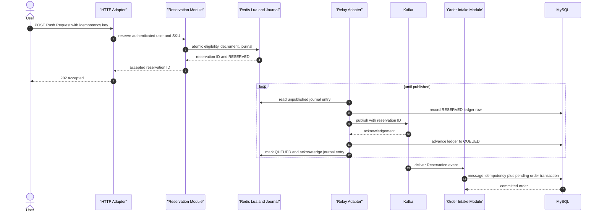
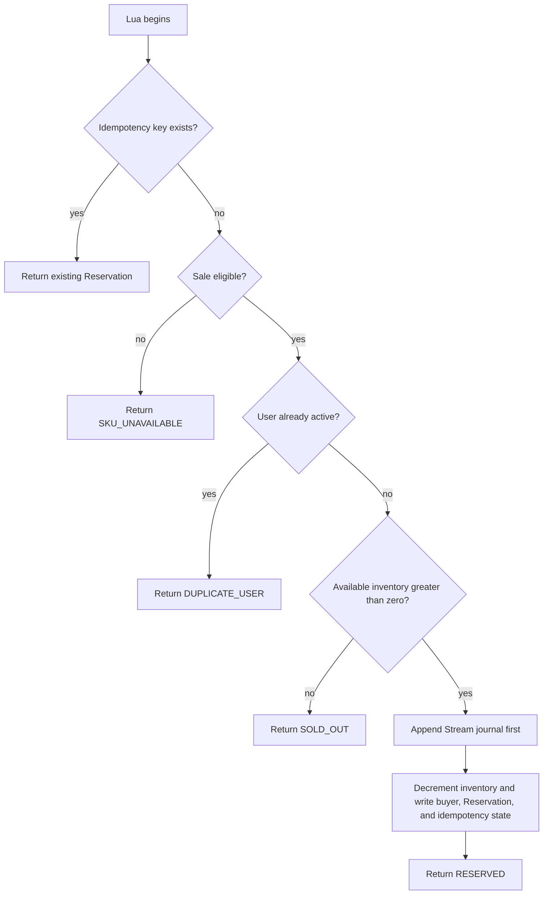
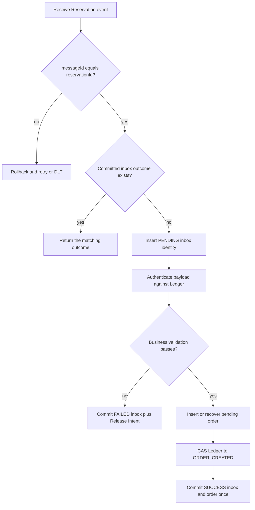
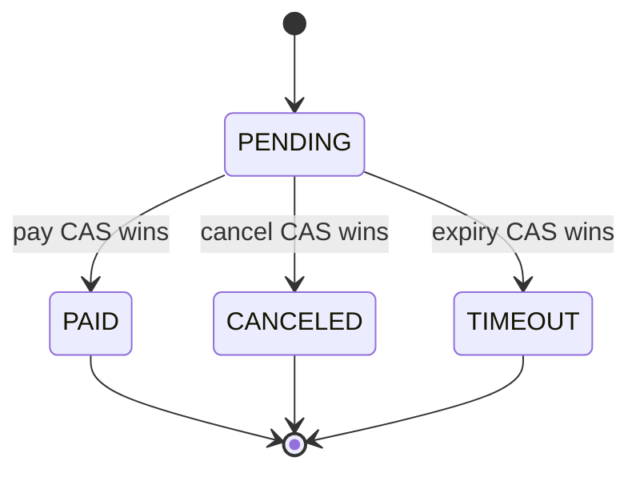
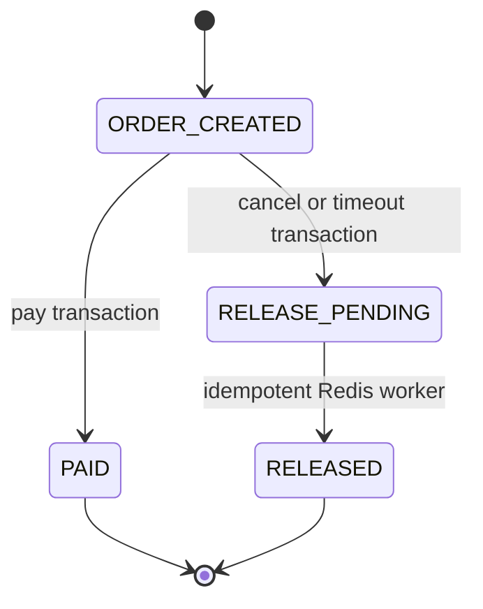
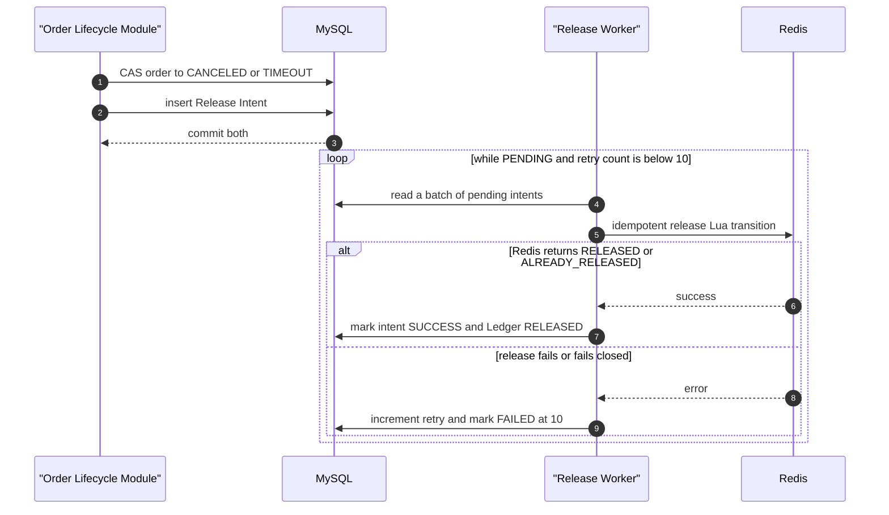

# Core rush flow

## The business promise

When the system accepts a Rush Request, it promises:

1. one unit was reserved at a clear linearization point;
2. the accepted request is recoverable after process death;
3. retries refer to the same Reservation;
4. Kafka redelivery creates at most one order;
5. cancel or timeout eventually releases exactly one unit.

“Kafka send returned” is not the business promise. It is only one transport observation.

## Current normal success sequence

The HTTP response does not wait for order creation. It returns after the Reservation and journal are atomically present in Redis. Compose enables AOF, but `everysec` is not a zero-loss durability guarantee.

## Reservation Lua responsibilities

The current Lua execution:

1. receives only keys built from the same Ticket SKU and literal Redis Cluster hash tag;
2. validates key types, safe integer metadata, sale status, and the sale window using one clock policy;
3. resolve the idempotency key;
4. return the existing Reservation for a retry with the same scoped idempotency identity;
5. reject a different active request from the same user and SKU;
6. reject insufficient inventory;
7. append the Stream journal entry as the first mutation, so an invalid Stream ID fails before inventory changes;
8. decrement Available Inventory and write the buyer, Reservation, and idempotency state;
9. return the stable reservation ID.

It should not publish Kafka, create a MySQL order, or perform payment.

These mutations are still one atomic Lua execution. The order matters because Redis does not undo
earlier writes when a later command raises a runtime error.

## Why the relay is separate

A direct sequence of “Lua succeeds, then producer sends Kafka” has a process-death gap. A try/catch can react to an observed exception, but it cannot run after the process disappears and cannot decide whether a timed-out send reached the broker.

The journal gives the relay a recoverable work list:

- unpublished entries are retried;
- an acknowledgement lets the relay delete the Stream entry after durable state advances to QUEUED;
- a timeout keeps the entry; `UNKNOWN` is an inferred outcome, not a persisted status;
- duplicate publication is safe because reservation ID is stable;
- Order Intake is idempotent.

After an entry has been recorded in the MySQL Ledger, an old `RESERVED` row is a second publication source if the Redis Stream disappears. Total Redis loss before that ledger write cannot be reconstructed by the current implementation.

The Redis SKU registry used to discover per-SKU Streams is a rebuildable index, not authoritative
state. A scheduled repair re-registers every durably `OPENED` SKU from MySQL, including soft-deleted
rows that may still own accepted journal work. Losing only the registry therefore delays discovery;
it does not strand the per-SKU journal indefinitely.

## Order Intake

Order Intake consumes one Reservation event and performs one local MySQL transaction:

The PENDING inbox row is inserted before Ledger/SKU validation, but it is not a committed skip marker:
payload-integrity faults and infrastructure failures roll the whole transaction back so Kafka can
retry or route to DLT. A permanent business rejection deliberately commits a matching FAILED inbox
and Release Intent in the same transaction. A successful path commits inbox, order, and Ledger
transition together.

## Pay, cancel, and timeout

Order and Reservation are separate aggregates. The Order state machine records the customer-visible
commercial outcome:

The related Reservation state records whether the held inventory is still consumed or has been
released:

Only one terminal Order transition may win. CANCELED and TIMEOUT create a Release Intent and move
the Reservation to RELEASE_PENDING in the same MySQL transaction. PAID moves the Reservation to
PAID and does not release inventory. A Reservation is never an Order status, and RELEASE_PENDING is
never an Order status.

## Release sequence

The current worker optionally takes one process-wide distributed lock and then scans a batch. It
does not claim or lease individual rows and it retries failures on the next fixed-delay scan until
the ten-attempt budget is exhausted. A `FAILED` intent remains visible and requires the admin retry
endpoint to return it to `PENDING`; it is not retried forever. Per-row leases and time-based backoff
are Target architecture. The Redis transition must check Reservation state before incrementing;
unconditional INCR is not idempotent, and the optional lock is not the correctness mechanism.

## HTTP contract

`POST /api/ticket-rush/requests` currently returns HTTP 202 with:

- reservation ID;
- request state such as RESERVED or an already-known state;
- order ID when asynchronous Order Intake has already linked one, otherwise null.

The response does not contain a `statusUrl` field. The conventional follow-up route is
`GET /api/ticket-rush/reservations/{reservationId}`; the frontend derives that path from the returned
ID. The POST requires an `Idempotency-Key` header. A client that loses the response can safely repeat
the request with the same key and receive the same Reservation.

Order queries remain separate because order creation is asynchronous.

## Current implementation anchors

- [ticket_rush.lua](../../src/main/resources/lua/ticket_rush.lua) atomically creates the Reservation, idempotency mapping, and Redis Stream journal.
- [ReservationOutboxRelay](../../src/main/java/dev/dahuangggg/ticketrush/infrastructure/mq/ReservationOutboxRelay.java) publishes the journal with a stable reservation ID.
- [OrderServiceImpl](../../src/main/java/dev/dahuangggg/ticketrush/service/impl/OrderServiceImpl.java) performs transactional Order Intake.
- [PaymentServiceImpl](../../src/main/java/dev/dahuangggg/ticketrush/service/impl/PaymentServiceImpl.java) commits terminal order state and schedules Release Intent.
- [InventoryReleaseServiceImpl](../../src/main/java/dev/dahuangggg/ticketrush/service/impl/InventoryReleaseServiceImpl.java) processes idempotent release work.

The matching Flyway schema is implemented. The 2026-07-22 empty-database integration gate passed
against real MySQL and Redis, and the local full-async benchmark exercised the normal
HTTP-to-Redis-to-relay-to-Kafka-to-order path with 1,000 accepted requests, 1,000 orders, conserved
inventory, and zero final Kafka lag. Producer acknowledgement-loss injection, Redis Cluster
execution, and process-death recovery are still required before treating those failure paths as
operationally proven. See [implementation status](current-vs-target.md).
