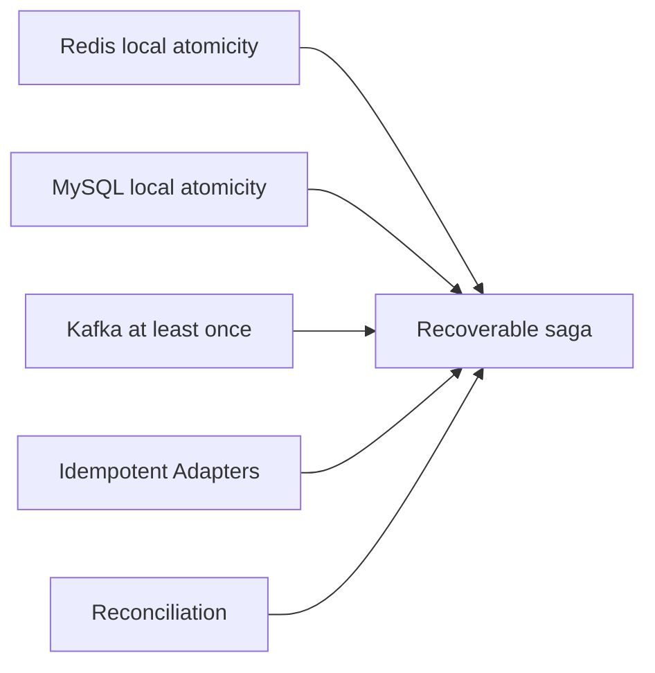
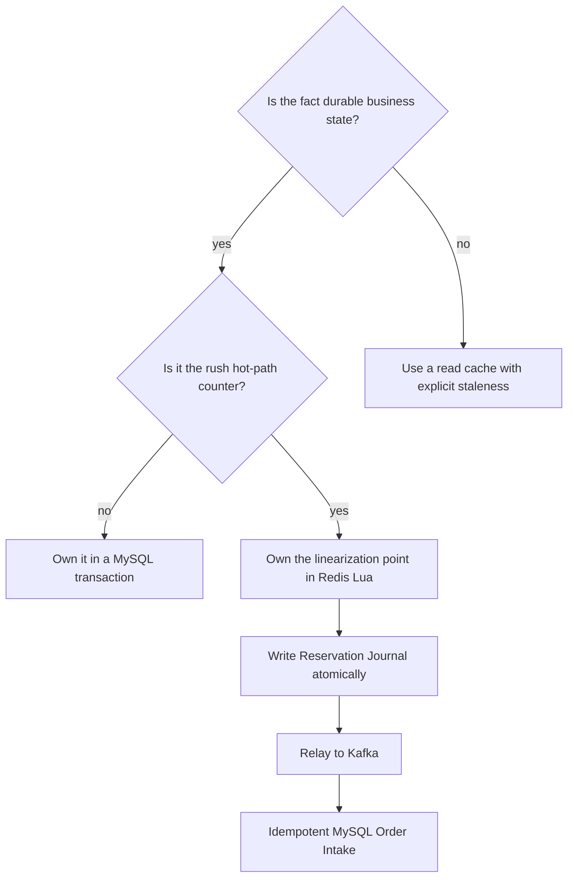

# MySQL, Redis Lua, Kafka, and relay

No single technology solves the whole ticket-rush problem. Each choice should own the work it is good at.

## Inventory reservation options

| Approach | Linearization | Throughput profile | Recovery | Teaching value |
|---|---|---|---|---|
| MySQL conditional update | Database row transaction | Limited by hot-row locking and connection pool | Strong local durability | Best baseline for correctness |
| MySQL pessimistic lock | SELECT FOR UPDATE | Simple but serializes contenders | Strong local durability | Demonstrates lock contention |
| Redis DECR from application code | Individual Redis command | Fast | Does not atomically include duplicate and journal rules | Useful anti-pattern |
| Redis Lua | One script | Fast single-threaded atomic execution | Requires persistence, journal, and reconciliation | Current hot-path primitive |

### MySQL-only baseline

```sql
UPDATE tb_ticket_sku
SET stock = stock - 1
WHERE id = ? AND stock > 0;
```

Benefits:

- one durable system;
- easy transaction with an order row;
- simple recovery and reconciliation.

Costs:

- one hot SKU becomes one hot database row;
- database connections queue during the rush;
- retries and user limits still need explicit idempotency.

This is the right first lesson before adding Redis.

### Redis Lua

Redis Lua is valuable when one atomic script owns:

- sale eligibility snapshot;
- per-user rule;
- Available Inventory decrement;
- Reservation identity;
- Reservation Journal append.

It is not a database transaction with Kafka or MySQL. Durability and cross-system recovery remain separate design work.

## Messaging options

| Approach | Crash after Reservation | Duplicate handling | Request latency | Recommendation |
|---|---|---|---|---|
| Direct synchronous Kafka send | Reservation may be stranded | message ID helps only after send | coupled to broker tail latency | Baseline only |
| Direct async Kafka callback | Same crash window | same | low response latency but weaker promise | Not sufficient |
| Redis journal plus Kafka relay | unpublished entry remains recoverable | stable reservation ID | HTTP ends after Redis journal | Current project choice |
| Redis Stream as the final queue, without Kafka | reservation and queue can be one Redis operation | consumer-group idempotency still needed | low | Simpler alternative, but contradicts the Kafka decision |
| MySQL transactional outbox | strong with MySQL-owned mutation | strong | adds DB write to hot path | Good when MySQL owns reservation |

The project keeps Kafka for asynchronous Order Intake. Therefore a Redis-side journal and relay fit the chosen Redis reservation owner better than a MySQL outbox on the hottest path.

## Why not distributed transactions

Two-phase commit across Redis, Kafka, and MySQL would add operational and latency costs while still requiring application-level semantics for timeout, cancellation, and user-visible status.

The current design uses:

- atomic local transitions;
- durable intents;
- at-least-once transport;
- idempotent consumers;
- reconciliation.



## Relay versus producer retry

Kafka producer retry lives inside one process lifetime. A relay owns a durable publication obligation.

| Question | Producer retry | Relay |
|---|---|---|
| Can it continue after process restart? | No, unless caller persisted work | Yes |
| Does it know the business reservation ID? | Only if caller supplies it | Yes |
| Can an operator query unpublished work? | Usually no | Yes |
| Can it reconcile UNKNOWN acknowledgement? | Not alone | Yes |
| Does it eliminate duplicates? | No | No; downstream idempotency does |

The relay creates recoverability, not exactly-once delivery.

## Release options

| Approach | Crash window | Replay safety | Project choice |
|---|---|---|---|
| DB update then direct Redis INCR | yes | unsafe if unconditional | No |
| Redis INCR then DB update | opposite crash window | unsafe | No |
| DB terminal state plus Release Intent | durable obligation | safe with idempotent Lua | Yes |
| Periodic order scan without intent | can infer some misses | hard to distinguish repeated release | Reconciliation only |

## Cache comparison

Event browsing has different correctness needs from inventory mutation.

| Layer | Latency | Consistency | Appropriate data |
|---|---|---|---|
| Caffeine | process-local, lowest | per-instance and bounded stale | hot event views |
| Redis cache | network hop | shared and bounded stale | event detail and lists |
| MySQL | highest on hot reads | durable source | event and SKU configuration |
| Redis Reservation state | hot and shared | strong atomicity inside one script | Available Inventory and holds |

Do not treat Available Inventory as an ordinary cache entry. Losing it requires ledger-based recovery, not a cache miss fallback to configured stock.

## Decision guide



## What to measure

- For an apples-to-apples reservation comparison, add a MySQL-only Reservation scenario with the
  same eligibility, idempotency, and inventory rules as Lua. The current `mysql` harness scenario is
  an event-detail read baseline and cannot supply that comparison.
- p50, p95, p99, error rate, and rejected request classes.
- database connection wait, Redis script latency, relay lag, Kafka consumer lag.
- inventory-conservation drift after each test.

QPS without invariant checks is not a valid result.

The final 2026-07-22 local run executed all three harness boundaries and passed their correctness
gates. It observed 22,959.58 req/s for the MySQL event-detail HTTP baseline, 132,450.33 req/s for the
Redis stock-and-dedup primitive, and 2,792.37 req/s for the HTTP 202 acceptance phase of full async;
the harness then waited for all 1,000 committed orders. These are different workloads and are not a
direct speedup ratio; see the [current benchmark record](../testing/testing-and-benchmarking.md#current-benchmark-record).
