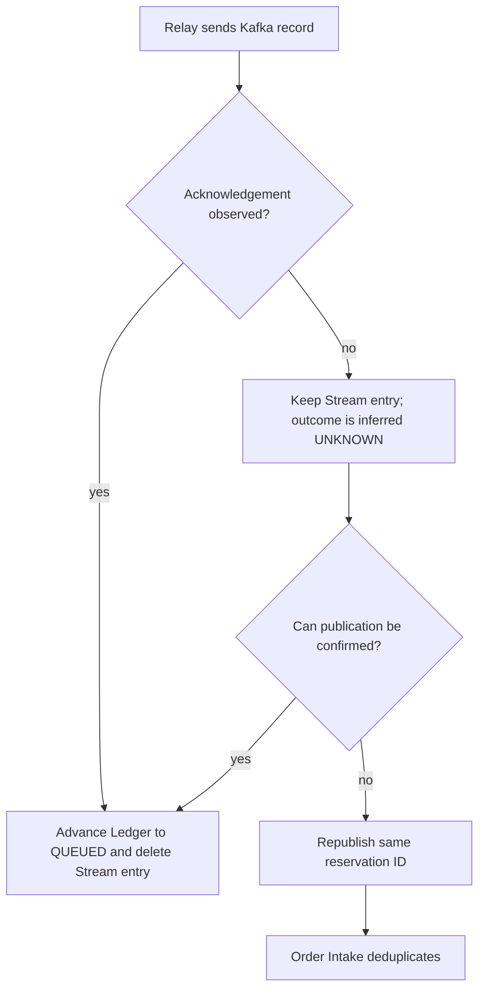
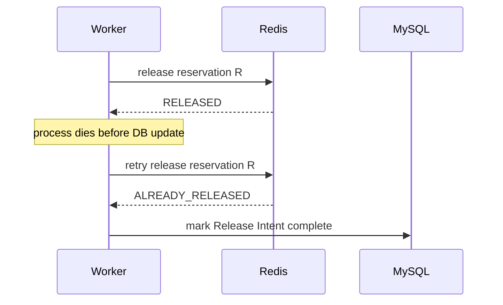
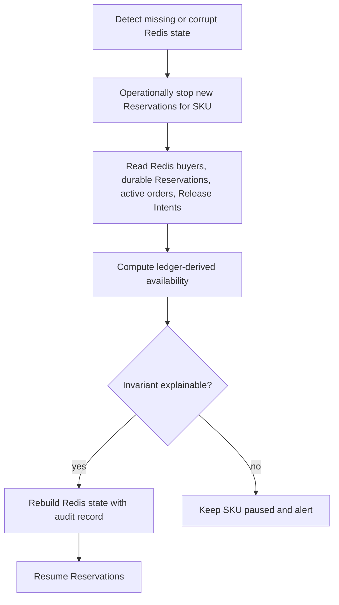

# Failure playbook

This guide treats failure timing as part of the design. Each row names the durable evidence that should remain after a crash and the test that proves recovery.

## Failure matrix

| Failure point | Unsafe symptom | Durable evidence | Recovery | Fault-injection test |
|---|---|---|---|---|
| Before Reservation Lua | no side effect | none | client may retry | fail Redis connection before script |
| After Lua, before HTTP response | client is uncertain | Reservation and journal | repeat same idempotency key | drop HTTP response |
| After Lua, before Kafka publish | inventory stranded | unpublished journal | relay publishes after restart | terminate process at relay seam |
| Malformed Reservation Journal entry | poison head blocks later holds | atomically copied raw fields and source ID in the per-SKU quarantine stream | remove poison from the active stream, alert, and continue from the next entry | batch size one with poison followed by a valid entry |
| Broker appends, ack is lost | immediate rollback can oversell | retained Stream entry; outcome inferred UNKNOWN | retry same reservation ID | producer records then throws timeout |
| Kafka delivers twice | duplicate order | committed message identity | return existing outcome | concurrent duplicate delivery |
| Intake marker commits, order fails | retry may be skipped | no committed partial transaction | Kafka retries | fail after message insert |
| Order becomes terminal, process dies | inventory leak | pending Release Intent | worker releases | terminate after DB commit |
| Redis releases, worker dies | next retry can inflate stock | intent still pending, Reservation already RELEASED | retry returns ALREADY_RELEASED | terminate before intent completion |
| Redis inventory key is lost | reset can resell sold units | durable first-opened marker, Redis buyer count, and durable ledger | rebuild only when buyer evidence survives; otherwise fail closed and keep unavailable | delete only the stock key, then separately delete all Redis evidence in a disposable test |
| Poison Kafka payload | reservation may leak or an unrelated Reservation may be released | raw DLT record, reservation ID header, and MySQL Ledger | auto-release only after full identity match; corrupt or mismatched input requires manual review | invalid JSON, forged header, and payload/ledger mismatch |

The durable mechanisms in this table exist in the current source. The final column is a proof plan,
not a claim that every chaos case ran: the normal real-service and full-async paths passed locally,
while acknowledgement-loss and process-death injection remain pending.

## Acknowledgement ambiguity



Do not infer “Kafka rejected the record” from a client timeout. Releasing inventory at UNKNOWN can produce an order without a held unit.

## Retry-safe release



The second Redis call must not increment again. A distributed lock does not provide this guarantee because the same worker may retry after a crash.

## Poison and permanent failures

Kafka retry is appropriate for transient failures such as a short MySQL outage. It is not useful for:

- invalid JSON;
- a future explicitly versioned payload whose version is unsupported; message versioning is not implemented yet;
- missing required identifiers;
- a Ticket SKU that can never be resolved;
- a domain invariant that permanently rejects the event.

Permanent failure handling must:

1. preserve the raw event and headers in DLT;
2. retain reservation ID even if the payload cannot deserialize;
3. require header, parsed payload identity, and all durable Reservation fields to match before any
   automatic state transition;
4. mark a fully matched Reservation rejected and create or complete its idempotent release when
   policy requires;
5. leave corrupt, missing-ledger, or mismatched records for manual review without releasing from the
   header alone;
6. alert with a correlation link.

Logging and acknowledging a poison record without compensation loses the inventory explanation.
Releasing solely from an unauthenticated header can cancel another user's valid Reservation. The
current DLT recovery Adapter therefore requires
`header reservationId == payload reservationId == messageId`, then validates user, event, SKU,
quantity, and price against the MySQL Ledger. Invalid JSON and every mismatch remain manual-review
cases. Those rejected payloads return normally so the recovery group may advance; the original DLT
record and headers remain available to a separate manual-review consumer group for the topic's
retention period.

If the recovery Adapter throws because MySQL, Redis, or another required dependency is unavailable,
the DLT recovery group uses a fixed one-second backoff with unlimited attempts. It does not invoke a
log-only recoverer, acknowledge the record, or publish an undefined `.DLT.DLT` record after an
arbitrary retry limit. This deliberately blocks that DLT partition until the durable Release Intent
can be created or an operator restores the dependency; alert on DLT recovery lag and oldest age.

## Redis restart or key loss

Never repair Available Inventory by blindly writing Configured Inventory. The durable
`stock_initialized` state machine distinguishes `NEW`, retryable `OPENING`, and `OPENED`. During a
first opening, Redis is prepared with unavailable metadata before MySQL records `OPENED`; only then
is the real sale status activated. V4 marks every pre-existing SKU as opened conservatively. The current Reconciliation
endpoint is read-only: it reports durable consumption, Redis buyer consumption, and a derived
available value. Stock Initialization uses configured capacity only while completing the retryable
first-opening protocol. After that, stock-key recovery shares a per-SKU mutex with every Release
Worker and consumes the derived value only when Redis buyer evidence survives and no PENDING or
FAILED Release Intent exists. It does not yet implement an operator-visible pause, audit record, or
full state rebuild.

Keep Redisson enabled for any multi-instance deployment so this mutex is distributed. The local-lock
fallback exists only for a single-process teaching profile.

The response computes:

```text
durableConsumed = heldReservations + activeOrderQuantity
recoveryConsumed = max(durableConsumed, redisConsumedReservations)
expectedAvailableStock = max(0, initialStock - recoveryConsumed)
inventoryConserved = availableStock exists
                     and initialStock = availableStock + recoveryConsumed
ledgerCaughtUp = durableConsumed = redisConsumedReservations
balanced = inventoryConserved and ledgerCaughtUp
```

Here `initialStock` means configured MySQL capacity. `ledgerCaughtUp=false` can be a short pre-relay
window and needs an age threshold; `balanced=true` does not prove that missing Redis Reservation
hashes are reconstructable.

A complete future recovery workflow is:



Only the stock key missing while the Redis buyer key survives and every Release Intent is settled is
currently an automatic partial-repair case: the admin initialization path takes the same per-SKU
mutex as the Release Worker, then restores stock and metadata from the derived value. This check does
not prove that every Reservation hash survives, so it must not be described as full Redis-state
repair. A previously opened SKU with no buyer evidence or an unsettled intent raises a
recovery-required error. The
release Lua also fails closed while the stock key is absent, so it cannot accidentally recreate
inventory as `1` through `INCR`.

Complete Redis loss before a Reservation reaches the MySQL Ledger is not recoverable by the current
implementation. After ledger persistence, durable rows can calculate a candidate remaining value,
but current initialization still fails closed because the buyer evidence is gone and there is no
implemented rebuild of buyer and Reservation keys. Keep the SKU unavailable and treat this as
disaster recovery, not an automatic retry.

A future repair action should include SKU, previous state, computed state, evidence counts, operator,
and timestamp.

## Database failure during Order Intake

Expected behavior:

- the local transaction rolls back message identity and order together;
- the listener propagates the error;
- Kafka retries with backoff;
- inventory remains held by the Reservation while retry is within policy;
- prolonged failure raises relay and consumer-lag alerts;
- terminal rejection creates a release path.

An independent committed PENDING marker that causes subsequent retries to return normally violates this behavior.

## Cancel and timeout races

Payment, cancel, and timeout race through one database compare-and-set from PENDING.

| Winner | Order state | Release Intent |
|---|---|---|
| Payment | PAID | none |
| User cancel | CANCELED | one pending intent |
| Timeout | TIMEOUT | one pending intent |

Only the CAS winner may insert the intent. A losing user pay/cancel request receives
`ORDER_NOT_PENDING`; the timeout worker treats a lost CAS as a no-op. Neither loser performs a Redis
side effect.

## Operational response

### Reservation publication lag

1. Inspect retained journal count and oldest age; `UNKNOWN` is inferred from a missing acknowledgement.
2. Check Kafka producer health and broker availability.
3. Confirm the relay is retrying with stable reservation IDs.
4. Do not mass-release while broker outcome is unknown.

### Order Intake lag

1. Check Kafka consumer lag and MySQL errors.
2. Sample Reservations older than the intake SLO with no order.
3. Verify their message status is retryable, not permanently skipped.
4. Scale consumers only after checking partition count and database capacity.

### Release backlog

1. Check pending intent age and retry count.
2. Verify Redis release is idempotent before manual replay.
3. Compare Available Inventory with ledger-derived availability.
4. Alert rather than silently abandoning an exhausted task.
5. After fixing the cause, an admin may requeue one exhausted intent with
   `POST /api/admin/release-intents/{reservationId}/retry`; the same idempotent Lua transition still
   guards the inventory side effect.

## Benefit summary

| Mechanism | Failure converted from | Failure converted to |
|---|---|---|
| Reservation Journal | invisible lost handoff | queryable unpublished work |
| Stable reservation ID | duplicate logical requests | replay-safe same request |
| Atomic Order Intake | committed marker without order | retryable transaction |
| Release Intent | crash between DB and Redis | durable pending work |
| Idempotent release Lua | duplicate INCR | harmless replay |
| Inventory evidence | unexplained Redis drift | auditable drift now; controlled repair remains a target |

## Related reading

- [Consistency case study](../architecture/consistency.md)
- [Testing and benchmarking](../testing/testing-and-benchmarking.md)
- [Observability](../operations/observability.md)
