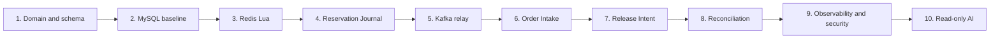

# Learning roadmap

The recommended sequence adds one new source of complexity at a time. Each stage starts with an invariant, adds one mechanism, and ends with a failure test.

This is a reconstruction curriculum, not a claim that every stage exists in the current runtime.
The repository implements the hardened Redis Reservation -> Journal/relay -> Order Intake -> Release
path, reconciliation inspection, observability primitives, and the read-only AI boundary. The
MySQL-only Reservation baseline is a learning reconstruction; rate limits, waiting rooms, Redis
Cluster, acknowledgement-loss and process-death drills, full Redis rebuild, browser E2E, and a live
model remain target or proof work. Use [implementation status](../architecture/current-vs-target.md)
for the current evidence boundary.

## Stage 1: domain and schema

Learn:

- Event, Ticket SKU, Rush Request, Reservation, Order;
- money in cents;
- soft delete and audit fields;
- active versus terminal order states;
- database unique constraints.

Exercise:

- write the inventory-conservation equation;
- encode pending and paid as one active uniqueness class;
- explain why canceled orders permit a later Reservation.

Done when:

- the schema is created by one migration history;
- uniqueness tests demonstrate the intended state table.

## Stage 2: MySQL-only baseline

Implement a conditional stock decrement and pending-order insert in one transaction.

Learn:

- row locks;
- compare-and-set;
- transaction rollback;
- connection-pool contention;
- idempotent HTTP requests.

Exercise:

- run concurrent buyers against one SKU;
- prove stock never becomes negative;
- measure connection wait and p99.

Do not skip this stage. It establishes the correctness baseline used to judge Redis complexity.

## Stage 3: Redis Lua Reservation

Move only the hot linearization point to Redis.

Learn:

- atomic Lua execution;
- Redis Cluster hash tags;
- fast duplicate rejection;
- sale-window clock policy;
- why Available Inventory is not an ordinary cache.

Exercise:

- reserve concurrently;
- retry one idempotency key;
- run against standalone and cluster Redis.

## Stage 4: Reservation Journal

Write Reservation and journal atomically.

Learn:

- cross-system crash windows;
- accepted-means-recoverable semantics;
- stable reservation identity;
- publication state.

Exercise:

- terminate the process after Lua;
- restart and show that the journal still explains the held unit.

## Stage 5: Kafka relay

Publish journal entries asynchronously.

Learn:

- at-least-once delivery;
- acknowledgement ambiguity;
- backoff;
- relay lag;
- deterministic message identity.

Exercise:

- simulate broker acceptance followed by timeout;
- republish and prove no duplicate business outcome.

## Stage 6: Order Intake

Create one pending order per Reservation.

Learn:

- message idempotency;
- local database transactions;
- DLT and permanent failure classification;
- why an early independent marker loses retries.

Exercise:

- fail after message insert;
- deliver the same record concurrently;
- repair a permanent domain rejection through compensation.

## Stage 7: payment, cancel, timeout, and Release Intent

Learn:

- competing CAS transitions;
- transactional outbox pattern;
- idempotent Redis release;
- scheduler batching.

Exercise:

- race pay and timeout;
- terminate after terminal DB commit;
- replay one Release Intent twice.

## Stage 8: Inventory Ledger and reconciliation

Learn:

- source-of-truth ownership;
- drift detection;
- controlled rebuild;
- operator audit.

Exercise:

- remove a Redis stock key in a disposable environment;
- exercise the implemented stock-key-only recovery while buyer evidence survives and Release Intents
  are settled;
- design the still-unimplemented full rebuild of buyer and Reservation keys;
- reject repair when evidence cannot explain the inventory.

## Stage 9: observability, performance, and security

Learn:

- correlation IDs;
- latency and backlog SLOs;
- low-cardinality metrics;
- rate limits and waiting rooms;
- secrets and privacy;
- correctness-gated benchmarks.

Exercise:

- build a dashboard for one reservation from HTTP to release;
- run the correctness-gated local benchmark, while keeping the remaining chaos cases as separate
  release evidence rather than treating load as their substitute;
- audit the ledger after load.

## Stage 10: read-only AI

Study and exercise the existing read-only AI boundary only after understanding the deterministic
business Modules. The current runtime already registers the query-only tools; this sequence describes
the learning order, not a future installation step.

Learn:

- tool allowlists;
- authenticated context;
- prompt injection;
- future RAG as advisory content, not current runtime policy;
- why natural-language intent must not bypass business flows.

Exercise:

- enumerate registered tools;
- attempt direct and indirect mutation prompts; if RAG is added later, include retrieved-document attacks;
- prove no Redis, Kafka, or MySQL mutation occurs.

## Suggested review questions

At every stage ask:

1. What is the linearization point?
2. What durable evidence remains if the process dies next?
3. Which identity makes retry safe?
4. Which Module owns the invariant?
5. Can the same side effect run twice?
6. How is drift detected?
7. What did the test actually prove?

## Advanced extensions

Only after the core roadmap:

- admission queue and waiting room;
- multi-SKU or quantity-aware limits;
- partition planning and consumer scaling;
- Redis replication and failover;
- Kafka schema evolution;
- real payment-provider callbacks;
- refunds and seat assignment;
- multi-region design.

Each extension should begin with a new or revised ADR and an updated invariant, not a new dependency alone.
