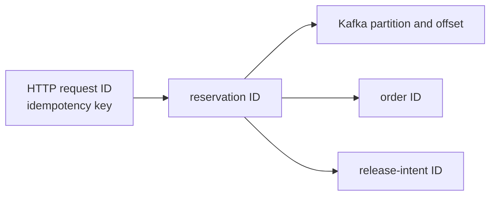
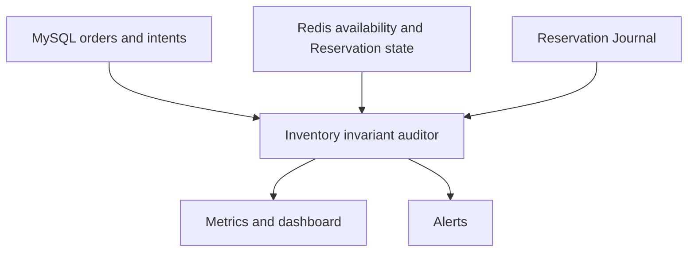
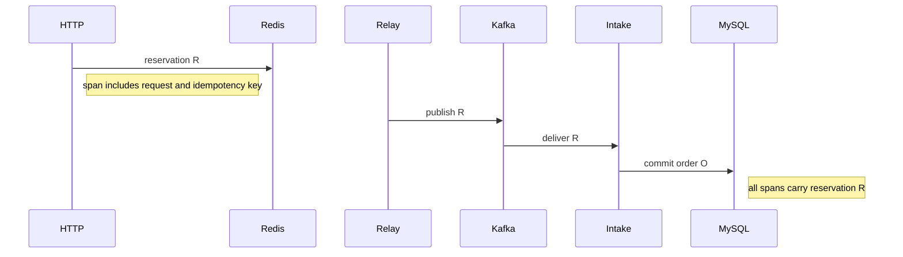

# Observability

Observability should answer one question quickly:

> Where is reservation R now, and does its inventory unit still obey the invariant?

## Correlation model

Use stable identifiers across every log, metric exemplar, message header, and database record:

| Identifier | Purpose |
|---|---|
| request ID | one HTTP attempt |
| idempotency key | one logical client Rush Request |
| reservation ID | one accepted inventory hold |
| Kafka topic, partition, offset | one transport delivery |
| order ID and order number | one durable order |
| release-intent ID | one required inventory return |
| user ID and SKU ID | business correlation, subject to privacy controls |



Never generate a fresh business identity for a transport retry.

## Target structured-event catalog

The following is the desired complete catalog, not a claim that every event is emitted by the current
code. Emit events at durable transitions:

- reservation.accepted;
- reservation.rejected;
- reservation.publication_pending;
- reservation.published;
- order_intake.committed;
- order_intake.retryable_failure;
- order_intake.permanent_failure;
- order.paid;
- order.canceled;
- order.timed_out;
- release_intent.created;
- inventory.released;
- inventory.release_already_applied;
- reconciliation.drift_detected;
- reconciliation.repair_applied.

Each event includes the correlation identifiers, state before and after, duration, retry count, and a low-cardinality reason code.

Do not log JWTs, refresh tokens, SMS codes, full AI prompts containing personal data, or arbitrary Kafka payloads at info level.

## Metrics

### Current runtime surface

The current implementation exposes:

- Actuator `health`, `info`, and `prometheus` endpoints;
- readiness composed from application readiness, database, Redis, and Kafka health;
- explicit rush, rush DLT, cache-invalidation, and cache-invalidation DLT topics;
- low-cardinality custom meters for rush outcome, Kafka send duration, order-creation duration, release outcome, hot-spot aggregation, and cache-lock behavior;
- an admin-only, read-only inventory conservation endpoint;
- benchmark capture of the Prometheus surface.

The exact custom meter roots are `ticket_rush_requests_total`, `ticket_rush_kafka_send`, `ticket_rush_order_creation`, `ticket_rush_release_total`, `ticket_rush_hotspot_signal_total`, and `ticket_rush_cache_lock_total`. Micrometer exports timers as the usual Prometheus count, sum, and bucket series.

The final 2026-07-22 harness run captured the live `/actuator/prometheus` response for the MySQL and
full-async application scenarios. In the full-async scrape, `ticket_rush_requests_total` recorded
1,000 `reserved` outcomes, while the Kafka-send and order-creation timer counts each recorded 1,000
successful operations. The same run finished with 1,000 orders, conserved inventory, and zero Kafka
lag. This verifies the local export path, not a deployed dashboard, alert delivery, long-running SLO,
or failure signal; see the [current benchmark record](../testing/testing-and-benchmarking.md#current-benchmark-record).

### Target dashboard catalog

The remaining names below are the recommended complete dashboard, not a claim that every gauge already exists in code.

### HTTP and Reservation

- rush_requests_total by outcome;
- rush_request_duration_seconds;
- reservation_lua_duration_seconds;
- available_inventory by SKU only for bounded teaching datasets;
- duplicate_and_idempotent_replay_total;
- reservation_journal_unpublished;
- reservation_journal_oldest_age_seconds.

### Relay and Kafka

- relay_publish_total by result;
- relay_publish_duration_seconds;
- relay_unknown_ack_total;
- relay_retry_total;
- Kafka producer error and consumer lag;
- DLT record count and oldest age.

### Order Intake

- order_intake_total by committed, duplicate, retryable, permanent;
- order_intake_duration_seconds;
- reservation_to_order_seconds;
- message rows without order;
- active-order uniqueness violations.

### Release and reconciliation

- release_intent_pending;
- release_intent_oldest_age_seconds;
- release_attempt_total by result;
- release_already_applied_total;
- release_failed_total;
- inventory_drift_units;
- reconciliation_run_total by clean, drift, repaired, aborted.

## Inventory invariant dashboard

For each hot SKU, show:

```text
configured
available
held reservations
active orders
pending releases
computed drift
```



Alert on unexplained drift, not merely on a low Available Inventory value. Sold out can be healthy; negative or unexplainable inventory cannot.

## Service-level objectives for teaching

Choose local values appropriate to the environment, then make them explicit:

- accepted Rush Request journaled within the HTTP latency budget;
- relay publication age below a defined threshold;
- accepted Reservation reaches an order or terminal rejection within a defined threshold;
- Release Intent completes within a defined threshold;
- inventory drift is zero after quiescence.

The exact numbers are environment-dependent. The shape of the SLO is not.

## Alerts

| Signal | Warning | Critical question |
|---|---|---|
| unpublished journal age | relay slowing | can accepted requests still reach Kafka? |
| consumer lag | order delay | is MySQL or partition count limiting intake? |
| pending release age | inventory unavailable too long | is Redis release retrying safely? |
| UNKNOWN ack growth | broker or network issue | are operators avoiding unsafe mass release? |
| DLT count | permanent failures | did each record fully match durable identity, or enter manual review? |
| inventory drift | invariant failure | should the SKU be paused? |

## Trace example



Sampling should retain errors, DLT transitions, slow requests, and reconciliation drift even when normal traffic is sampled.

## Runbook links

- Publication, intake, release, and recovery actions are in the [failure playbook](../failures/failure-playbook.md).
- Metric validation and load-test reporting are in [testing and benchmarking](../testing/testing-and-benchmarking.md).
- Sensitive-data restrictions are in [security](../security/security.md).
