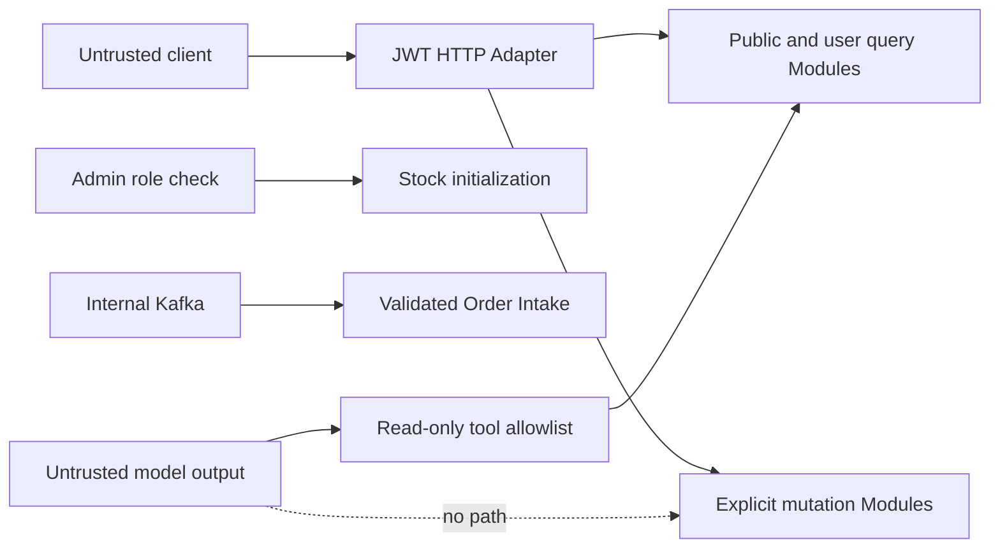

# Security

This is a teaching system, so development conveniences must be labeled clearly and must not be mistaken for production controls.

## Threat model

Protect against:

- unauthenticated mutation requests;
- a user reading or mutating another user's order;
- a normal user calling admin inventory initialization;
- replayed or automated Rush Requests;
- forged Kafka messages;
- prompt injection attempting to reach mutation code;
- leaked JWT, refresh token, SMS code, API key, or personal data;
- operator mistakes that reset live inventory.

## Trust map

Internal transport is not automatically trusted. Order Intake validates event, SKU, quantity, user, price snapshot, and reservation identity against the MySQL Ledger before persistence. Message schema versioning remains a future extension.

## Authentication and authorization

- JWT access tokens establish user identity.
- Refresh tokens are random server-side records in Redis and support revocation.
- User ID comes from the authenticated context, not a request body, query parameter, or AI argument.
- Order queries, payment, and cancellation enforce ownership in the domain Module.
- Admin endpoints require both valid authentication and the admin role.
- Public browsing endpoints expose only intended event and SKU views.

Production exercises should add:

- refresh-token rotation and reuse detection;
- short access-token lifetime and explicit key rotation;
- audience validation, explicit clock-skew policy, and signing-key rotation (issuer validation is already enforced);
- device/session inventory and revocation;
- audit events for admin actions.

## Rush abuse controls

One-user-one-SKU is a business rule, not a complete anti-bot system.

Layer controls:

- per-account and per-IP rate limits;
- device and risk signals;
- a waiting room or admission tokens for extreme peaks;
- idempotency keys;
- request-size and connection limits;
- anomaly detection for distributed automation;
- explicit rejection metrics.

Do not place expensive CAPTCHA or database work after an attacker has already reached the hot inventory path if it can be validated earlier.

## AI boundary

The AI tool registry is an authorization allowlist:

- allowed: event search/detail, SKU query, current-user order query;
- forbidden: rush, create order, pay, cancel, stock initialization, reminder write, admin action.

System prompts improve behavior but do not enforce security. The current runtime has no RAG path; if retrieval is added later, a malicious retrieved document must still be unable to discover a mutation tool.

See [AI read-only boundary](../ai/read-only-boundary.md).

## Secrets

- Do not commit real OpenAI keys, JWT signing keys, database passwords, or Redis credentials.
- Development defaults in configuration are not production-safe.
- Load secrets from a secret manager or injected environment.
- Rotate any credential that appeared in logs, shell history, screenshots, or Git history.
- Avoid putting secrets directly in command examples where process listings or history expose them.

## Logging and privacy

Never log:

- SMS verification code;
- JWT or refresh token;
- full Authorization header;
- raw password or provider key;
- complete AI conversation when it contains personal or order data;
- full malformed messages without redaction.

Use stable internal IDs for correlation and apply retention limits. Phone numbers should be masked in logs and non-production fixtures should be synthetic.

## Development-only behavior

Current local configuration includes intentionally simplified choices such as development Docker credentials, a single Kafka broker, and simulated SMS/payment behavior. The backend does not enable a global arbitrary-origin CORS policy; local frontend development uses the Vite proxy.

These choices are acceptable only when:

- the service is bound to a trusted development environment;
- the documentation labels them;
- no real user data or real provider credentials are used.

Before exposing the service:

- keep CORS disabled by default or allow only explicit trusted origins;
- enable TLS;
- replace default secrets;
- configure broker authentication and authorization;
- configure Redis and MySQL authentication and network policy;
- add rate limits and audit logs;
- review error messages for data leakage.

## Inventory administration

Stock initialization is destructive if performed against a lost Redis key during an active sale. Admin authorization alone is insufficient.

The current implementation separates first opening from recovery. First opening uses the durable
`NEW -> OPENING -> OPENED` state machine. For an already-opened SKU with only the stock key missing,
recovery shares a per-SKU mutex with the Release Worker, derives availability from durable and Redis
evidence, and proceeds only while buyer evidence survives and every Release Intent is settled. It
fails closed instead of writing Configured Inventory when evidence is incomplete.

The complete operational target should additionally:

1. pause new Reservations for the SKU;
2. calculate availability from the Inventory Ledger;
3. require an explicit reason and operator identity;
4. write an audit record;
5. rebuild through the Reconciliation Module;
6. verify the invariant before resuming.

Do not blindly seed Configured Inventory into an active SKU.

## Security tests

Current automated tests cover authentication rejection, admin role enforcement, query ownership,
the AI tool allowlist, SMS verify-and-consume behavior, hashed refresh-token keys, and stable
Reservation idempotency. The complete release-facing suite should also cover:

- browser-level authorization behavior;
- prompt injection cannot call an unregistered method;
- forged message with wrong event/SKU relation is rejected;
- logs contain no token or SMS code;
- rate limits behave under concurrent requests.

Live-model prompt-injection, browser E2E, log-redaction inspection, and concurrent rate-limit tests
remain pending; the current source does not implement a rate limiter.

Security and consistency overlap: an authorization bypass that reaches inventory is also an inventory-invariant failure.
