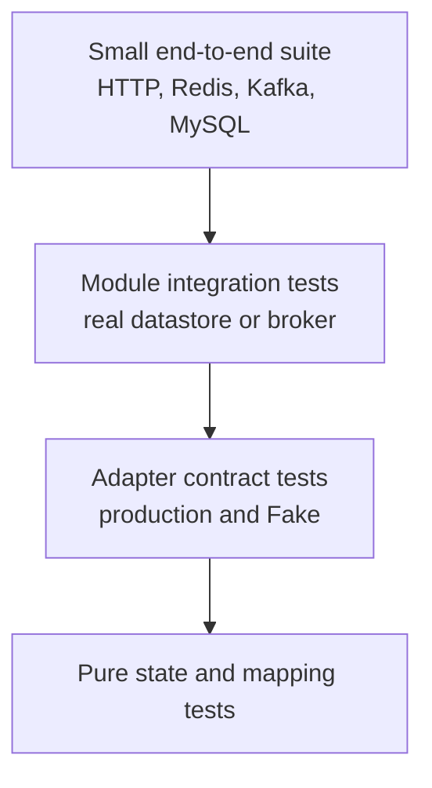
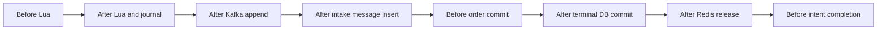
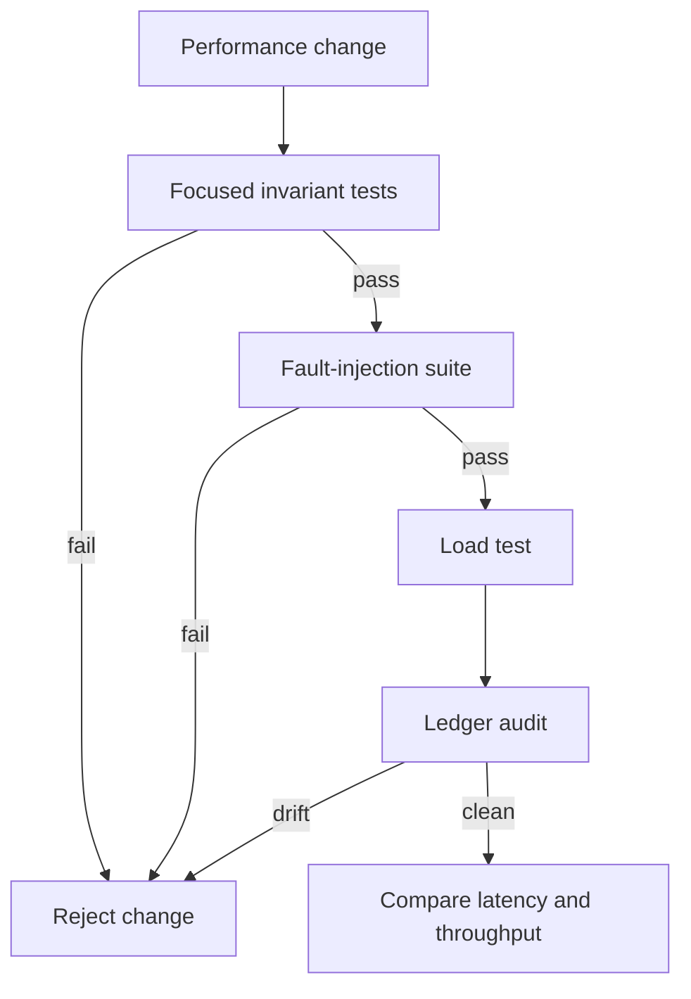

# Testing and benchmarking

The test strategy has two independent goals:

1. prove business invariants under retries and crashes;
2. measure throughput and latency without weakening those invariants.

A fast result that loses inventory is a failed benchmark.

## Test layers



### Pure tests

Use for:

- status transition tables;
- idempotency-key validation;
- ledger arithmetic;
- message schema validation;
- error classification.

### Adapter contract tests

Run the same behavior contract against production and Fake Adapters where practical:

- reserve returns the same reservation for the same idempotency key;
- release returns RELEASED once and ALREADY_RELEASED thereafter;
- Order Intake returns the existing outcome for a committed duplicate.

Fake behavior must preserve the same invariants as the production Adapter. A Fake that unconditionally increments stock can hide a production replay bug.

### Integration tests

Use real Redis for Lua semantics, real MySQL for transaction and unique-index behavior, and a
separate Kafka end-to-end lane for actual delivery behavior.

The established project convention is SpringBootTest plus TestConfiguration and Primary Fake Adapters for dependencies intentionally outside the test.

In this repository, integration-tagged tests use real local MySQL and Redis and apply Flyway through
`application-integration.yaml`. Kafka client configuration is present, but listener auto-start and
scheduled workers are disabled; these tests do not prove Kafka delivery. The default Maven lane
excludes the tag, and Failsafe runs it only under the `integration` profile.

## Required consistency tests

This is the completion target, not a claim that every bullet already has a passing test. The current
real-service integration classes cover the main Reservation, idempotent release, transactional Order
Intake, Release Intent, and stock initialization paths. The full-async benchmark additionally covers
the normal HTTP, relay, Kafka, and committed-order path. Ack-loss, process-death, Redis Cluster, and
several concurrent race cases remain explicit gaps.

### Reservation

- stock zero returns SOLD_OUT without journal mutation;
- duplicate active user does not decrement again;
- retry with the same scoped idempotency identity returns the same reservation ID;
- concurrent requests never make inventory negative;
- sale-window cutoff is evaluated at the Reservation linearization point;
- all Lua keys work against Redis Cluster, not only standalone Redis.

### Relay

- unpublished journal entry is published after relay restart;
- broker accepts but acknowledgement is lost;
- the same reservation is published more than once with one message identity;
- publication backoff does not lose the entry;
- a permanent publish failure remains visible and alertable.

### Order Intake

- duplicate Kafka delivery creates exactly one order;
- two concurrent consumers create exactly one order;
- failure after message identity insert remains retryable;
- failure before transaction commit leaves no SUCCESS marker;
- paid plus new pending order for one user and SKU violates the unique constraint;
- canceled or timed-out order does not block a new Reservation.

### Release Intent

- cancel and timeout each create exactly one intent;
- payment creates no intent;
- two terminal-state contenders produce one winner;
- executing one intent twice increments inventory once;
- worker death after Redis success is safe;
- exhausted retry remains visible for operator action.

### Reconciliation

- missing Redis key rebuilds from ledger, not Configured Inventory;
- a queued Reservation without an order is counted as held;
- completed release is not counted as held;
- every injected failure preserves or eventually restores inventory conservation.

## Fault injection

Introduce explicit test seams at durable transition points rather than random sleeps.



For each point, terminate or throw once, restart the workflow, and assert:

- final order count;
- Available Inventory;
- Reservation state;
- journal publication state;
- Release Intent state;
- inventory-conservation equation.

Suggested test names describe the fault and invariant:

```text
relay_republishes_sameReservation_whenAckIsLost
orderIntake_retries_whenFailureOccursAfterMessageInsert
release_doesNotIncrementTwice_whenWorkerDiesAfterRedis
reconcile_rebuildsFromLedger_whenStockKeyIsMissing
```

## Running tests

Run the fast lane without Docker:

```bash
./mvnw test
```

Run a focused fast class while developing:

```bash
./mvnw -Dtest=TicketRushControllerTest test
./mvnw -Dtest=EventCacheManagerTest test
./mvnw -Dtest=MicrometerTicketRushMetricsTest test
```

Run the MySQL/Redis integration lane:

```bash
docker compose up -d mysql redis kafka
./mvnw -Pintegration verify
```

Run one integration-tagged class. This still does not enable the disabled Kafka listeners:

```bash
./mvnw -Pintegration -Dit.test=OrderServiceTest verify
```

### Current verification record

On 2026-07-22:

- `./mvnw -B test` passed 106 fast tests with zero failures, errors, or skips; Maven also compiled
  the integration-tagged test sources before excluding them from execution;
- `MYSQL_DATABASE=ticket_rush_it_gate_20260722_1145 ./mvnw -B -Pintegration clean verify` passed
  106 Surefire tests and 27 Failsafe tests with zero failures, errors, or skips against an independent
  empty database plus real MySQL and Redis;
- Flyway applied V1, V2, V3, V4, and the repeatable development seed successfully and produced 12
  base tables;
- the integration profile kept Kafka listeners and scheduled workers disabled, so this test command
  is not Kafka end-to-end evidence.

The full-async benchmark below separately exercised live Kafka. Do not report “passed” if Docker was
unavailable or if only compilation ran. State the command, result, and excluded external systems.

## Benchmark families

### MySQL event-read baseline

`bash bench/run.sh mysql` measures the HTTP event-detail path with Redis and Caffeine disabled. It is a database read baseline, not a Reservation benchmark.

### Redis Lua benchmark

`bash bench/run.sh lua` measures the atomic Redis primitive and checks final stock plus unique-user cardinality. It intentionally excludes HTTP, JWT, MySQL validation, relay, Kafka, and Order Intake.

Useful extensions include:

- many users and one hot SKU;
- one user repeating the same idempotency key;
- sold-out rejection;
- mixed SKUs to observe Redis slot distribution;
- relay backlog while Kafka is slow.

Report successful Reservations separately from SOLD_OUT, DUPLICATE, validation errors, and infrastructure failures.

### Full asynchronous benchmark

`bash bench/run.sh async` submits an authenticated HTTP Reservation burst, then waits for relay,
Kafka, and Order Intake to converge. Its reported k6 throughput and latency measure the HTTP 202
acceptance phase; the correctness gate subsequently verifies accepted request count, committed order
count, final Redis inventory, and Kafka lag. It does not measure order-commit throughput.

Control:

- controlled inventory;
- enough Kafka partitions;
- known consumer concurrency;
- database pool metrics;
- a final ledger audit.

Do not compare the three QPS values as if they measured the same boundary, and do not treat HTTP 202 throughput as order throughput.

## Current benchmark record

The final local `bash bench/run.sh all` execution on 2026-07-22 exited successfully under run ID
`1784692033_4123146903ca9a80`:

| Boundary | Observed throughput | Tail latency | Correctness gate |
|---|---:|---:|---|
| MySQL event-detail HTTP baseline | 22,959.58 req/s | p99 94.20 ms | 690,221 requests; zero HTTP/socket errors |
| Redis stock-and-dedup primitive | 132,450.33 req/s | p99 2.655 ms | 100,000 successful primitive operations and unique synthetic buyers; final stock zero; inventory conserved |
| Full async HTTP 202 acceptance phase | 2,792.37 req/s | p99 205.514 ms | after the burst: 1,000 accepted, 1,000 orders, final stock zero, Kafka lag zero |

These boundaries are not directly comparable. This was one dirty-worktree run on one local machine,
not a capacity promise. The [full verification report](../zh-CN/verification-report.md) records exact
versions, commands, percentiles, cleanup evidence, warnings, and untested failure modes.

## Experimental controls

Record:

- commit SHA and dirty-worktree state;
- CPU, memory, JVM flags, and warm-up;
- MySQL, Redis, and Kafka versions and topology;
- pool sizes, topic partition count, and replication factor;
- dataset and initial inventory;
- run duration and concurrency;
- p50, p95, p99, max, throughput, and error classes;
- GC pauses, connection wait, Redis Lua latency, relay lag, and consumer lag;
- final inventory invariant.

Use multiple runs and report variability. A single local run is an observation, not a capacity promise.

## Correctness gate for performance changes



Only compare performance after correctness gates pass.
