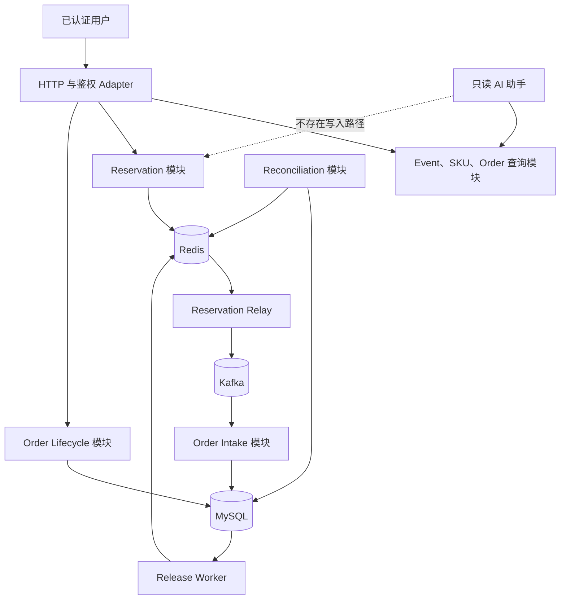
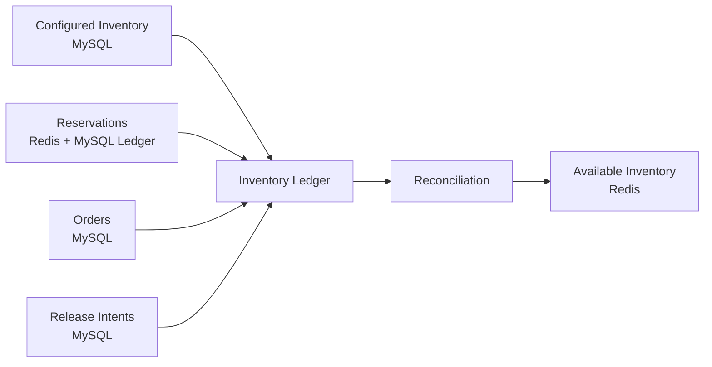
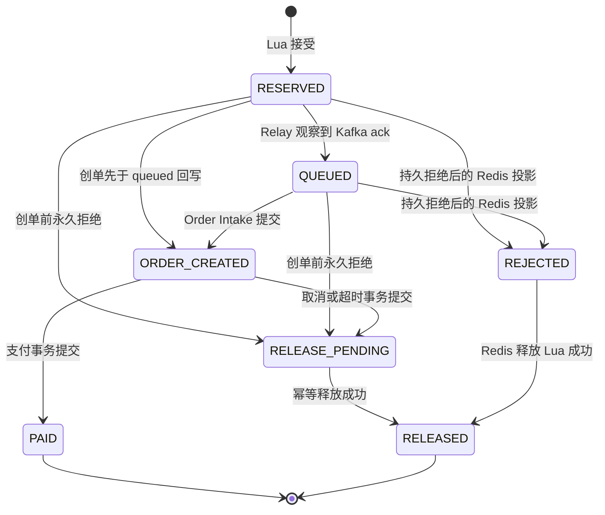
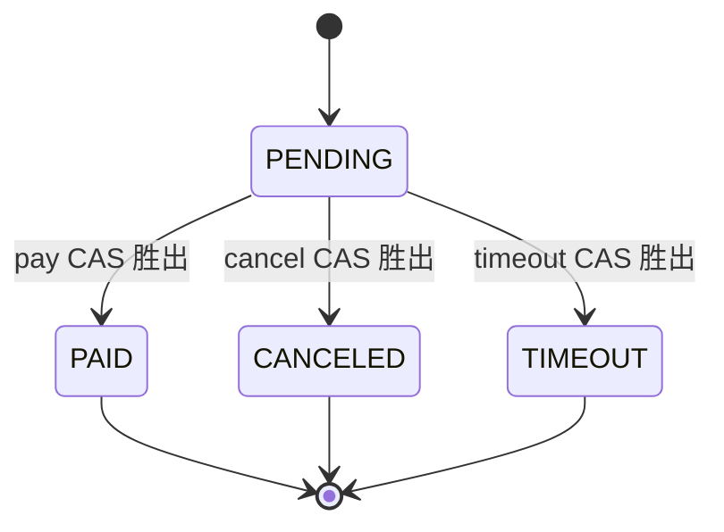
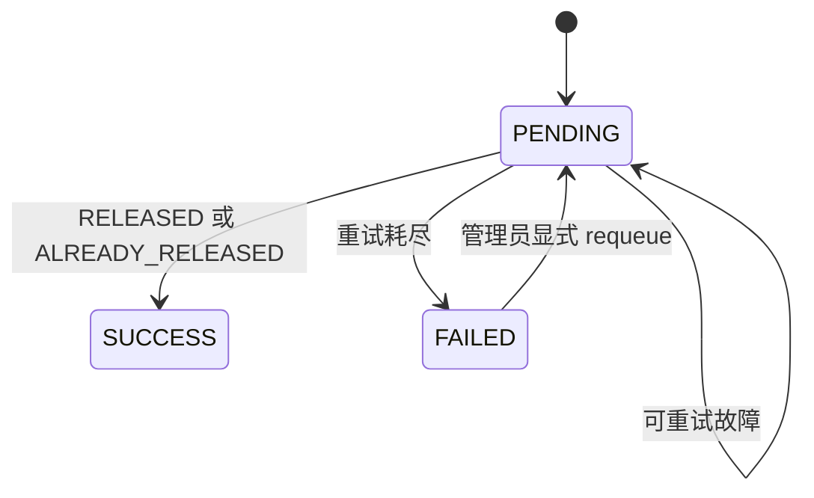

# 领域与当前架构

## 教学目标

ticket-rush 不是“把 Controller、Service、Mapper 串起来”的普通 CRUD 示例。项目重点是：在 Redis、Kafka 和 MySQL 无法组成一个分布式事务时，如何用局部原子操作、稳定身份、持久化意图和对账维持业务不变量。

## 领域词汇

| 词汇 | 含义 | 当前所有者 |
|---|---|---|
| Event | 一场可浏览的演出活动 | MySQL Event 查询模块 |
| Ticket SKU | 活动下可售卖的票档，包含金额、配置库存和销售窗口 | MySQL SKU 配置 |
| Configured Inventory | 开售前配置的总量，不是实时剩余量 | MySQL `tb_ticket_sku.stock` |
| Available Inventory | 此刻仍可被 Reservation 占用的数量 | Redis Reservation 模块 |
| Rush Request | 用户的一次抢票意图，必须携带幂等身份 | HTTP + Reservation 模块 |
| Reservation | 一个库存单位已从 available 变为 held 的事实 | Redis 快路径；MySQL Ledger 提供持久证据 |
| Reservation Journal | 与 Reservation 在同一 Lua 中写入的可恢复待发布记录 | Redis Stream |
| Relay | 读取 Journal 并至少一次投递 Kafka 的后台任务 | `ReservationOutboxRelay` |
| Order Intake | 消费 Reservation 事件并幂等创建待支付订单 | MySQL 本地事务 |
| Release Intent | 订单取消、超时或创单前永久拒绝后必须释放库存的持久义务 | MySQL `tb_inventory_release_intent` |
| Reconciliation | 对比 Redis 与持久 Ledger，解释库存漂移 | 管理员只读检查；完整重建仍是目标架构 |

完整词汇定义见[领域上下文](../../CONTEXT.md)。

## 系统边界



## 模块职责

| 模块 | 对外承诺 | 隐藏的实现细节 |
|---|---|---|
| Authentication | 建立当前用户和角色 | JWT、原子验证码消费、摘要化 refreshToken |
| Event Query | 返回公开活动视图 | MySQL、Caffeine、Redis、布隆过滤器、逻辑过期 |
| Ticket SKU Query | 返回票档配置和可售数量视图 | MySQL 元数据与 Redis 实时库存 |
| Reservation | 幂等接受或拒绝 Rush Request | Cluster hash tag、Lua、Reservation、Journal |
| Relay | 最终把每个已接受 Reservation 发布到 Kafka | Stream 扫描、ack 不确定性、重试、隔离毒记录 |
| Order Intake | 一个 Reservation 最多创建一个活跃订单 | inbox、订单、Ledger 同事务与唯一约束 |
| Order Lifecycle | 支付、取消或超时只能有一个 CAS 胜者 | 订单状态机和 Release Intent |
| Inventory Release | 一个 Release Intent 最多归还一次库存 | Reservation 状态转换 Lua 与重试 Worker |
| Reconciliation | 解释库存数量与持久证据是否一致 | Ledger 算术、缺失 stock key 的安全恢复 |
| Read-only AI | 查询活动、票档和当前用户订单 | 固定查询工具白名单，不注册写工具 |

## 数据所有权



Kafka 只运输 Reservation 事件，不是库存事实的所有者。Caffeine 与普通 Redis 活动缓存也只是读模型；它们丢失后可回源 MySQL。Available Inventory 不同，它是热路径业务状态，丢失后不能直接回填 Configured Inventory。

## 三个状态机

### Reservation



这张图叠加了 MySQL 持久主线与 Redis 投影，两者共享 `ReservationStatus` 名称，但中间状态
不一定相同。创单前永久拒绝会先在事务中提交 MySQL `RELEASE_PENDING` 与 Release Intent，
事务完成后再尽力把 Redis 投影标为 `REJECTED`；状态查询优先读取 MySQL，所以通常返回
`RELEASE_PENDING`。Release Worker 先要求持久状态为 `RELEASE_PENDING`，Redis 侧则允许从
`REJECTED` 等可释放状态幂等转为 `RELEASED`。

### Order



### Release Intent



## 关键不变量

### 库存守恒

```text
configured
  = available
  + held reservation quantity
  + active order quantity
```

对账时还要区分“Redis 已接受、MySQL Ledger 尚未追平”的短窗口。当前检查使用 Redis buyer 数量与持久消费数量两条证据，不能把瞬时 `ledgerCaughtUp=false` 直接等同于数据丢失。

### 幂等身份链

```text
同一认证 userId + 同一 skuId + SHA-256(trim(Idempotency-Key))
  -> 一个 reservationId
  -> 一个 Kafka messageId
  -> 最多一个活跃订单
```

这个映射不是“裸 Key 全局唯一”，也不是完整 payload 的摘要；Lua 会先按上述作用域查找已有
映射，再校验本次请求的 event 等字段。客户端应为每次逻辑动作生成新键，只在响应不确定时
重用原键。

### 活跃订单唯一性

PENDING 与 PAID 都属于活跃类，同一用户和 SKU 最多一条；CANCELED 与 TIMEOUT 为终态，不阻止之后重新抢票。V4 使用生成列 `active_order_guard` 把两种活跃状态映射到同一个唯一类。

### 释放至多一次

释放 Lua 只有在 Redis Reservation 从可释放状态转换到 `RELEASED` 时才执行 `SREM + INCR`。重复执行返回 `ALREADY_RELEASED`，不会再次增加库存。

## Redis Cluster Key 规则

同一个 Lua 涉及的 SKU Key 都使用字面 hash tag `{skuId}`：

```text
ticket:{3001}:stock
ticket:{3001}:buyers
ticket:{3001}:meta
ticket:{3001}:reservation:<reservationId>
ticket:{3001}:request:<userId>:<idempotencyHash>
ticket:{3001}:outbox
```

花括号是 Redis Cluster 计算 slot 的语义，不是文档占位符。不同 SKU 可以分布到不同 slot，同一 SKU 的一次 Lua 操作保持同槽。

## MySQL Schema 演进

- V1 创建历史基础表。
- V2 增加用户角色。
- V3 增加抢票提醒。
- V4 增加 Reservation Ledger、订单与消息的 `reservation_id`、Release Intent、正确的活跃订单唯一约束和 `stock_initialized` 状态。

Flyway 是唯一 schema 事实来源；Docker 不再挂载另一套建表 SQL。已经发布的迁移不能修改，只能新增版本。

## 代码入口

| 主题 | 源码入口 |
|---|---|
| HTTP 抢票 | [TicketRushController](../../src/main/java/dev/dahuangggg/ticketrush/controller/TicketRushController.java) |
| Reservation 编排 | [TicketRushServiceImpl](../../src/main/java/dev/dahuangggg/ticketrush/service/impl/TicketRushServiceImpl.java) |
| Redis Adapter | [RedisRushReservationAdapter](../../src/main/java/dev/dahuangggg/ticketrush/infrastructure/redis/RedisRushReservationAdapter.java) |
| 原子预占 | [ticket_rush.lua](../../src/main/resources/lua/ticket_rush.lua) |
| Relay | [ReservationOutboxRelay](../../src/main/java/dev/dahuangggg/ticketrush/infrastructure/mq/ReservationOutboxRelay.java) |
| Order Intake | [OrderServiceImpl](../../src/main/java/dev/dahuangggg/ticketrush/service/impl/OrderServiceImpl.java) |
| 订单生命周期 | [PaymentServiceImpl](../../src/main/java/dev/dahuangggg/ticketrush/service/impl/PaymentServiceImpl.java) |
| 单笔超时事务 | [TimeoutOrderProcessorImpl](../../src/main/java/dev/dahuangggg/ticketrush/service/impl/TimeoutOrderProcessorImpl.java) |
| Release Worker | [InventoryReleaseServiceImpl](../../src/main/java/dev/dahuangggg/ticketrush/service/impl/InventoryReleaseServiceImpl.java) |
| Schema | [V4 migration](../../src/main/resources/db/migration/V4__harden_reservation_and_release_flow.sql) |
