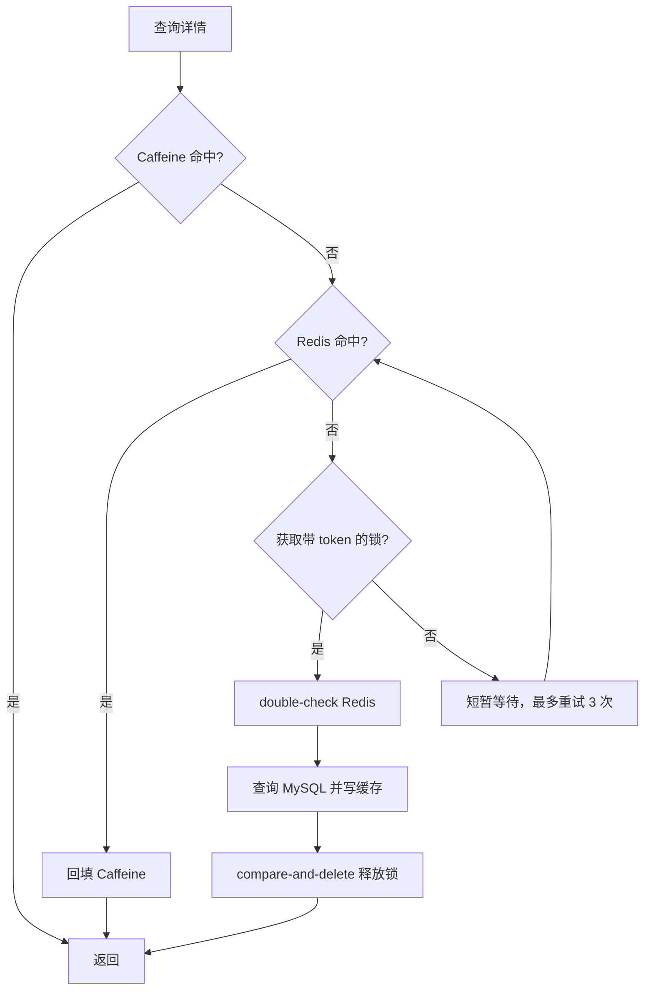

# ticket-rush 缓存设计面试话术

> 当前实现快照：2026-07-22。本文只使用当前源码和[本轮验证报告](verification-report.md)作为证据。本地、被 Git 忽略的 `dev-docs` 中三组旧机器缓存 QPS 是历史实验，本轮没有按相同边界复跑，不能当成当前性能结论。

## 30 秒版本

> 活动查询是读多写少，我把活动详情做成 Caffeine + Redis 两级缓存。普通活动使用 Cache-Aside、互斥锁和 double-check，热点活动使用逻辑过期并异步重建，穿透则用 Bloom Filter 和短 TTL 空值缓存。动态热点检测不在请求线程逐次写 Redis，而是在有界本地结构中抽样聚合，再由单线程定时 flush。缓存更新先同步失效，失败才发 Kafka 兜底。这里必须和抢票库存分开：活动详情是可回源的读模型，Available Inventory 是业务状态，Redis 丢失时不能直接用 MySQL 初始库存覆盖。

## 为什么需要两级缓存

| 层 | 价值 | 代价 |
|---|---|---|
| Caffeine | 进程内访问快，减少 Redis 网络开销 | 多实例各有副本，存在短暂不一致 |
| Redis | 多实例共享，容量和治理能力更强 | 仍有网络开销，需要处理穿透、击穿、雪崩 |
| MySQL | 持久活动元数据 | 不应承受热点详情的全部读峰值 |

当前 Caffeine 详情默认最多 1,000 条、列表最多 100 条，TTL 30 秒。详情值带 `normal/hot` 类型，避免普通缓存命中后被热点路径误判。

## 普通活动：Cache-Aside + 互斥锁

回答重点：

- 锁 value 是唯一 token，不能用常量；
- 释放锁使用 Lua 比较 owner 后删除，避免旧线程删掉新锁；
- 获取锁后必须 double-check；
- 普通详情 Redis TTL 为 30 分钟加 0～5 分钟抖动；
- 三次等待后降级直查数据库，避免无限阻塞；
- 损坏 JSON 会删除重建，不会写成假 404。

## 热点活动：逻辑过期

> 热点 Key 没有物理 TTL，value 里携带 `expireAt`。未过期直接返回；逻辑过期时一个线程拿锁提交异步重建，其他请求继续返回旧值。这样用短暂陈旧换取尾延迟稳定。热点冷启动仍会先查 MySQL 并立即预热，避免永远拿不到缓存。

逻辑过期适合允许短暂陈旧的活动详情，不适合精确库存或支付状态。

## 穿透、击穿、雪崩

| 问题 | 当前处理 |
|---|---|
| 缓存穿透 | Redisson Bloom Filter；禁用时用 NoOp；MySQL 确认不存在后写 2 分钟空值 |
| 缓存击穿 | 普通活动互斥重建；热点活动逻辑过期和异步重建 |
| 缓存雪崩 | 详情和列表 TTL 随机抖动；Caffeine 分担 Redis 流量 |

Bloom Filter 只会给出“可能存在”，不能代替 MySQL；NoOp 模式是可运行降级，不等于仍有 Bloom 防护。

## 动态热点为什么要聚合

旧式做法如果每个请求都提交一个异步 Redis `INCR`，线程池队列可能在真正的热点下反过来制造内存压力。当前实现：

- 默认每 10 次访问抽样一次；
- 本地 `LongAdder` 聚合并按抽样率折算；
- 单线程默认每秒 flush；
- 最多跟踪 10,000 个活动；
- 60 秒窗口内估算达到 1,000 次时预热；
- Redis 失败时把 delta 放回，下一轮重试；
- dropped、flush failed、promoted 都记录低基数指标。

这是一套热点提示机制，不是计费级精确计数器。

## 缓存一致性怎么回答

> 数据库更新后先同步删除普通详情、热点详情、空值和本地缓存。同步删除失败才发布 `event.cache.invalidate`。消费端 Redis 删除失败会指数退避，耗尽后进入 DLT；消息格式损坏不重试。生产者只记录序列化或 `send()` 同步抛出的立即失败，当前没有观察返回 Future 的异步 broker ack 失败，所以这一路仍是 best effort。普通 Key 最终受物理 TTL 限制；热点 Key 只有逻辑 `expireAt`，过期后还需后续读请求触发异步重建。这个方案提供缓存最终一致，不提供库存级线性一致。

不要说“Kafka 保证缓存绝不丢”。缓存失效生产者是 best effort；普通 Key 有物理 TTL，热点 Key 则是逻辑过期并依赖后续读触发重建。

## 高频追问

### 为什么不是所有活动都逻辑过期？

普通活动没必要永久保留 Redis Key 和异步重建复杂度；Cache-Aside 更简单。热点才用陈旧读换稳定延迟。

### 为什么 keyword 不缓存？

模糊搜索组合多，命中率低且容易造成 Key 爆炸。当前只缓存没有 keyword 的 city/date 组合。

### Redis 故障怎么办？

配置明确禁用 Redis 时会直查 MySQL，锁竞争重试耗尽也会直查数据库；短 TTL Caffeine 能
吸收一部分已命中流量。但 Redis 已启用时，运行中的 `GET`/`hasKey` 连接异常目前不会自动
熔断并回源 MySQL，请求可能直接失败。生产上仍需补限流、熔断和数据库保护，本项目也没有
验证 Redis outage 下的容量。

### 能否把库存也按 Cache-Aside 回源？

不能。活动详情是可重建读模型；`ticket:{skuId}:stock` 是抢票线性化点的 Available Inventory。Key 丢失可能意味着持有和释放仍在进行，必须按 Ledger 和 buyer 证据恢复，不能把 Configured Inventory 当缓存值回填。

## 性能证据应该怎么说

本轮只可陈述：

- `bench/run.sh mysql` 测的是关闭 Redis/Caffeine 的活动详情 HTTP 基线；
- `bench/run.sh lua` 测的是 Redis Lua 原语；
- `bench/run.sh async` 的吞吐和延迟测 HTTP 202 Reservation 接受阶段，随后才等待 Relay、Kafka 与 Order Intake 收敛并校验订单与库存。

三者边界不同，吞吐不能横向相除得出“缓存提升倍数”。准确结果、环境和目录见[验证报告](verification-report.md)。如果要证明 Caffeine 相对 Redis 的收益，需要在同一数据、同一接口、同一并发和多轮重复下重新设计 A/B 实验。

## 不能这样说

- “加了 Redis 就一定更快。”
- “Bloom Filter 能 100% 判断活动存在。”
- “逻辑过期没有一致性问题。”
- “Kafka 兜底后缓存消息绝不会丢。”
- “Redis 库存就是普通缓存，丢了回源 MySQL。”
- “旧文三组 QPS 就是当前版本实测。”

## 历史方案（已废弃，不要照用）

旧原稿仍可用于理解演进，但只应概括为：早期使用无界异步计数、裸 JSON 本地值和 Docker DDL，并记录过一次不同环境的缓存实验。当前实现已经改为有界聚合、带类型的 Caffeine 值和 Flyway 单一 Schema；历史数值不在当前文档重复引用。
