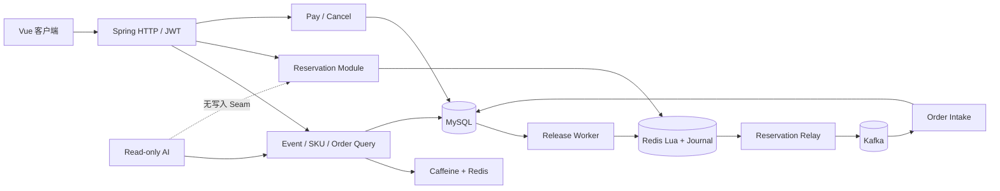

# ticket-rush 开发复盘：从 MVP 到当前可恢复架构

> 当前实现快照：2026-07-22。本文按“历史阶段”和“当前实现”明确分区。历史阶段用于解释设计演进，不能照搬为当前调用链；当前事实以源码、Flyway、ADR 和[本轮验证报告](verification-report.md)为准。

## 1. 教学目标

ticket-rush 不是只追求一个漂亮 QPS，而是用有限模块讲清楚高并发票务的核心问题：

- 请求身份与用户归属；
- 读多写少查询的缓存治理；
- Redis Lua 线性化的 Reservation；
- Redis → Kafka → MySQL 跨系统恢复；
- Kafka 至少一次下的消费幂等；
- 支付、取消、超时竞争；
- 库存释放可重放；
- Schema、测试与性能证据不漂移；
- AI 只能读，不能触达稀缺资源写路径。

核心库存不变量：

```text
Available Inventory + held Reservations + active orders = Configured Inventory
```

## 2. 当前架构



当前模块边界：

| 模块 | 所有事实 |
|---|---|
| Authentication | 当前用户和角色 |
| Event Query | 活动公开读模型与缓存 |
| Ticket SKU Query | 票档元数据和 Redis 可售视图 |
| Reservation | 库存预占、幂等、buyer、Journal |
| Relay | 至少一次发布稳定 Reservation 事件 |
| Order Intake | inbox、订单和 Ledger 同事务 |
| Order Lifecycle | 支付、取消、超时 CAS |
| Inventory Release | Release Intent 与幂等 Redis 释放 |
| Reconciliation | 解释库存守恒和安全恢复条件 |
| Read-only AI | 活动、票档、当前用户订单查询 |

## 3. 当前数据与 Schema

Flyway 是唯一 Schema 事实来源：

1. V1：用户、活动、票档、订单、消息 inbox，以及历史兼容表；
2. V2：用户角色；
3. V3：开抢提醒；
4. V4：Reservation Ledger、订单 Reservation 关联、Release Intent、活跃订单 guard、库存开放状态机；
5. `db/dev/R__demo_seed.sql`：开发和集成 profile 的相对时间演示数据。

Docker Compose 只创建基础设施和数据库，不再维护建表 SQL。V4 把旧 `tb_ticket_rollback_task` 改名为 `tb_ticket_rollback_task_legacy_archive`；当前运行时不会处理它。

关键持久表：

```text
tb_user
tb_event
tb_ticket_sku
tb_rush_reservation
tb_ticket_order_msg
tb_ticket_order
tb_inventory_release_intent
tb_rush_reminder
```

V1 中的 AI chat session 和 rule doc 表是历史预留，不代表当前运行时已经实现 RAG。当前聊天记忆使用 Redis；AI 工具注册表只允许查询。

## 4. 当前一致性主链路

### 4.1 Reservation

HTTP 接收 `Idempotency-Key`，生成稳定 `reservationId`。Lua 原子校验并写：

- `ticket:{skuId}:stock`；
- `ticket:{skuId}:buyers`；
- metadata；
- Reservation Hash；
- request 幂等映射；
- Redis Stream Journal。

HTTP 202 表示已预占和已记录 Journal，不等待 Kafka。

### 4.2 Relay 与 Kafka

Relay 先持久化 MySQL Reservation Ledger，再用 `messageId=reservationId` 发布。timeout 是 UNKNOWN，Journal 不删除，下一轮同 ID 重试。Kafka delivery 是至少一次。

### 4.3 Order Intake

消费者同一个 MySQL 事务提交 inbox、PENDING 订单和 Reservation `ORDER_CREATED`。确定性拒绝同事务提交 FAILED inbox 与 Release Intent；基础设施或完整性异常回滚并重试。

### 4.4 支付与释放

支付同事务更新 Order 和 Reservation PAID。取消/超时同事务更新 Order 终态、Reservation RELEASE_PENDING 和 Release Intent。Worker 用状态型 Lua 幂等释放，再提交 Intent SUCCESS 和 Ledger RELEASED。

## 5. 当前缓存和库存必须分开

活动详情缓存丢失可以回源 MySQL：普通活动 Cache-Aside，热点活动逻辑过期，穿透有 Bloom/空值保护。

Available Inventory 不是普通缓存。单独 stock Key 缺失时只有在 buyer 仍在、没有未结 Release Intent、Ledger 可解释且拿到同一 SKU mutex 时才能恢复；全 Redis 丢失会失败关闭。

## 6. 当前 AI 边界

AI 已经是当前运行时能力，但严格只读：

- 允许活动搜索、活动详情、票档和当前用户订单查询；
- 禁止抢票、创单、支付、取消、库存、管理员和提醒写操作；
- 用户 ID 从 JWT 上下文派生，工具不能接受任意 userId；
- Tool allowlist 是安全边界，Prompt 文本不是；
- RAG 不在当前 runtime，未来文档也必须当不可信输入。

普通认证 HTTP 中存在 Reminder CRUD，不代表 AI 能调用 Reminder 写入。

## 7. 测试与性能证据

当前 gate（集成测试库的创建步骤见[运行指南](running-testing-and-benchmarking.md#真实-mysqlredis-集成通道)）：

```bash
./mvnw -B test
# 先按运行指南创建并设置 INTEGRATION_DB；Flyway 不会创建 database。
MYSQL_DATABASE="$INTEGRATION_DB" ./mvnw -B -Pintegration clean verify
cd frontend && npm ci && npm audit --audit-level=high && npm run build
bash bench/run.sh all
```

本轮实际执行结果：106 个 Surefire 测试和 27 个 Failsafe 测试通过；空库真实执行 Flyway V1–V4 与 repeatable seed；最终 benchmark run 的 MySQL、Lua、full async 三个场景通过各自正确性门禁。精确版本、耗时、结果目录和未覆盖项见[验证报告](verification-report.md)。

三个 benchmark 边界不同，不能把吞吐直接横向比较，也不能用历史缓存实验数字替代本轮结果。

## 8. 历史演进（已废弃方案，只用于解释设计动机）

### 阶段 A：同步 MVP

早期目标是跑通登录、活动、票档、Lua、Kafka 和订单。Schema 由 Docker SQL 初始化，Redis Key 未使用统一 hash tag。

### 阶段 B：直发 Kafka 与内联回滚

早期在 Lua 后由 HTTP 线程等待 Kafka ack，发送失败立即调用回滚 Lua；消息幂等标记通过独立 `REQUIRES_NEW` 事务提前提交。取消或超时内联回滚，失败写 rollback task。

这些方案无法覆盖进程强杀和 ack 不确定性：catch 不会在进程退出时执行，提前提交 inbox 又可能吞掉真实重试。

### 阶段 C：V4 可恢复 Saga

当前架构引入 Redis Journal、稳定 Reservation identity、MySQL Ledger、同事务 Order Intake 和 Release Intent。它把跨系统“瞬间原子”改写为“每一步有持久事实、可重试且副作用幂等”。

### 旧方案到当前方案

| 历史实现 | 当前实现 |
|---|---|
| `ticket:stock:<skuId>`、`ticket:order:user:<skuId>` | `ticket:{skuId}:stock`、`ticket:{skuId}:buyers` 字面量 hash-tag 等同槽 Key |
| HTTP 线程直发 Kafka | Lua Journal + 后台 Relay |
| ack timeout 立即回滚 | 保留 Journal，同 ID 重试 |
| 独立事务提前提交消息标记 | inbox、订单、Ledger 同事务 |
| 取消后内联回滚，失败写 rollback task | Order 终态 + Release Intent 同事务，Worker 幂等释放 |
| buyer 固定 TTL | 不设固定 TTL，未来按持久生命周期 GC |
| Docker DDL | Flyway V1–V4 唯一 Schema |
| AI/RAG 只是未来设想 | AI 查询已实现且严格只读；RAG 仍未进入 runtime |

## 9. 当前仍未完成

- Redis Cluster、复制和 failover 实跑；
- Kafka ack-loss、Relay/Worker 进程强杀；
- V3→V4 数据 guard 与 DDL 中途失败恢复演练；
- 全 Redis buyer/Reservation/Journal 重建；
- 多实例限流、长期积压和容量基线；
- 真实支付、短信供应商和生产安全；
- 真实模型 Prompt Injection 对抗。

这些边界是发布时必须保留的诚实说明，不能因为源码存在或快速测试通过就写成“生产级已完成”。
