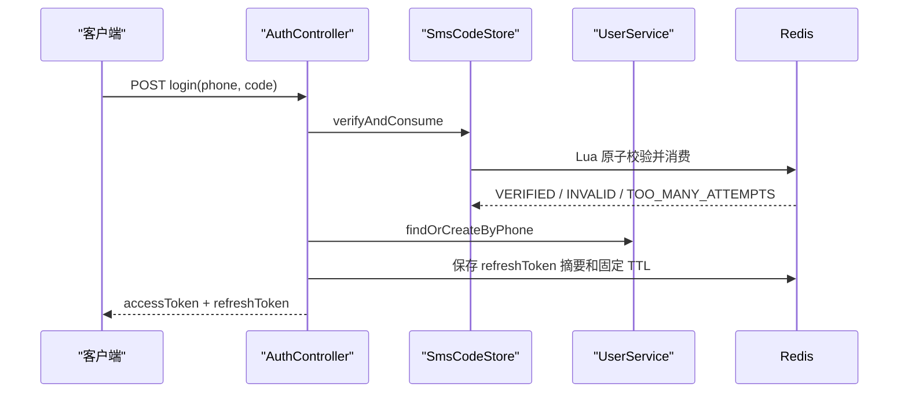

# 模块一：用户登录与 JWT 鉴权

> 当前实现快照：2026-07-22。本文已经按当前源码重写；旧版教学过程仅保留在本地、被 Git 忽略的 `dev-docs/module-1-user-auth.md`，不应再把旧文中的明文 refreshToken 存储或非原子验证码校验当成当前实现。

## 模块职责

认证模块负责建立可信的当前用户上下文，不参与抢票库存决策：

- 生成模拟短信验证码并保存到 Redis；
- 原子校验、累计失败次数并一次性消费验证码；
- 首次登录时按手机号创建用户；
- 签发短效 JWT accessToken 和可撤销 refreshToken；
- 为后续 Controller 提供 `UserContext`；
- 对 `/api/admin/**` 额外校验管理员角色。

## 当前接口

| 接口 | 鉴权 | 作用 |
|---|---|---|
| `POST /api/auth/sms-code` | 否 | 生成验证码；同手机号 60 秒内只允许发送一次 |
| `POST /api/auth/login` | 否 | 原子消费验证码并登录 |
| `POST /api/auth/refresh` | 否 | 用现有 refreshToken 换取新 accessToken |
| `POST /api/auth/logout` | 否 | 删除 refreshToken 摘要对应的 Redis 记录 |
| `GET /api/users/me` | 是 | 返回 JWT 当前用户资料 |

`refresh` 和 `logout` 不要求仍然有效的 accessToken，否则 accessToken 过期后用户反而无法续期或退出。

## Redis Key 与生命周期

| Key | Value | 默认生命周期 |
|---|---|---:|
| `auth:sms-code:{phone}` | `验证码|失败次数` | 5 分钟 |
| `auth:sms-cooldown:{phone}` | `1` | 60 秒 |
| `auth:refresh-token:<sha256(token)>` | `userId` | 固定 14 天 |

验证码保存和冷却键创建由一个 Lua 脚本完成。校验也由 Lua 原子完成：

1. Key 不存在则失败；
2. 正确时删除 Key，保证同一验证码只能成功一次；
3. 错误时在保留原 TTL 的前提下增加失败次数；
4. 默认累计 5 次失败后删除验证码并返回次数耗尽；
5. Redis 无法确认结果时失败关闭，不会把 `null` 当成验证成功。

验证码 Key `auth:sms-code:{phone}` 与冷却 Key `auth:sms-cooldown:{phone}` 使用相同的手机号
hash tag，因此可在 Redis Cluster 的同一个 Lua 脚本中操作。

## Token 语义

### accessToken

- HMAC 签名 JWT；
- 默认有效期 2 小时；
- 包含 `iss`、`sub`、`userId`、`phone`、`role`、`iat`、`exp`；
- 服务端不保存 Session；
- 退出登录不会立即吊销已经签发的 accessToken，它会在过期时失效。

### refreshToken

- 使用 32 字节安全随机数生成 URL-safe 不透明 token；
- 客户端持有原 token，Redis 只保存 SHA-256 摘要；
- 刷新时不轮换 token，也不延长 TTL；
- 删除摘要即可立即阻止后续刷新；
- 原子轮换和重放检测仍是目标架构。

## 鉴权调用链



受保护请求先经过 `JwtAuthenticationInterceptor`。它会在解析前防御性清空 `ThreadLocal`，解析成功后写入 `UserContext`，并在同步完成或异步处理开始时清理上下文，避免线程复用导致身份串线。`AdminAuthInterceptor` 必须排在 JWT 拦截器之后。

## 配置与安全边界

| 配置 | 默认值 |
|---|---|
| `ticket-rush.auth.sms-code-ttl` | `5m` |
| `ticket-rush.auth.sms-code-max-attempts` | `5` |
| `ticket-rush.auth.refresh-token-ttl` | `14d` |
| `ticket-rush.jwt.access-token-ttl` | `2h` |

- 教学环境没有接入真实短信供应商，日志只记录脱敏手机号，不记录验证码明文。
- `JWT_SECRET` 必须从环境注入，不能提交仓库。
- 当前没有 accessToken 黑名单、refreshToken 轮换、外部限流、TLS 或多实例滥用防护。
- 用户身份只能来自 JWT 上下文，业务请求和 AI 工具都不能传任意 `userId` 覆盖它。

## 验证入口

```bash
./mvnw -Dtest=AuthControllerTest,RedisSmsCodeStoreTest,RedisRefreshTokenStoreTest,JwtAuthenticationInterceptorTest test
```

全量命令和本轮实际通过数见[验证报告](verification-report.md)。

## 历史方案（已废弃，不要照用）

本地 `dev-docs` 原稿记录了模块初版，以下差异只用于解释演进：

| 早期描述 | 当前实现 |
|---|---|
| Java 先 `GET` 再比较验证码 | Lua 原子比较、计数和一次性消费 |
| refreshToken 原文直接成为 Redis Key | Redis Key 只包含 token 的 SHA-256 摘要 |
| 刷新可被理解为滑动续期 | 固定 14 天 TTL，刷新不延长 |
| 只在同步请求结束后清理上下文 | 同步完成和异步切换点都清理 |
