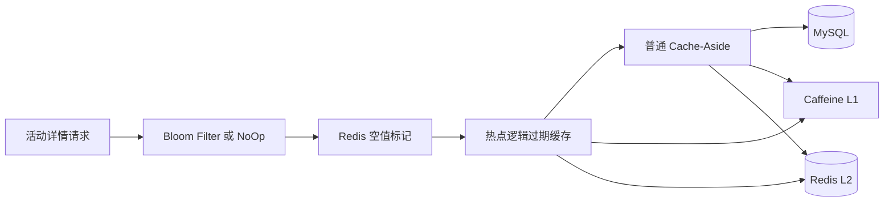

# 模块二：活动列表与详情缓存

> 当前实现快照：2026-07-22。本文只描述当前缓存路径；旧版 Docker DDL、旧压测数字和早期热点计数仅保留在本地、被 Git 忽略的 `dev-docs/module-2-event.md`，不能作为当前证据。

## 当前接口

| 接口 | 鉴权 | 行为 |
|---|---|---|
| `GET /api/events` | 否 | 按城市、关键词、日期过滤；热点优先、演出时间升序 |
| `GET /api/events/{eventId}` | 否 | 查询活动详情；不存在返回 `404 EVENT_NOT_FOUND` |

带 `keyword` 的模糊查询不缓存，避免组合型 Key 爆炸。没有关键词时，列表 Key 由 `city + date` 组成。

## 当前缓存结构



### Caffeine L1

- 活动详情默认最多 1,000 条，列表默认最多 100 条；
- `expireAfterWrite=30s`；
- 详情值带明确的 `normal/hot` 类型，普通值不会被热点探测路径误判；
- benchmark profile 可以把 maximum size 设为 0 来禁用本地缓存。

### 普通活动

读取顺序：Caffeine → Redis → Redis 互斥锁 → MySQL。

- Redis 详情 TTL 为 30 分钟加 0～5 分钟随机抖动；
- 锁 TTL 为 10 秒，value 是唯一 token；
- 释放锁用 compare-and-delete Lua，过期锁的旧持有者不能删除新锁；
- 获锁后 double-check Redis；
- 最多等待重试 3 次，之后降级直查 MySQL；
- 损坏的 JSON 会被删除并重新构建，不会被当成“活动不存在”。

### 热点活动

- Key 不设置物理 TTL，value 内保存 `expireAt`；
- 逻辑未过期时直接返回；
- 逻辑过期时只允许一个线程异步重建，当前请求返回旧值；
- 热点冷启动时先走普通路径查 MySQL，再立即预热热点 Key；
- 异步重建线程池在 Bean 销毁时关闭。

### 穿透和雪崩保护

- Redisson 启用时使用 Bloom Filter；未启用时注入 NoOp 实现，应用仍可启动；
- MySQL 确认不存在后写 `event:null:<eventId>`，TTL 2 分钟；
- 列表 Redis TTL 为 10 分钟加 0～3 分钟随机抖动；
- 详情和列表的短 Caffeine TTL 缩小本地与 Redis 的不一致窗口。

## 当前 Redis Key

| Key | 用途 |
|---|---|
| `event:detail:<eventId>` | 普通详情 JSON |
| `event:detail:hot:<eventId>` | 热点逻辑过期包装值 |
| `event:null:<eventId>` | 不存在标记 |
| `event:lock:<eventId>` | 普通详情重建锁 |
| `event:lock:hot:<eventId>` | 热点异步重建锁 |
| `event:list:<cacheKey>` | 活动列表 |
| `event:bloom` | 活动 ID Bloom Filter |
| `event:access:count:<eventId>` | 动态热点窗口计数 |

这里的尖括号表示普通字符串占位符；这些活动缓存 Key 没有 Redis Cluster 的字面量 hash tag。

## 动态热点检测

请求线程只写本地聚合计数，不再为每个请求创建异步 Redis 任务。当前默认行为：

- 每 10 次访问抽样一次，并按抽样率折算计数；
- 单线程定时器默认每秒批量 flush；
- Redis 访问窗口默认 60 秒；
- 估算访问数达到 1,000 时预热热点缓存；
- 本地最多跟踪 10,000 个活动，淘汰和 flush 失败都有低基数指标；
- Redis 暂时失败时把 delta 放回本地，等待下一轮重试。

## 缓存失效

写路径完成数据库更新后应调用 `invalidateCache(eventId)`：

1. 先同步删除普通详情、热点详情、空值标记和 Caffeine；
2. 同步删除失败才发送 `event.cache.invalidate`；
3. 消费端删除失败使用指数退避，耗尽后进入 `.DLT`；
4. 反序列化失败不重试；
5. 生产者会记录序列化或 `send()` 同步抛出的立即失败；当前没有观察返回 Future 的异步
   broker ack 失败，因此这部分仍是 best effort。普通详情、列表和空值 Key 最终受物理 TTL
   限制；热点详情没有物理 TTL，只会在 `expireAt` 后由后续读请求触发异步重建。

这是一条缓存最终一致链路，不是订单或库存一致性协议。Available Inventory 绝不能套用“缓存丢了回源 MySQL”这一规则。

## Schema 来源与验证

表结构只来自 Flyway，当前活动表基线在 `V1__baseline_schema.sql`。Docker Compose 不挂载建表 SQL。

```bash
./mvnw -Dtest=EventControllerTest,EventCacheManagerTest,RedisHotSpotDetectorTest test
```

本轮性能只重新执行了纯 MySQL 活动详情基线；历史 MySQL/Redis/Caffeine 三组 QPS 不是本轮结果。当前数字见[验证报告](verification-report.md)。

## 历史方案（已废弃，不要照用）

| 早期描述 | 当前实现 |
|---|---|
| Docker `001_schema.sql` 是建表来源 | Flyway V1–V4 是唯一 Schema 事实 |
| 每次请求提交一个异步 Redis 计数任务 | 有界本地聚合并定时批量 flush |
| Caffeine 只存裸 JSON | 详情值携带 normal/hot 类型 |
| 历史缓存 QPS 可直接写进简历 | 只能引用有结果目录的本轮实测 |
