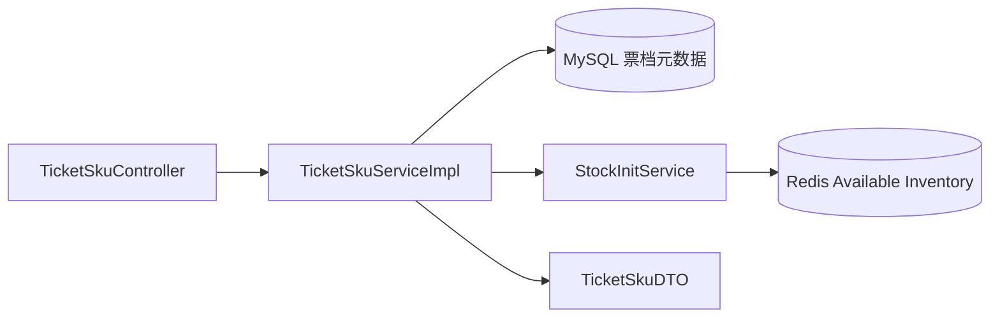

# 模块三：票档查询与库存视图

> 当前实现快照：2026-07-22。票档的 MySQL `stock` 是 Configured Inventory，Redis 才是 Available Inventory。本文已经删除“Redis Key 缺失时回退展示 MySQL 库存”的旧描述，因为当前源码明确返回 `stock=null` 和 `stockInitialized=false`。

## 当前接口

| 接口 | 鉴权 | 行为 |
|---|---|---|
| `GET /api/events/{eventId}/skus` | 否 | 返回活动下全部票档，按价格升序；没有票档返回 `[]` |
| `GET /api/ticket-skus/{skuId}` | 否 | 返回单个票档；不存在返回 `404 TICKET_SKU_NOT_FOUND` |

## DTO 语义

`TicketSkuDTO` 包含：

- `id`、`eventId`、`name`；
- `price`：整数分，Java 使用 `Long`，MySQL 使用 `BIGINT`；
- `stock`：Redis 当前可售库存，Key 缺失时为 `null`；
- `stockInitialized`：Redis 库存 Key 是否存在；
- `saleStartTime`、`saleEndTime`；
- `limitPerUser`、`status`。

查询层不会把 MySQL Configured Inventory 伪装成 Redis Available Inventory：

```text
Redis stock key 存在 -> stock=实时可售数，stockInitialized=true
Redis stock key 缺失 -> stock=null，stockInitialized=false
```

这条边界很重要。Redis Key 缺失可能代表从未初始化，也可能代表故障；普通查询接口无权猜测并自动恢复。

## 两种库存含义

| 名称 | 存储 | 用途 |
|---|---|---|
| Configured Inventory | `tb_ticket_sku.stock` | 配置容量和对账基准 |
| Available Inventory | `ticket:{skuId}:stock` | 抢票热路径原子扣减 |

MySQL 的 `stock` 不随每次抢票实时扣减。订单消费者也不再执行一次 MySQL 库存 CAS；库存事实通过 Reservation、订单和 Release Intent 共同解释。

## 状态字段

`TicketSku.status` 当前常量：

| 值 | 含义 |
|---:|---|
| 0 | 未开始 |
| 1 | 售卖中 |
| 2 | 已售罄 |

`status=1` 只是销售资格的一部分。Reservation Lua 还会校验：

- Redis metadata 是否完整；
- 请求的 `eventId` 是否匹配；
- 当前 Redis 服务端时间是否在销售窗口；
- `quantity` 是否为 1；
- Available Inventory 是否大于 0。

因此不能用查询 DTO 的 `status` 代替抢票资格判定。

## Schema

当前表结构由 Flyway 管理：

- V1 创建 `tb_ticket_sku`；
- V4 增加 `stock_initialized`，取值为 `NEW(0)`、`OPENED(1)`、`OPENING(2)`；
- 开发和集成数据来自 `db/dev/R__demo_seed.sql`，不是 Docker 初始化 SQL。

金额始终以整数分表示，不能改成 `float` 或 `double`。

## 调用链



## 验证

```bash
./mvnw -Dtest=TicketSkuControllerTest test
```

真实服务 gate 必须先创建一个独立空数据库；Maven/Flyway 不会创建 database。完整建库命令见[本地运行、测试与压测](running-testing-and-benchmarking.md#真实-mysqlredis-集成通道)，本轮结果见[验证报告](verification-report.md)。

## 历史方案（已废弃，不要照用）

| 早期描述 | 当前实现 |
|---|---|
| Redis 未初始化时展示 MySQL `stock` | 返回 `null` 并明确 `stockInitialized=false` |
| Docker seed SQL 提供演示数据 | Flyway repeatable dev seed |
| `status=1` 即可抢 | Lua 同时校验 metadata、时间窗、数量和库存 |
| MySQL `stock` 是实时库存 | MySQL 是配置容量，Redis 是实时 Available Inventory |
