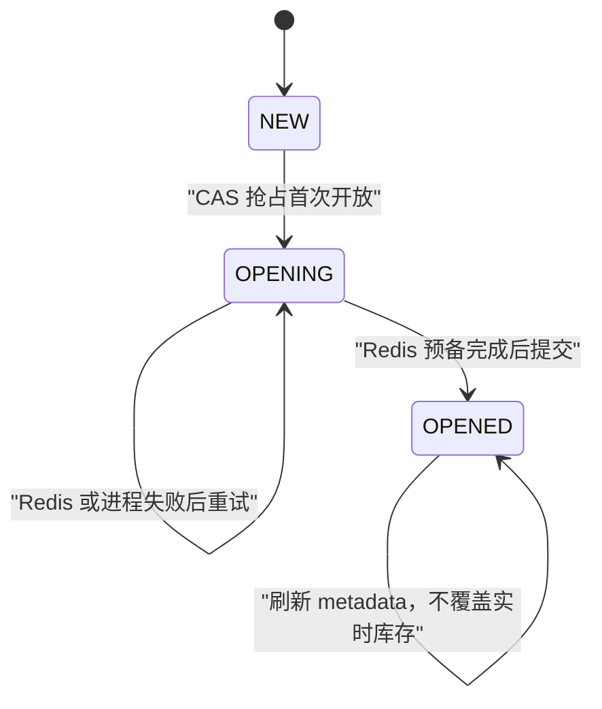

# 模块四：Redis 库存初始化与安全恢复

> 当前实现快照：2026-07-22。初始化已不是简单的 `SETNX(MySQL stock)`。当前代码用持久状态机区分首次开放和故障恢复；证据不足时失败关闭。

## 当前接口

| 接口 | 鉴权 | 行为 |
|---|---|---|
| `POST /api/admin/skus/{skuId}/init-stock` | Admin | 首次开放、刷新 metadata，或按严格条件恢复缺失 stock Key |
| `GET /api/admin/skus/{skuId}/inventory-check` | Admin | 只读检查库存守恒，不修改 Redis |

普通用户和 AI 都不能调用这些接口。

## Redis Key

同一 SKU 的业务 Key 使用同一个字面量 hash tag：

```text
ticket:{skuId}:stock
ticket:{skuId}:buyers
ticket:{skuId}:meta
ticket:{skuId}:reservation:<reservationId>
ticket:{skuId}:request:<userId>:<idempotencyHash>
ticket:{skuId}:outbox
ticket:{skuId}:inventory-mutation-lock
```

`ticket:rush:outbox:skus` 是 Relay 的可重建发现索引，不参与单次多 Key Lua，所以不要求同槽。

## 首次开放状态机

MySQL `tb_ticket_sku.stock_initialized`：



首次开放顺序：

1. 在同一 SKU inventory mutex 中执行；
2. `NEW -> OPENING` 使用 MySQL 条件更新；
3. 先把 Redis metadata 写成不可售，并用 `SET NX` 准备 Configured Inventory；
4. 确认 Redis 值与 MySQL 配置容量一致；
5. MySQL 标记 `OPENED`；
6. 最后把真实销售状态写回 Redis metadata。

这样即使进程在中间退出，`OPENING` 仍可安全重试，也不会提前开放库存。

## 已开放 SKU 的 Key 丢失

当 `stock_initialized=OPENED` 但 `ticket:{skuId}:stock` 缺失时，不能直接从 MySQL 重置。当前自动恢复只在以下条件全部满足时执行：

- `buyers` 证据仍存在；
- 该 SKU 没有 `PENDING` 或 `FAILED` Release Intent；
- 恢复流程与 Release Worker 使用同一 SKU mutex；
- 对账模块可以计算 `expectedAvailableStock`。

否则抛出 `InventoryRecoveryRequiredException`，保持不可售。全量 Redis 丢失后 buyer、Reservation 和 Stream 都不存在，当前系统会失败关闭，完整状态重建仍是目标架构。

## 对账字段

只读 `inventory-check` 同时返回：

- `initialStock`：MySQL Configured Inventory；
- `availableStock`：Redis Available Inventory，Key 缺失时为 `null`；
- `heldReservations`：持久 Ledger 中 RESERVED、QUEUED、RELEASE_PENDING 数量；
- `activeOrderQuantity`：PENDING、PAID 订单数量；
- `redisConsumedReservations`：Redis buyer 数；
- `expectedAvailableStock`；
- `inventoryConserved`、`ledgerCaughtUp`、`balanced`。

当前计算使用：

```text
durableConsumed = heldReservations + activeOrderQuantity
recoveryConsumed = max(durableConsumed, redisConsumedReservations)
expectedAvailable = max(0, configured - recoveryConsumed)
```

之所以取较大值，是为了覆盖“Lua 已接受、MySQL Ledger 还未追平”的正常短窗口。`ledgerCaughtUp=false` 不一定等于丢数据，告警还要结合 Reservation 年龄。

## 锁的边界

- Redisson 启用时，SKU mutex 是分布式锁；
- Redisson 禁用时退化为进程内锁，只适合单实例教学运行；
- 锁用于串行化恢复与释放，但释放幂等性仍由 Reservation 状态转换保证；
- 不能把“有锁”描述成跨系统一致性的唯一正确性机制。

## 验证

```bash
./mvnw -Dtest=StockInitControllerTest,StockInitServiceImplTest,InventoryReconciliationServiceImplTest test
```

真实服务 gate 的独立空库必须先手动创建，步骤见[运行指南](running-testing-and-benchmarking.md#真实-mysqlredis-集成通道)。本轮已经在独立空库执行真实 MySQL/Redis 集成 gate；Redis Cluster、全量 Redis 丢失恢复和多实例恢复仍未验证。详见[验证报告](verification-report.md)。

## 历史方案（已废弃，不要照用）

| 早期描述 | 当前实现 |
|---|---|
| 每次都 `SETNX(ticket:stock:<skuId>, MySQL stock)` | 字面量 hash-tag Key + MySQL `NEW/OPENING/OPENED` 状态机 |
| Key 丢失就回填初始库存 | 需要 buyer、Release Intent 和 Ledger 证据，否则失败关闭 |
| 查询时回退展示 MySQL stock | 返回 `null` 和 `stockInitialized=false` |
| Docker SQL 维护 `stock_initialized` | Flyway V4 是唯一 Schema 来源 |
