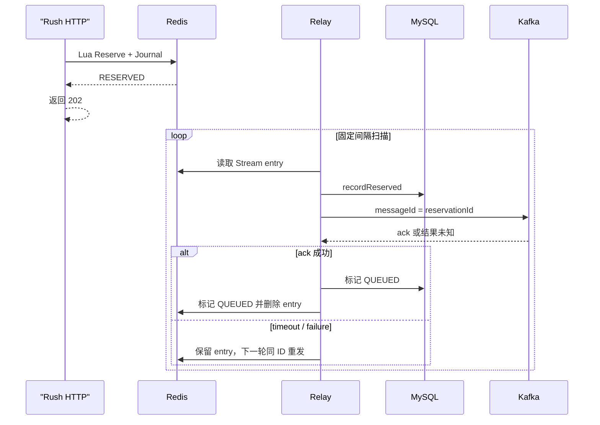

# 模块五：Redis Lua Reservation 与 Journal

> 当前实现快照：2026-07-22。抢票 HTTP 线程不再在 Lua 成功后直接发送 Kafka，也不会在 Kafka timeout 时立即回滚。当前承诺是“Reservation 与 Redis Stream Journal 已原子写入”，后续由 Relay 至少一次发布。

## HTTP 合约

```http
POST /api/ticket-rush/requests
Authorization: Bearer <accessToken>
Idempotency-Key: <一次用户动作的稳定键>
Content-Type: application/json

{"eventId":2001,"skuId":3001,"quantity":1}
```

成功返回 HTTP `202 Accepted`：

```json
{
  "reservationId": "3001-...",
  "status": "RESERVED",
  "orderId": null
}
```

HTTP 202 只说明 Redis 已原子接受 Reservation 与 Journal，不说明 Kafka 已确认或订单已经创建。客户端保存 `reservationId`，并通过下面的接口轮询：

```http
GET /api/ticket-rush/reservations/{reservationId}
Authorization: Bearer <accessToken>
```

响应不确定时必须复用原来的 `Idempotency-Key`。服务端对去除首尾空格后的 Key 做 SHA-256，Key 不能为空且最长 128 个字符。

## 当前 Redis Key

Lua 一次触碰的六个 Key 全部共享 `{skuId}` hash tag：

```text
ticket:{skuId}:stock
ticket:{skuId}:buyers
ticket:{skuId}:meta
ticket:{skuId}:reservation:<reservationId>
ticket:{skuId}:request:<userId>:<idempotencyHash>
ticket:{skuId}:outbox
```

这使多 Key 脚本在 Redis Cluster slot 规则上成立，但本轮仍没有在真实 Redis Cluster 上执行，不能把“Key 设计正确”写成“Cluster 已验证”。

## Lua 原子决策

`ticket_rush.lua` 按以下顺序执行：

1. 在任何写入前检查所有 Key 类型；
2. 相同用户、SKU、幂等摘要已经存在时返回原 `reservationId`；
3. 校验 metadata 的 `eventId`、`status`、销售窗口、价格和 `cleanupAt`；
4. 只允许 `quantity=1`；
5. 校验 stock 是合法整数且大于 0；
6. 检查 buyer Set，阻止同一用户用新幂等键重复占用；
7. 首个写操作是 `XADD` Journal，避免 Stream ID 异常发生在库存已扣之后；
8. `DECR stock`、`SADD buyers`、`HSET reservation`、`SET request mapping`；
9. 返回 `RESERVED|reservationId`。

Redis Lua 是原子执行，但运行时错误不会自动撤销已经执行的 Redis 写命令，所以“先完整校验、把可能失败的 XADD 放在首个写位置”是正确性要求，不只是代码风格。

## 返回语义

| Lua 结果 | HTTP 层含义 |
|---|---|
| `RESERVED` | 新 Reservation 已接受 |
| `EXISTING` | 相同幂等请求，返回原 Reservation 当前状态 |
| `SOLD_OUT` | stock 缺失或不大于 0 |
| `DUPLICATE_USER` | 同一用户已经持有该 SKU |
| `SKU_UNAVAILABLE` | metadata、活动、状态、时间窗或数量不满足 |
| `CORRUPT_STATE` | Redis 类型或业务数值损坏，服务失败关闭 |

## Relay：Redis 到 Kafka



关键点：

- HTTP 请求不等待 Kafka；
- Relay 在发送前先把完整 Reservation 写入 MySQL Ledger；
- Kafka timeout 是 `UNKNOWN`，不能据此立即返还库存；
- 重试复用 `reservationId` 作为 `messageId`；
- Kafka 至少一次投递，重复由 Order Intake inbox 吸收；
- Redis Stream 丢失但 MySQL Ledger 已有老 `RESERVED` 时，Relay 可以从持久 Ledger 二次发布；
- 已开放 SKU 的数据库扫描会重建丢失的 outbox SKU 发现索引；
- 无法解析的 Stream entry 会被原子移入 quarantine Stream，不阻塞同 SKU 后续排查。

## 生命周期与清理

accepted buyer、Reservation Hash、幂等映射和 Journal 当前都没有固定 TTL。metadata 的 `cleanupAt` 只是未来 GC 最早可考虑的时间，不会自动删除业务证据。

清理必须先有持久 Ledger 证明 Reservation 已终态，并确认 Relay 和释放流程不再依赖这些 Key。用“一小时 TTL 自动解锁用户”会破坏慢消费、长时间故障和已支付去重语义。

## 失败边界

- Redis AOF `everysec` 仍可能在主机级故障中丢失尚未 fsync 且还没有进入 MySQL Ledger 的数据；
- Redis Cluster、复制 failover、Relay 多实例和 producer ack-loss 仍需故障注入；
- `ticket:rush:outbox:skus` 可重建，但完整 Redis 丢失前的 pre-ledger 窗口仍不能从 MySQL 推导；
- 请求级限流、排队令牌和生产级防刷仍是目标架构。

## 验证

```bash
./mvnw -Dtest=TicketRushControllerTest,ReservationOutboxRelayTest,ReservationOutboxDiscoveryRepairTest test
bash bench/run.sh lua
bash bench/run.sh async
```

真实服务 gate 运行前还要按[运行指南](running-testing-and-benchmarking.md#真实-mysqlredis-集成通道)创建独立空库。本轮真实 Redis Lua 与 full async 成功路径已运行；未覆盖的故障边界见[验证报告](verification-report.md)。

## 历史方案（已废弃，不要照用）

| 早期描述 | 当前实现 |
|---|---|
| Key 为 `ticket:stock:<skuId>` / `ticket:order:user:<skuId>` | `ticket:{skuId}:stock` / `ticket:{skuId}:buyers` 字面量 hash-tag 等同槽 Key |
| Lua 后在请求线程直接发 Kafka | Lua 写 Journal，后台 Relay 发布 |
| Kafka timeout 立即执行回滚 Lua | 结果未知，保留 Journal 并同 ID 重试 |
| 每次生成独立 UUID messageId | `messageId = reservationId`，贯穿重试和 inbox |
| buyer Set 固定 1 小时 TTL | 不设固定 TTL，未来按持久生命周期 GC |
