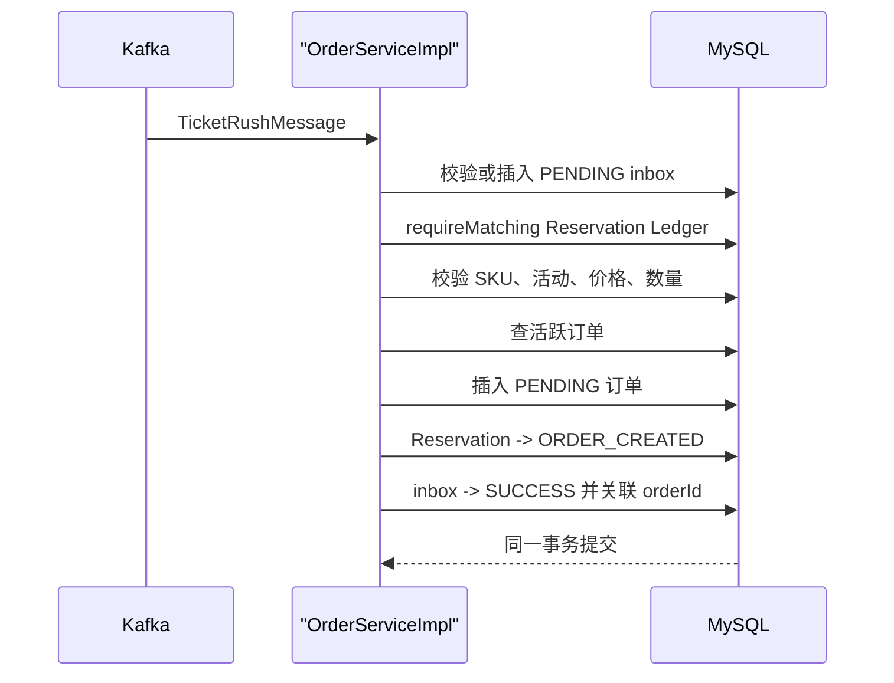

# 模块六：Kafka Order Intake 与异步创单

> 当前实现快照：2026-07-22。当前 Order Intake 不使用 `REQUIRES_NEW` 提前提交消息标记。inbox、订单与 Reservation Ledger 状态必须在一个 MySQL 事务中同成同败。

## 模块职责

- 消费 `ticket.rush.requests`；
- 验证 payload 与 MySQL Reservation Ledger 的身份；DLT 恢复路径再额外核对 Kafka header；
- 用 inbox 抵御至少一次投递产生的重复消息；
- 创建待支付订单；
- 对可确定的永久业务拒绝提交 FAILED inbox 和 Release Intent；
- 让基础设施或完整性故障回滚事务并进入 Kafka retry/DLT。

Kafka 只运输 Reservation 事件，不是库存事实的所有者，也不负责扣 MySQL `tb_ticket_sku.stock`。

## 消息身份

当前 Relay 构造：

```text
messageId = reservationId
Kafka header reservationId = reservationId
```

消息还携带 `userId`、`eventId`、`skuId`、`quantity` 和预占时的 `unitPrice` 快照。常规消费者在任何 inbox 查询前先要求 payload 中的 `messageId == reservationId`，并把它与 Ledger 核对，避免伪造 messageId 占用别人的幂等槽。只有 DLT 恢复消费者会进一步把 Kafka header、payload 和 Ledger 三方对齐后再决定是否自动释放。

## 单事务流程



基础设施异常、payload/Ledger 不匹配、唯一键竞争或 Ledger 状态竞争都会抛异常，整笔事务回滚。此时 Kafka 重试仍然有效。

## 重复与永久拒绝

| 情况 | 当前处理 |
|---|---|
| inbox 已 `SUCCESS` | 返回已存在的 `orderId` |
| inbox 已 `FAILED` | 返回已提交的拒绝原因 |
| inbox 身份字段不匹配 | 抛异常并重试/DLT，不污染稳定 ID |
| SKU 不存在、活动不匹配、价格变化、数量不是 1 | 同事务提交 FAILED inbox、Reservation `RELEASE_PENDING` 和 Release Intent |
| 同用户已有另一 Reservation 的活跃订单 | 永久拒绝新 Reservation，并创建 Release Intent |
| 同一 Reservation 的订单已存在 | 补齐 inbox 和 Ledger，返回原订单 |

永久拒绝不是静默丢消息：它必须把已占用的库存转成可恢复的 Release Intent。

## 两层幂等

### 消息 inbox

`tb_ticket_order_msg.message_id` 有唯一索引。记录状态为：

- `PENDING(0)`：事务内处理中；
- `SUCCESS(1)`：订单已提交，保存 `order_id`；
- `FAILED(2)`：确定性业务拒绝已提交。

不能把 PENDING inbox 提前放进独立事务，否则应用可能在订单提交前退出，后续重试却误认为消息已经处理。

### 活跃订单唯一约束

V4 生成列 `active_order_guard` 将 `PENDING(0)` 和 `PAID(1)` 都映射为同一个值 `1`，`CANCELED(2)`、`TIMEOUT(3)` 映射为 `NULL`。唯一键：

```text
(user_id, sku_id, active_order_guard)
```

因此同一用户、SKU 最多只有一条待支付或已支付订单，历史取消/超时订单不会阻止之后重新抢票。

## DLT 恢复边界

统一错误处理会把重试耗尽的消息放入 `ticket.rush.requests.DLT`。自动恢复消费者只有在以下证据全部一致时才创建 Release Intent：

- Kafka header 有非空 `reservationId`；
- payload 可解析；
- payload 的 `messageId`、`reservationId` 与 header 相同；
- MySQL Ledger 存在且完整 payload 匹配；
- Reservation 还没有订单、支付或释放结果。

损坏或不一致的 DLT 记录只记录人工审查信息，不会仅凭 header 释放库存。恢复基础设施本身失败时使用无限固定重试，不级联产生未定义的 `.DLT.DLT`。

## 查询接口

| 接口 | 作用 |
|---|---|
| `GET /api/orders/{orderId}` | 查询当前用户自己的订单 |
| `GET /api/orders/by-no/{orderNo}` | 按订单号查询当前用户自己的订单 |
| `GET /api/orders/me` | 当前用户订单列表，创建时间倒序 |

查不到或查询他人订单都返回同一种 `ORDER_NOT_FOUND`，避免泄露资源是否存在。

## 验证

```bash
./mvnw -Dtest=OrderControllerTest,TicketRushDltRecoveryConsumerTest test
bash bench/run.sh async
```

真实服务 gate 运行前还要按[运行指南](running-testing-and-benchmarking.md#真实-mysqlredis-集成通道)创建独立空库。本轮真实 MySQL 集成已覆盖顺序重复消息，full async 也证明一次真实 Kafka 成功路径创建 1,000 笔订单并追平 Ledger；integration profile 刻意关闭 Listener，所以不能用集成测试本身声称 Kafka E2E 通过。真实 Kafka 重投、并发消费者和提交点进程强杀仍需独立故障注入，详见[验证报告](verification-report.md)。

## 历史方案（已废弃，不要照用）

| 早期描述 | 当前实现 |
|---|---|
| `TicketOrderMsgService(REQUIRES_NEW)` 先提交幂等标记 | inbox、订单、Ledger 同一事务 |
| UUID messageId 与 Reservation 无关 | `messageId = reservationId` |
| PENDING 与 PAID 映射为不同活跃值 | 两者统一映射为 active guard `1` |
| Kafka 消费者扣 MySQL 库存 | Lua 已扣 Redis Available Inventory，消费者只创单 |
| 异常直接跳过或无限重试 | 区分事务重试、确定性拒绝、DLT 自动恢复和人工审查 |
