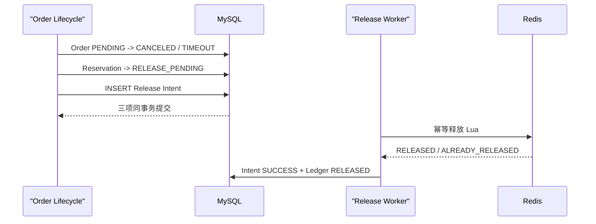

# 模块七：支付、取消、超时与 Release Intent

> 当前实现快照：2026-07-22。当前代码没有运行 `tb_ticket_rollback_task` 补偿任务，也不会在取消事务提交后直接调用 Redis。V4 已把旧表改名为只读历史归档，新的释放义务写入 `tb_inventory_release_intent`。

## 订单状态

| 值 | 状态 | 可从 PENDING 到达 |
|---:|---|---|
| 0 | PENDING | 初始状态 |
| 1 | PAID | 支付 CAS |
| 2 | CANCELED | 用户取消 CAS |
| 3 | TIMEOUT | 超时处理 CAS |

三个终点互斥，所有更新都要求 `WHERE status=0`。支付、取消或超时只有一个能赢，其他路径得到 no-op 或 `ORDER_NOT_PENDING`。

## 当前接口

| 接口 | 鉴权 | 结果 |
|---|---|---|
| `POST /api/orders/{orderId}/pay` | 当前用户 | 成功返回 204；Order 和 Reservation 同事务标为支付 |
| `POST /api/orders/{orderId}/cancel` | 当前用户 | 成功返回 204；Order 终态和 Release Intent 同事务提交 |
| `POST /api/admin/release-intents/{reservationId}/retry` | Admin | 将 FAILED Intent 显式重置为 PENDING |

他人订单按不存在处理，不能仅凭订单 ID 操作。

## 支付事务

支付路径在一个 MySQL 事务中：

1. 校验订单属于当前用户；
2. `PENDING -> PAID` CAS 并写 `pay_time`；
3. Reservation Ledger `ORDER_CREATED -> PAID`；
4. 提交后尽力把 Redis Reservation 标为 `PAID`。

MySQL Ledger 是权威状态。提交后的 Redis 状态同步失败只记录告警，不能回滚已经成功的支付。Release Worker 执行前也会检查持久 Ledger，已支付 Reservation 不允许释放。

## 取消与超时事务



如果事务失败，订单状态、Reservation 状态和 Intent 一起回滚。如果事务成功后应用立刻退出，Worker 仍能从 MySQL 找到释放义务。

## 超时扫描

当前默认每 60 秒扫描一次创建超过 15 分钟的 PENDING 订单：

- 使用 `(create_time, id)` keyset 游标；
- 每批最多 100 条；
- 每笔订单由 `TimeoutOrderProcessor` 在独立 `REQUIRES_NEW` 事务处理；
- 一条毒订单失败只记录告警，游标继续越过它，不会饿死整页后续订单；
- CAS 输给支付或取消时返回 false，不创建 Release Intent。

## Release Worker

当前默认每 1 秒扫描最多 100 条 PENDING Intent：

- Redisson 启用时可用一把全局 retry lock 降低多实例重复扫描；
- 每条释放还与 stock-key 恢复共享 SKU inventory mutex；
- Lua 只有在 Reservation 可释放且 buyer 证据匹配时才执行 `SREM + INCR`；
- Redis stock Key 缺失或类型损坏时拒绝猜测库存；
- Redis 已为 `RELEASED` 时返回 `ALREADY_RELEASED`，不会再次增加库存；
- 成功后 MySQL 同事务把 Intent 标记 SUCCESS、Ledger 标记 RELEASED；
- 失败累计到 10 次后标记 FAILED；管理员可显式 requeue。

全局锁和 SKU 锁用于串行化与负载控制，不是释放幂等性的来源。正确性来自 Reservation 状态条件转换。

## Release Intent 状态

| 值 | 状态 | 含义 |
|---:|---|---|
| 0 | PENDING | 等待或重试释放 |
| 1 | SUCCESS | Redis 已释放或确认早已释放 |
| 2 | FAILED | 重试耗尽，等待告警和管理员处理 |

当前实现没有每行 claim lease、`next_attempt_at` 或指数退避。Worker 使用固定延迟重新扫描；这些能力仍是后续运维加固项。

## 验证

```bash
./mvnw -Dtest=PaymentControllerTest,PaymentServiceImplTimeoutTest test
```

真实服务 gate 的独立空库必须先手动创建，步骤见[运行指南](running-testing-and-benchmarking.md#真实-mysqlredis-集成通道)。真实 MySQL/Redis 集成测试覆盖支付、取消、超时、幂等释放和失败重试的服务级路径。本轮没有执行 Worker 在“Redis 成功、MySQL 完成前”被强杀的进程级故障注入，详见[验证报告](verification-report.md)。

## 历史方案（已废弃，不要照用）

| 早期描述 | 当前实现 |
|---|---|
| 取消/超时后内联执行 Redis rollback | 订单终态与 Release Intent 同事务，Worker 异步释放 |
| 失败写 `tb_ticket_rollback_task` | 写 `tb_inventory_release_intent`；旧表只保留 legacy archive |
| `ticket_rollback.lua` 是无条件 `INCR + SREM` | 先校验 Reservation 状态、buyer、stock，再幂等转换为 RELEASED |
| 单次查出全部超时订单 | keyset 分页，每单独立事务 |
| 分布式锁保证不重复增加库存 | Reservation 状态机才是幂等正确性机制 |
