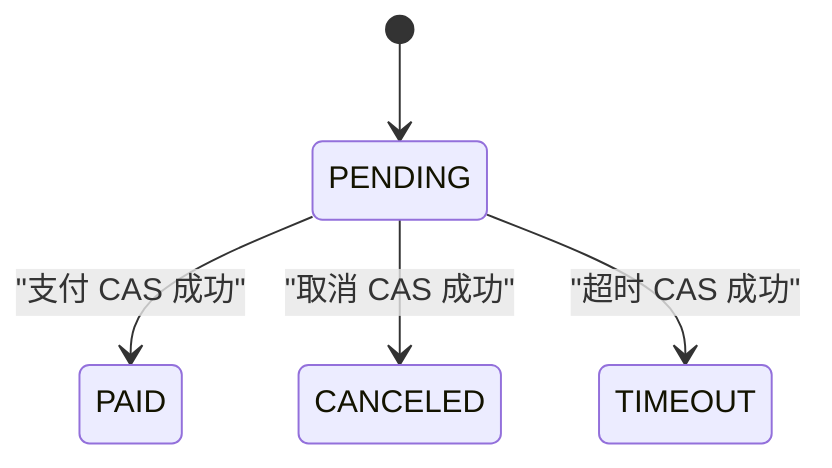

# ticket-rush 订单超时与支付并发面试话术

> 当前实现快照：2026-07-22。取消和超时不再内联回滚 Redis，也不再写 `tb_ticket_rollback_task`。当前做法是订单终态、Reservation `RELEASE_PENDING` 和 Release Intent 在同一个 MySQL 事务中提交，再由 Worker 幂等释放。

## 30 秒版本

> 待支付订单 15 分钟后超时。定时任务用 `(create_time, id)` 做 keyset 分页，每批 100 条，每笔订单在独立事务里执行 `WHERE status=0` 的 CAS，因此支付、取消和超时只有一个能成功。取消或超时成功时，不在事务外直接调用 Redis，而是同事务把 Reservation 改成 `RELEASE_PENDING` 并插入唯一 Release Intent。后台 Worker 重放一个带状态校验的 Lua：只有从可释放状态转为 `RELEASED` 时才 `SREM buyer + INCR stock`，重复执行返回 `ALREADY_RELEASED`。这样应用在任意边界退出，释放工作不会丢，库存也不会重复增加。

## 为什么当前选定时扫描

| 方案 | 优点 | 缺点 | 本项目 |
|---|---|---|---|
| MySQL 定时扫描 | 简单、状态可查询、易教学 | 要控制扫描和多实例竞争 | 当前使用 |
| Kafka 延迟消息 | 大规模到期任务更自然 | 需要延迟能力和额外运维 | 未使用 |
| Redis 过期监听 | 接入快 | 通知不可靠，不能作为业务事实 | 不使用 |
| Redis ZSet | 延迟精度和吞吐较好 | 仍需轮询、持久化和故障恢复 | 未使用 |

选择不是因为定时扫描“最好”，而是当前规模下可读、可测。keyset 游标和每单独立事务已经修复了全表一次性扫描、毒数据阻塞整批的问题。

## 支付与超时竞争



### 支付先赢

1. 支付 `UPDATE ... WHERE status=0` 成功；
2. 同事务把 Reservation Ledger 标记 PAID；
3. 超时线程 CAS 更新数为 0，返回 no-op；
4. 不创建 Release Intent，不归还库存。

### 超时或取消先赢

1. Order CAS 到 TIMEOUT/CANCELED；
2. 同事务将 Reservation 标记 RELEASE_PENDING；
3. 同事务插入 Release Intent；
4. 支付线程 CAS 为 0，返回 `ORDER_NOT_PENDING`；
5. Worker 最终归还库存。

这里不需要先加分布式锁再更新。MySQL CAS 是订单状态竞争的线性化点，锁会增加复杂度，但不能替代事务约束。

## 为什么需要 Release Intent

“数据库先提交，随后调用 Redis”仍有进程退出窗口：订单已经终态，但 Redis 释放还没有执行。只在 catch 中写补偿也不够，因为进程强杀根本不会执行 catch。

当前事务边界：

```text
Order PENDING -> CANCELED/TIMEOUT
Reservation ORDER_CREATED -> RELEASE_PENDING
INSERT tb_inventory_release_intent(PENDING)
COMMIT
```

三项同成同败。Worker 可以晚执行，但工作不会凭空消失。

## Lua 为什么幂等

释放脚本不是无条件 `INCR`。它会检查：

- Reservation Hash 存在且类型正确；
- 状态允许释放，PAID 明确拒绝；
- stock Key 存在且是合法整数；
- buyer Set 存在且包含 Reservation 所属用户；
- 重复状态 `RELEASED` 直接返回 `ALREADY_RELEASED`。

只有首次合法转换才把状态设为 RELEASED，再执行 `SREM + INCR`。因此 Worker 在 Redis 成功后、MySQL 标记完成前退出，下一轮重试也不会二次增加库存。

## Worker 和失败处理

- 默认每秒扫描一次，单批最多 100 条；
- Redisson 可选全局 retry lock 只用于减少重复扫描；
- 每个 SKU 的释放和 stock-key 恢复共享 inventory mutex；
- 失败最多累计 10 次，之后 Intent 变成 FAILED；
- Admin 可以调用 `/api/admin/release-intents/{reservationId}/retry` 显式 requeue；
- 当前没有 per-row lease、`next_attempt_at`、指数退避和完整操作审计。

面试时要明确：锁不是幂等保证，Reservation 状态机才是。

## 毒订单为什么不会拖死整页

扫描器按 `(create_time, id)` 取候选，并逐条调用 `TimeoutOrderProcessor.timeout()`。该方法使用 `REQUIRES_NEW`：

- 一条失败只回滚自己；
- 外层捕获异常并继续后面的订单；
- 游标仍移动到本页最后一条，不会反复卡在同一个坏行；
- CAS 已输的订单只是 no-op。

## 高频追问

### 为什么支付后 Redis 同步失败不回滚支付？

支付事务中的 MySQL Order 和 Reservation Ledger 已经是持久权威状态。提交后只尽力同步 Redis 查询状态；Worker 在释放前还会看 Ledger，PAID 不会被释放。把 Redis 同步失败变成支付回滚会重新引入跨系统双写。

### Release Intent 插入失败怎么办？

它和订单终态在同一个事务里，异常会让整个事务回滚，订单仍是 PENDING，可重试。

### 多实例会不会重复释放？

可能重复扫描和调用，但 Lua 只允许一次状态转换。Redisson lock 降低重复工作，不承担正确性。

### stock Key 丢失时能否直接 INCR？

不能。脚本返回缺失错误，Intent 保持未结。恢复流程必须先用 buyer、Ledger 和 Intent 证据计算安全值。

## 不能这样说

- “取消后先提交数据库，再同步回滚 Redis 就是原子操作。”
- “catch 到 Redis 异常再补偿可以覆盖进程强杀。”
- “分布式锁保证库存只加一次。”
- “Redis Key 丢了直接从 MySQL 初始库存恢复。”
- “超时任务一次性查出所有订单没有问题。”

## 验证边界

本轮真实服务测试覆盖支付、取消、超时、Release Intent 和幂等释放的服务级路径。Worker 在指定持久化点被进程强杀、多个真实实例竞争、重试耗尽后的完整人工 runbook 仍未执行。精确证据见[验证报告](verification-report.md)。

## 历史方案（已废弃，不要照用）

旧原稿中的“状态提交后内联 Redis rollback，失败写 rollback task，30 秒补偿任务重试”是 V1–V3 历史方案。V4 只保留 `tb_ticket_rollback_task_legacy_archive` 供升级审计，当前运行时不会处理它。
