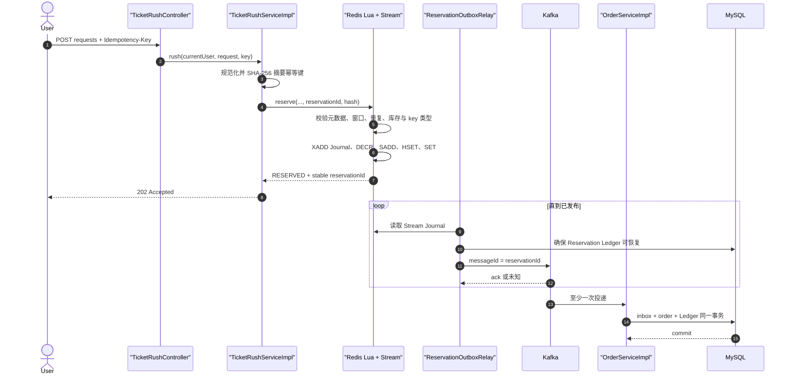
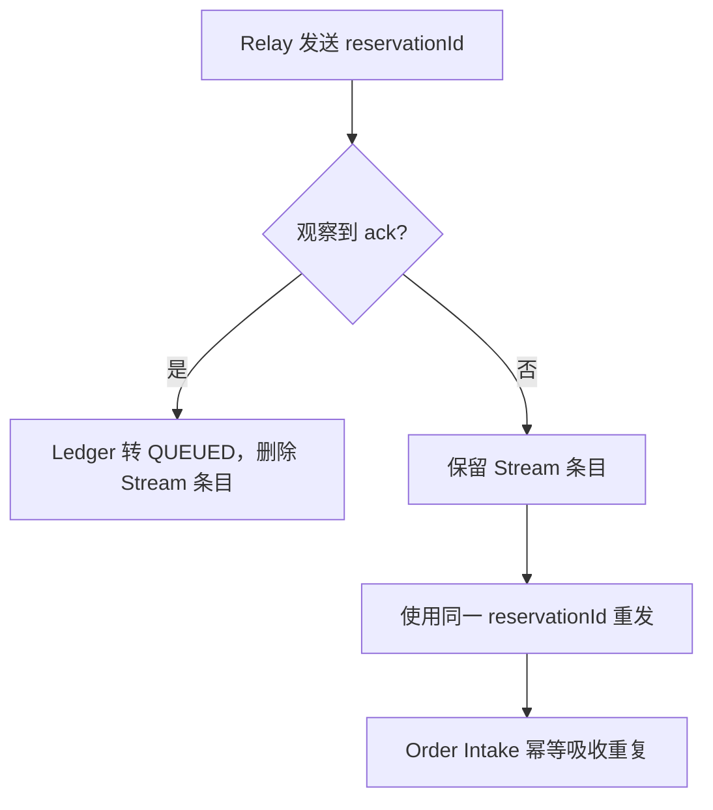
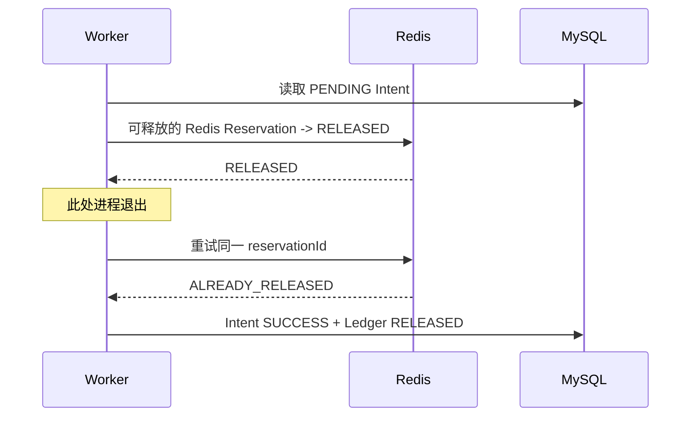

# 抢票一致性链路

## HTTP 接受到底承诺什么

`POST /api/ticket-rush/requests` 返回 `202 Accepted`，表示 Redis Lua 已经原子创建 Reservation 和 Journal。它不表示订单已经创建，也不表示 Kafka ack 已经返回。

响应形状是：

```json
{
  "reservationId": "3001-...",
  "status": "RESERVED",
  "orderId": null
}
```

请求必须携带 `Idempotency-Key`。如果客户端没有收到响应，应使用相同的键重试，并通过 `GET /api/ticket-rush/reservations/{reservationId}` 查询状态。

## 成功调用链



## Lua 为什么先校验再写

Redis Lua 是原子执行的，但脚本运行时错误不会自动回滚脚本此前的写入。因此当前脚本先完成：

- 所有 Key 类型校验；
- 元数据、时间和整数范围校验；
- 幂等与买家重复校验；
- Stream 可写性相关的 `XADD`。

只有这些步骤成功后，才扣库存并写 Reservation。`cleanupAt` 只是未来生命周期 GC 的最早标记，不是自动 TTL；下游故障可能持续超过任意固定宽限期，所以 accepted Reservation、buyer、幂等映射和 Journal 当前都不自动过期。

## Relay 如何处理 Kafka ack 不确定性

Kafka 客户端超时只能说明“没有观察到 ack”，不能证明 Broker 没写入。



不能因为超时就立刻归还库存，否则第一次发送可能已经创建订单，重发前的回滚会导致“有订单但没有 held 单位”。

Redis 的 SKU Stream 注册表只是可重建索引。定时修复任务从 MySQL 中持久化的已开放 SKU 重建注册表，注册表丢失会延迟发现，不应永久搁置 Stream。

## Order Intake 为什么必须同事务

错误做法是先独立提交“消息已见”标记，再创建订单。若订单插入失败，Kafka 重试会看到标记并跳过，最终出现 accepted Reservation 没有订单。

当前成功路径在一个 MySQL 事务里完成：

```text
BEGIN
  INSERT inbox(message_id = reservation_id, status = PENDING)
  校验消息身份与 Reservation Ledger
  INSERT 或恢复唯一 pending order
  CAS Reservation Ledger -> ORDER_CREATED
  UPDATE inbox -> SUCCESS, order_id = ...
COMMIT
```

永久业务拒绝会在同一事务中提交 `FAILED inbox + Release Intent`。载荷伪造、基础设施异常等可重试故障则回滚整个事务，让 Kafka 能够再次投递或进入 DLT。

## 支付、取消与超时竞争

三条路径都从 Order `PENDING` 通过数据库 CAS 竞争：

| 胜者 | Order | Reservation | Release Intent |
|---|---|---|---|
| 支付 | PAID | PAID | 不创建 |
| 用户取消 | CANCELED | RELEASE_PENDING | 创建一条 |
| 超时 | TIMEOUT | RELEASE_PENDING | 创建一条 |

取消或超时必须把订单终态、Reservation 状态和 Release Intent 放在同一个 MySQL 事务中。用户请求的失败 CAS 返回 `ORDER_NOT_PENDING`；超时 Worker 的失败 CAS 是正常 no-op。失败方不操作 Redis。

超时任务采用 keyset 批次扫描，每笔订单交给 `REQUIRES_NEW` 事务处理，避免一条毒订单回滚整批并反复阻塞后续订单。

## Release Worker 的可重放性



正确性来自 Redis Reservation 状态转换，而不是分布式锁。当前 Worker 的可选进程级锁用于减少多个实例重复扫同一批任务；每行 lease 和基于时间的退避仍是目标架构。

## 主要故障点与恢复证据

| 故障点 | 留下的证据 | 恢复动作 |
|---|---|---|
| Lua 后、HTTP 响应前 | Reservation + Journal | 客户端同键重试 |
| Lua 后、Kafka 发布前 | Stream Journal | Relay 重启后发布 |
| Broker 已写、ack 丢失 | 未删除 Journal + 稳定 ID | 重发，Intake 去重 |
| inbox 插入后、事务提交前 | 整个事务回滚 | Kafka 重试 |
| 取消/超时事务后、Redis 前 | PENDING Release Intent | Worker 释放 |
| Redis 已释放、Intent 完成前 | Redis 已是 RELEASED | 重放返回 ALREADY_RELEASED |
| stock key 丢失 | durable opening marker + buyers + Ledger，且没有未结 Release Intent | 证据充分才按 Ledger 恢复，否则失败关闭 |

完整故障矩阵见[英文故障手册](../failures/failure-playbook.md)。
