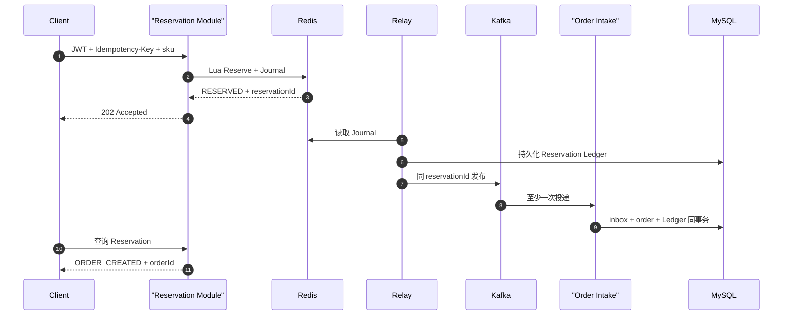

# ticket-rush 秒杀链路面试话术

> 当前实现快照：2026-07-22。本篇已经按 Reservation Journal、Kafka 至少一次、事务型 Order Intake 和 Release Intent 重写。旧版“HTTP 等 Kafka ack、timeout 立即回滚、buyer 一小时 TTL”仅存在于本地、被 Git 忽略的 `dev-docs` 历史原稿，不是当前架构。

## 一分钟总述

> 抢票入口必须带 JWT 和 `Idempotency-Key`。服务端生成稳定 `reservationId`，Redis Lua 在同一 `{skuId}` hash slot 内校验销售 metadata、时间窗、库存、一人一单和幂等映射，并原子写 Stream Journal、扣库存、写 buyer 与 Reservation。HTTP 在这些事实存在后返回 202，不等待 Kafka。后台 Relay 先把 Reservation 写入 MySQL Ledger，再用 `reservationId` 作为稳定 messageId 至少一次发 Kafka；ack 结果未知时保留 Journal 并同 ID 重试。消费者在同一个 MySQL 事务提交 inbox、订单和 Ledger 状态，重复消息返回原结果，未提交失败继续重试。取消或超时同事务提交 Order 终态与 Release Intent，Worker 用 Reservation 状态机幂等释放，所以重放不会把库存加两次。

## 核心不变量

```text
configured inventory
  = available inventory
  + held reservations（包括尚未进入 MySQL Ledger 的 Redis 预占）
  + active order quantity
```

还要满足：

```text
同一认证用户 + 同一 SKU + 规范化 Idempotency-Key -> 一个 reservationId
一个 reservationId -> 最多一个订单
一个用户 + 一个 SKU -> 最多一个 PENDING/PAID 订单
一个 Release Intent -> 库存最多增加一次
```

## 成功链路



## 为什么 Lua 不只是 `DECR + SADD`

入口必须一次完成：

- Key 类型和业务数值检查；
- `eventId`、SKU 状态、销售窗口、数量检查；
- 相同幂等请求返回原 Reservation；
- 同用户新请求去重；
- Stream Journal；
- stock 扣减；
- buyer Set；
- Reservation Hash；
- request → reservation 映射。

所有写命令前先验证，首个写是可能因 Stream ID 状态失败的 `XADD`。Redis Lua 原子执行不意味着运行时错误自动回滚已经写过的数据。

## 为什么不在 HTTP 线程直接发 Kafka

Redis 与 Kafka 无法做一个本地事务。Lua 成功后进程可能立刻退出；producer timeout 也可能是 Broker 已收但 ack 丢失。如果把 timeout 当失败并立即返还库存，稍后 Kafka 消息仍可能创单，形成“订单存在但库存已释放”。

当前用 Redis Journal 保存待发布事实，Relay 使用稳定 ID 重试。HTTP 延迟不再绑定 Kafka 尾延迟，但 202 的语义也必须说清：已预占，不是已下单。

## Kafka 语义与消费幂等

项目使用至少一次语义，不声称 exactly-once：

- producer `acks=all`、开启 producer idempotence；
- Relay 仍把 timeout 当 UNKNOWN 并允许业务级重发；
- `messageId = reservationId`；
- inbox `message_id` 唯一；
- inbox、订单和 Reservation Ledger 同一事务；
- 订单表用 `(user_id, sku_id, active_order_guard)` 兜底；
- PENDING 与 PAID 同属活跃类；取消和超时不阻止后续重抢。

Producer idempotence 不能替代业务 inbox，因为应用重启、Relay 重发和消费者事务仍需要稳定业务身份。

## 永久拒绝与 DLT

SKU 不存在、活动不匹配、价格变化等确定性业务拒绝会提交 FAILED inbox，并在同一事务创建 Release Intent。基础设施异常或消息身份不一致则回滚并交给 Kafka 重试。

进入 DLT 后，只有 header、payload 与 MySQL Ledger 全部一致才自动创建 Release Intent；损坏消息保留给人工审查，不能仅凭 header 释放库存。

## 取消、超时和库存归还

> 订单终态、Reservation `RELEASE_PENDING` 和 Release Intent 同一个 MySQL 事务。Worker 重放 Lua；只有首次从可释放状态到 RELEASED 才 `SREM buyer + INCR stock`。重复调用返回 `ALREADY_RELEASED`，PAID 或缺失 stock Key 都拒绝释放。

这是 Saga 补偿，不是分布式事务。释放可能延迟，但义务持久且重放安全。

## 高频追问

### HTTP 202 后一直没有订单怎么办？

先用 `reservationId` 查询状态。Journal 保留未发布记录；Relay 可重试。Relay 在 Kafka 前先写 MySQL Ledger，因此 Stream 后续丢失时，老 RESERVED Ledger 也可成为二次发布来源。持续积压需要观察 Relay age、Kafka lag 和 DLT。

### Kafka ack 丢了怎么办？

不回滚。保留 Journal，用相同 ID 重发，Order Intake 幂等吸收重复。当前源码实现了这个策略，但本轮还没有真正注入 ack-loss。

### Redis 整体丢失怎么办？

当前只能在 buyer 证据仍在且没有未结 Intent 时安全恢复单独缺失的 stock Key。全 Redis 丢失包含 pre-ledger 窗口，系统失败关闭；完整 buyer/Reservation/Journal 重建仍是目标架构。

### 为什么 buyer 不设一小时 TTL？

accepted Reservation 可能因为下游故障很久才完成；PAID 用户也不能因任意 TTL 自动获得再次购买资格。未来只能在持久 Ledger 证明终态、所有重放和释放完成后按生命周期 GC。

### 一人一单在哪里保证？

Redis buyer Set 在入口快速拒绝，MySQL 活跃订单唯一键做持久兜底。两层处理不同故障窗口。

### MySQL 为什么不扣实时库存？

Redis Lua 是 Reservation 线性化点，MySQL `stock` 是 Configured Inventory。消费者再次扣 MySQL 库存会产生两个库存事实和双重扣减语义。

## 性能怎么说

只引用[验证报告](verification-report.md)中的最终绿色 run，并先说边界：MySQL 活动详情、单 Redis Lua、full async 是三种不同工作负载，不能直接用 QPS 横向比较。full async 的 2,792.37 req/s 是 HTTP 202 接受阶段速率，不是订单提交吞吐；性能输出只有在后续订单数、buyer、Ledger、最终库存和 Kafka lag 全部门禁通过后才有效。

## 不能这样说

- “HTTP 202 表示 Kafka 和订单都成功了。”
- “Kafka timeout 就代表消息没进 Broker。”
- “失败时立即回滚 Redis 是 crash-safe。”
- “Kafka 是 exactly-once，所以消费者不用幂等。”
- “分布式锁保证释放只执行一次。”
- “Redis Key 丢了就从 MySQL 初始库存恢复。”
- “buyer Set 一小时过期可以兜底所有异常。”
- “AI 可以帮用户直接抢票。”

## 当前未完成的证明

- Redis Cluster 与 failover 实跑；
- producer ack-loss、Relay 和 Release Worker 进程强杀；
- 多实例长时间堆积和容量回归；
- 全 Redis 状态重建；
- 真实支付、短信与生产安全。

## 历史方案（已废弃，不要照用）

V1–V3 的教学实现是“Lua 后同步等 Kafka ack，失败内联 rollback；消息标记独立事务；取消/超时写 rollback task；buyer 固定 TTL”。这些做法用于解释为什么 V4 引入 Journal、同事务 inbox 和 Release Intent，不应再作为当前代码讲法。
